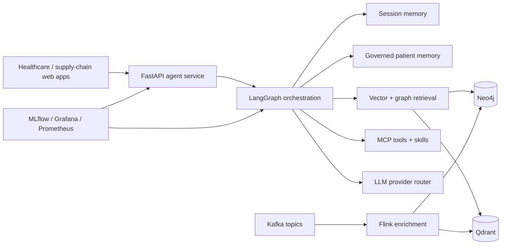

# Agentic AI Healthcare + Supply Chain GraphRAG

This repository is a provider-neutral reference platform for governed GraphRAG applications in healthcare and supply-chain domains. It combines realtime event ingestion, graph and vector retrieval, multi-agent orchestration, and cited responses into one local-first workspace.

## Start here

Choose the path that matches your goal:

| Goal | Start with |
| --- | --- |
| Run the platform locally | [Quickstart](#quickstart) |
| Understand the system boundary and runtime flow | [Architecture](#architecture) |
| Deploy with Compose, Minikube, or EKS | [03 — Platform Blueprint](docs/03_platform_blueprint.md) |
| Operate, troubleshoot, or re-index services | [08 — Operations Runbook](docs/08_operation_runbook.md) |
| Add or extend a domain | [09 — Supply Chain Domain](docs/09_supply_chain_domain.md) |
| Review the business scope and safety constraints | [01 — Business Requirements](docs/01_business_requirements.md) |

## Scope and boundaries

- **Purpose:** demonstrate an auditable, grounded agent runtime over synthetic healthcare
  and supply-chain data.
- **Supported providers:** local Ollama/MiniLM development plus Databricks AI, AWS
  Bedrock, and other provider-backed deployments through the same application contract.
- **Core stores:** Neo4j for explicit relationships and Qdrant for semantic retrieval.
- **Safety boundary:** this is not a medical device, EHR, clinical data repository, or
  source of clinical decisions. Answers are advisory, synthetic, and subject to the
  repository's guardrails and human-review paths.

## Modern AI platform capabilities

- Multi-model LLM access with provider abstraction and model routing across local and Databricks foundation models
- Dual persistence with Neo4j for explicit relationships and Qdrant for vector search and semantic retrieval
- End-to-end realtime knowledge ingestion from streaming healthcare and supply-chain events into a live knowledge base
- LangGraph orchestration for multi-agent reasoning, specialist delegation, confidence evaluation, and human-in-the-loop review
- Embedded MCP server patterns for governed tool access, skills, and role-aware execution
- Fail-closed patient-scope authorization shared by HTTP and MCP patient tools
- Durable SQLite coordination for Neo4j-to-Qdrant replay with leases, retries, and idempotency
- Layered runtime architecture that separates UI, API/BFF, orchestration, domain agents, tools, and data platforms
- Separate session memory for short-lived conversational continuity and governed durable patient memory with consent, provenance, retention, and expiry controls
- Unified delivery model across development and production with containerized services and infrastructure-as-code deployment patterns

## Quickstart

Use the Makefile for the default local workflow.

```bash
make compose-up
make api-hc
make query-hc
make validate-docs
```

Common targets:

- `make compose-up` starts the shared infra plus both domains.
- `make compose-up-hc` starts the healthcare domain.
- `make compose-up-sc` starts the supply-chain domain.
- `make validate` runs stack validation.
- `make validate-docs` runs markdownlint.
- `make test-unit` runs unit tests across the workspace.
- `make lint` runs Ruff checks.

## Architecture



## Domains

| Domain | Core focus | Key runtime |
| --- | --- | --- |
| Healthcare | drug safety, lab interpretation, coding review, patient summaries | `domains/healthcare/agent-service`, Flink jobs, Neo4j, Qdrant |
| Supply chain | logistics, inventory and disruption analysis | `domains/supply-chain/agent-service`, Flink jobs, Neo4j, Qdrant |

## Repository layout

```text
.
├── Makefile
├── pyproject.toml
├── uv.lock
├── docs/
├── domains/
│   ├── healthcare/
│   └── supply-chain/
├── packages/
│   ├── agent-core/
│   └── knowledge-core/
├── infra/
│   ├── compose/
│   ├── helm/
│   └── observability/
├── scripts/
├── README.md
└── docs/adrs/
```

## Local deployment paths

Choose one path for local development:

| Path | Start | Stop | Runtime |
| --- | --- | --- | --- |
| Docker Compose only | `make compose-up` | `make compose-down` | Docker containers on `graphrag-net` |
| Minikube with Docker driver | `make minikube-up` | `make minikube-down` | Kubernetes pods inside a Docker-backed Minikube node |

For Minikube service access, run `make minikube-ports`. See [03 — Platform Blueprint](docs/03_platform_blueprint.md#2-local-deployment-paths) for prerequisites and details.

Put your real `DATABRICKS_TOKEN` in the gitignored `infra/helm/values-dev.local.yaml`; `make minikube-up` applies it automatically. Never commit it.

## Documentation index

| Document | Purpose |
| --- | --- |
| [docs/01_business_requirements.md](docs/01_business_requirements.md) | Business scope, personas and requirements |
| [docs/02_architecture.md](docs/02_architecture.md) | System architecture and runtime model |
| [docs/03_platform_blueprint.md](docs/03_platform_blueprint.md) | Target platform blueprint and backlog |
| [docs/04_data_platform.md](docs/04_data_platform.md) | Kafka, Flink, Neo4j, Qdrant and embeddings |
| [docs/05_ai_agents.md](docs/05_ai_agents.md) | Agent orchestration, request types, memory, MCP and guardrails |
| [docs/06_quality_assurance.md](docs/06_quality_assurance.md) | QA strategy, evaluations and MLflow gates |
| [docs/07_cicd_automation.md](docs/07_cicd_automation.md) | CI/CD and release flow |
| [docs/08_operation_runbook.md](docs/08_operation_runbook.md) | Operations, troubleshooting and re-indexing |
| [docs/09_supply_chain_domain.md](docs/09_supply_chain_domain.md) | Supply-chain domain architecture |
| [docs/10_healthcare_landscape.md](docs/10_healthcare_landscape.md) | Healthcare reference patterns and gaps |
| [docs/adrs/README.md](docs/adrs/README.md) | Architecture decision index |

## ADRs

The ADRs describe the major architectural decisions behind the platform:

- [ADR-0001](docs/adrs/0001-dual-persistence-qdrant-neo4j.md) — dual persistence with Qdrant and Neo4j
- [ADR-0002](docs/adrs/0002-qdrant-streaming-vector-store.md) — streaming vector store choice
- [ADR-0003](docs/adrs/0003-ontology-governance-and-seed-generation.md) — ontology governance and seed generation
- [ADR-0004](docs/adrs/0004-local-first-llm-provider-routing.md) — local-first routing with provider fallback
- [ADR-0005](docs/adrs/0005-embed-fastmcp-in-rag-api.md) — embedded MCP server in the API
- [ADR-0006](docs/adrs/0006-skills-layer-standardization-and-validation.md) — skills-layer standardization
- [ADR-0007](docs/adrs/0007-langgraph-multi-agent-orchestration.md) — multi-agent orchestration with LangGraph
- [ADR-0008](docs/adrs/0008-mlflow-tracing-and-evaluation.md) — observability and MLflow evaluation
- [ADR-0009](docs/adrs/0009-domain-module-extraction.md) — extraction of domain-specific modules
- [ADR-0010](docs/adrs/0010-layered-agentic-architecture.md) — layered runtime architecture
- [ADR-0011](docs/adrs/0011-uv-workspace-packaging.md) — uv workspace packaging
- [ADR-0012](docs/adrs/0012-capability-oriented-layout.md) — capability-oriented repository layout

## Related

- [docs/05_ai_agents.md](docs/05_ai_agents.md) for the runtime behavior of the agents
- [docs/04_data_platform.md](docs/04_data_platform.md) for the ingestion and persistence model
- [docs/08_operation_runbook.md](docs/08_operation_runbook.md) for deployment and operations
- [docs/06_quality_assurance.md](docs/06_quality_assurance.md) for evaluation gates and validation
