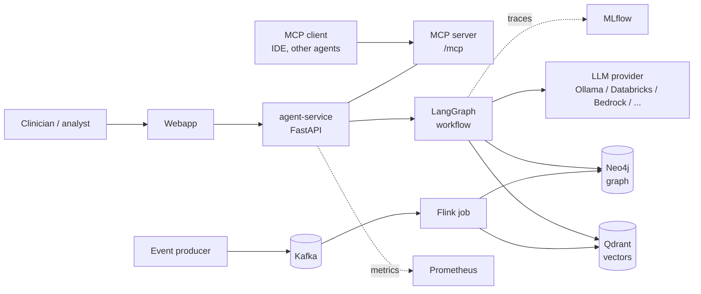
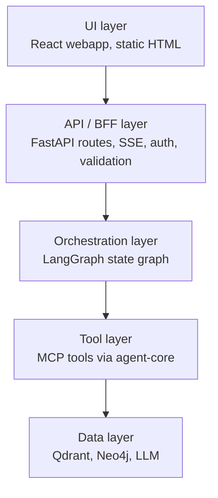
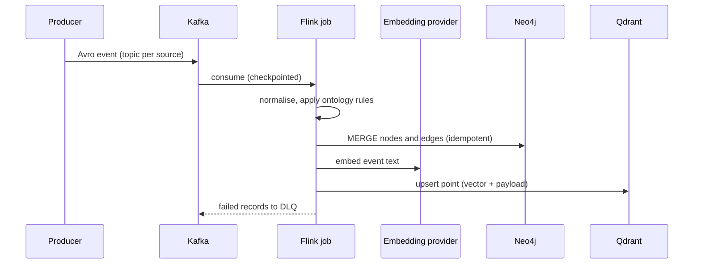
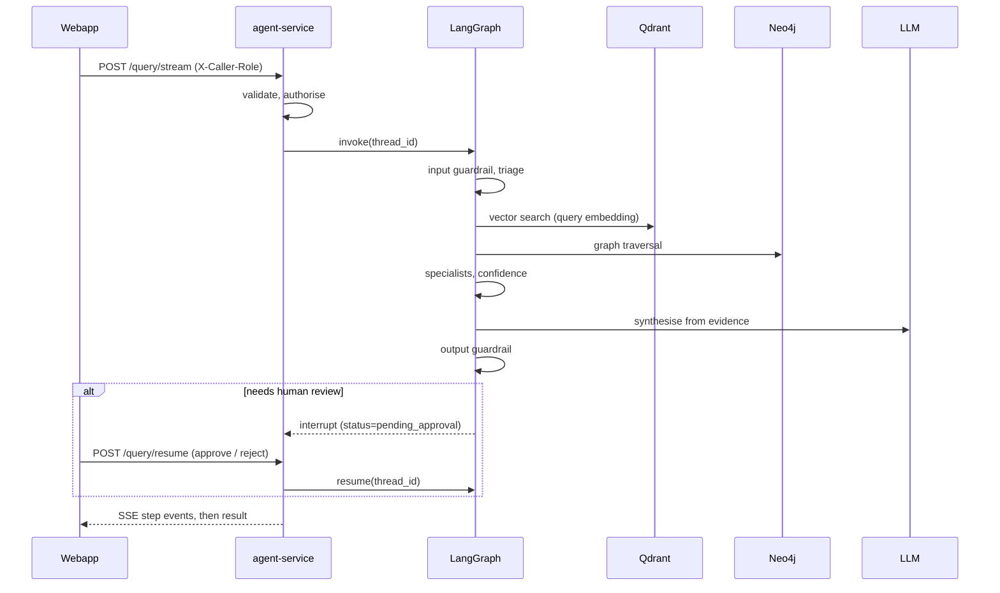

# 02 — Architecture

This document describes the **logical architecture**: the components, how data and
requests flow between them, and the cross-cutting design principles. Deployment
topology is in [03 — Platform Blueprint](03_platform_blueprint.md); the data pipeline is
in [04 — Data Platform](04_data_platform.md); agent internals are in
[05 — AI Agents](05_ai_agents.md).

## 1. System context



The platform has two planes:

| Plane | Responsibility | Components |
| --- | --- | --- |
| **Data plane** | Turn raw events into searchable, linked knowledge | Producer, Kafka, Schema Registry, Flink, Neo4j, Qdrant |
| **Agent plane** | Answer questions with governed, grounded evidence | Webapp, agent-service, LangGraph, MCP, LLM providers |

Both planes share the **knowledge layer**: the ontology, rule packs, graph seeds and
skills, plus a single embedding configuration (see [§5](#5-cross-cutting-design)).

## 2. Layered agent architecture



| Layer | Owns | Must not |
| --- | --- | --- |
| UI | Rendering, streaming display, trace view | Call data stores or LLMs directly |
| API / BFF | Request validation (Pydantic, extra fields forbidden), caller role, CORS, SSE framing | Contain retrieval or prompting logic |
| Orchestration | Triage, retrieval, specialists, confidence, synthesis, guardrails, human review | Bypass tool policy |
| Tools | Authorised, audited, size-bounded operations | Make policy decisions in prompts |
| Data | Storage and model inference | Know about callers |

LangGraph is the **only** query path. The REST endpoints and the MCP
`graphrag_answer_generate` tool both invoke the same compiled graph. See
[ADR-0010](adrs/0010-layered-agentic-architecture.md) and
[ADR-0012](adrs/0012-capability-oriented-layout.md).

## 3. Code organisation

```text
packages/
  agent-core/        # domain-neutral runtime: settings, policy, audit, guardrails,
                     # MCP server builder, metrics, streaming, ports
  knowledge-core/    # domain-neutral knowledge: embedding, ontology loader,
                     # rules engine, storage, pipeline runner
domains/
  healthcare/
    agent-service/   # healthcare_agent package + tests (unit, integration, evals)
    data-pipelines/  # flink-job, producer, Avro schemas
    knowledge/       # ontology, graph-seeds, skills
    scripts/         # validation, seed generation, smoke tests
    webapp/          # React + TypeScript + Vite
  supply-chain/      # same shape; static webapp, smaller agent
infra/               # compose, Helm, environments, images, observability, nginx
```

The repository is a Python 3.11 **uv workspace**: shared packages are built as wheels
and installed into each image ([ADR-0011](adrs/0011-uv-workspace-packaging.md)).

### 3.1 Shared packages

| Package | Module | Purpose |
| --- | --- | --- |
| `agent-core` | `settings` | `AgentServiceSettings` (Pydantic settings) |
| | `policy` | Role → allowed-tools policy, loaded from YAML |
| | `governance` | Authorise, audit, time and size-bound every tool call |
| | `audit` | `AuditEvent`, `JsonlAuditSink` |
| | `guardrails` | Input and output checks, redaction |
| | `mcp_server` | FastMCP builder: `ToolSpec`, annotations, transport security |
| | `metrics` | Prometheus collectors |
| | `streaming` | SSE event framing and allowlist |
| | `runtime`, `ports` | Thread offload helpers and provider-neutral interfaces |
| `knowledge-core` | `embedding` | Embedding provider factory (local / Databricks) |
| | `ontology`, `ontology_loader` | Typed ontology models and YAML loader |
| | `rules_engine` | Drug-safety, lab-signal and claims-outcome rules |
| | `storage`, `runner` | Neo4j / Qdrant writers and pipeline runner |

## 4. Runtime flows

### 4.1 Ingestion



### 4.2 Query



## 5. Cross-cutting design

| Concern | Design | Reference |
| --- | --- | --- |
| **Dual persistence** | Neo4j holds explicit relationships; Qdrant holds semantic vectors; both are written from the same event | [ADR-0001](adrs/0001-dual-persistence-qdrant-neo4j.md) |
| **Embedding parity** | Ingest and query use the same `knowledge_core.embedding` provider and model; a dimension mismatch fails fast | [ADR-0002](adrs/0002-qdrant-streaming-vector-store.md) |
| **Ontology governance** | YAML ontology is the source of truth for seeds, rules and validation | [ADR-0003](adrs/0003-ontology-governance-and-seed-generation.md) |
| **Model routing** | Provider factory with fallback, complexity tiers and a cost budget | [ADR-0004](adrs/0004-local-first-llm-provider-routing.md) |
| **Tool governance** | Policy and authorisation before execution; audit after | [ADR-0005](adrs/0005-embed-fastmcp-in-rag-api.md) |
| **Skills** | Generated, validated skill manifests drive planning | [ADR-0006](adrs/0006-skills-layer-standardization-and-validation.md) |
| **Orchestration** | LangGraph multi-agent graph with HITL and memory | [ADR-0007](adrs/0007-langgraph-multi-agent-orchestration.md) |
| **Observability** | MLflow traces and evaluations; Prometheus metrics | [ADR-0008](adrs/0008-mlflow-tracing-and-evaluation.md) |

### 5.1 Security model

- **Caller role** comes from the `X-Caller-Role` header (`read_only`, `generation`,
  `export`). In production `AGENT_ALLOW_ROLE_HEADER=false` and the role must be supplied
  by a trusted gateway.
- **Authorisation runs before execution**, including before an SSE stream opens, so a
  denied request returns HTTP 401 instead of a partial stream.
- **Redaction** removes raw payloads for every role except `export`.
- **Bounded output** — answer, evidence and response-byte limits are enforced by
  guardrails, not by prompts.
- **MCP transport security** — optional DNS-rebinding protection with allowed hosts and
  origins.
- **Secrets** come from environment variables or an external secret manager, never from
  source.

### 5.2 Failure handling

| Failure | Behaviour |
| --- | --- |
| Primary LLM returns an error | `FallbackProvider` retries on the fallback provider |
| Embedding model missing | Startup fails unless `EMBEDDING_REQUIRE_MODEL=false` (then a deterministic hash fallback is used) |
| Vector dimension mismatch | Fails fast; recreate the collection and re-ingest |
| Bad event | Sent to the DLQ (healthcare); the job continues |
| Neo4j / Qdrant unavailable | Retrieval nodes return structured errors; confidence drops |

## 6. Domains

| Aspect | Healthcare | Supply chain |
| --- | --- | --- |
| Agent package | `healthcare_agent` | `supply_chain_agent` |
| Streaming (SSE) | Yes | No |
| Multi-turn memory | Yes | No |
| Human-in-the-loop | Yes | No |
| Confidence re-retrieval loop | Yes (threshold 0.75) | Yes (threshold 0.75) |
| Specialist delegation router | Yes | No |
| Webapp | React + Vite | Static HTML / JS |
| Detail | [05](05_ai_agents.md) | [09](09_supply_chain_domain.md) |
