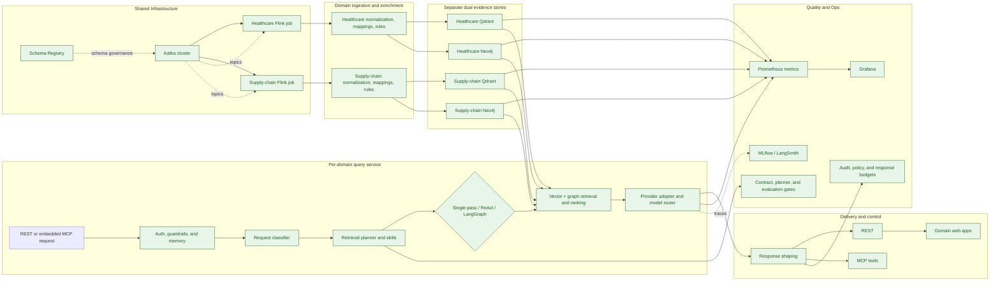

# Platform Blueprint

> **Version:** 1.0 | **Last updated:** 2026-08-22 | **Status:** Active

Single source of truth for architecture, technical specifications, and delivery roadmap.

| Audience | Use this document to... |
|----------|------------------------|
| Executives | Assess capability maturity, review gaps, and track staged delivery |
| Architects | Reference the target architecture, capability map, and integration contracts |
| Engineers | Look up container topology, API contracts, env vars, and sprint work items |

## Table of Contents

- [Part I — Architecture](#target-outcome): Target outcome, implementation status, gaps, principles, architecture diagrams, ontology model, skill architecture, capability map
- [Part II — Technical Specifications](#part-ii--technical-specifications): Container inventory, library versions, Kafka/Flink/Qdrant/Neo4j specs, RAG API contracts, observability, CI/CD, environment variables
- [Part III — Delivery Backlog](#part-iii--delivery-backlog): Status summary, staged plan, sprint work items, multi-domain extension, AI trends gap analysis

---

# Part I — Architecture

## Target Outcome

A semantic intelligence platform — not a simple GraphRAG pipeline.

Key characteristics:

- source events are normalized into canonical healthcare concepts before persistence,
- vector and graph stores are populated from the same semantic contract,
- query orchestration selects retrieval and reasoning strategies intentionally,
- AI tools are decomposed into auditable skills with policy-aware execution,
- evaluation, provenance, and guardrails are part of the architecture rather than post-processing.

## Implementation Status

What is implemented today:

- ontology-driven ingestion modules exist in `platform/healthcare/flink-app/app` (`ontology_loader.py`, `normalization.py`, `rules_engine.py`),
- dual persistence remains active across Qdrant and Neo4j,
- `rag-api` query flow now includes request classification, retrieval planning, and deterministic evidence ranking,
- LLM calls are routed through a provider adapter abstraction (`llm_provider.py`) with Ollama, OpenAI, Anthropic, and FallbackProvider,
- dynamic model routing selects models by query complexity (`domain/model_router.py`: simple/moderate/complex tiers, cross-provider `provider:model` syntax),
- domain-routed embeddings use named Qdrant vectors (`clinical`, `claims`, `device`) with per-domain model configurability (`platform/shared/embedding.py`),
- structured output generation via JSON-mode constrained prompts (`domain/structured_output.py`) with Pydantic response models,
- input/output guardrails with classifier-based injection detection, off-topic filtering, and grounding validation (`domain/guardrails.py`),
- session-scoped and cross-session conversation memory with pluggable Redis persistence (`domain/memory.py`),
- evaluation-gated CI with configurable quality thresholds (`domain/evaluation_gates.py`),
- MCP surface includes 10 clinical workflow tools (`skills_plan_get`, `timeline_explain`, `medication_risk_assess`, `coding_gap_detect`, `cohort_risk_summary`, and others),
- planner quality checks exist (`test_planner_evaluation.py`, `test_planner_edge_cases.py`) in addition to API contract tests,
- LangGraph multi-agent orchestration with eight specialized nodes is implemented behind the `RAG_API_LANGGRAPH_ENABLED` feature flag,
- inter-agent delegation protocol with typed AgentCards, capability discovery, and delegation router (`agent_cards.py`),
- MLflow tracing with nested span hierarchy and healthcare-specific evaluation harness is implemented behind the `MLFLOW_TRACKING_URI` feature flag,
- LangSmith integration for LangGraph pipeline tracing is available via `LANGSMITH_API_KEY`,
- terminology mappings cover all 6 producer vocabularies at 100% (LAB→LOINC, ICD-10, MED→RxNorm, CPT, Specialty→NUCC, Payer→NAIC),
- ontology governance enforced via CODEOWNERS, drift detection CI gate (`validate_ontology_drift.py`), and terminology coverage CI gate (`validate_terminology_coverage.py`),
- ontology conformance tests validate relationship cardinality, node type alignment, required properties, and direction correctness (`test_ontology_conformance.py`),
- retrieval benchmark with 25 labeled query fixtures and precision@k / recall@k scoring (`retrieval_benchmark.py`),
- grounded-answer scorecard with unsupported-claim rate and citation coverage metrics (`grounding_scorecard.py`),
- evidence fusion reranking combining relevance, recency, and graph signal weighting (`evidence.py`),
- provider failover contract tests covering timeout, connection error, non-200, and cross-provider kwargs (`test_provider_failover.py`),
- latency-based model routing with per-tier rolling average tracking and automatic tier downgrade (`LatencyTracker`),
- cost budget tracking with hourly accumulation and tier downgrade on budget exhaustion (`CostTracker`, env `LLM_COST_BUDGET_HOURLY_USD`).

## Open Gaps

Infrastructure and governance gaps:

- planner logic is currently heuristic and requires benchmark-driven route quality evaluation,
- production controls (policy classes, privacy posture, staged rollout controls) remain incomplete for non-demo workloads.

AI-capability gaps (see [Part III](#part-iii--delivery-backlog) for detailed backlog):

- schema-constrained decoding (grammar-enforced JSON) beyond current JSON-mode prompting,
- dedicated ML guardrail model (Llama Guard) beyond current regex-based classifier,
- streaming responses (SSE) to client UIs,
- hard evaluation gate promotion once baseline quality is stable,
- per-user identity propagation and fine-grained data access governance,
- neural reranking between retrieval and synthesis,
- multimodal clinical image and document understanding.

## Design Principles

1. Canonical semantics before retrieval.
2. Shared semantic contract across Kafka, Flink, Neo4j, Qdrant, REST, and MCP.
3. Separation of domain knowledge, orchestration logic, and generation provider.
4. Deterministic evidence assembly before probabilistic synthesis.
5. Policy and provenance attached to every evidence path.
6. Structured outputs with schema-constrained extraction for downstream system integration.
7. Confidence-aware responses — abstain or escalate when evidence is insufficient.
8. Evaluation-gated promotion — quality thresholds block releases, not just tests.
9. Identity-aware governance — per-user access control propagated through the agent pipeline.
10. Model-agnostic generation — route to local, managed, or specialized models based on task requirements.

## Target Architecture

```text
Source Systems / Producers
  -> Kafka + Schema Registry
  -> Flink ingestion and enrichment
  -> Semantic normalization layer
     -> terminology mapping
     -> entity resolution
     -> rule execution
     -> provenance tagging
  -> Dual persistence
     -> Qdrant semantic evidence view
     -> Neo4j ontology-aligned graph view
  -> Query orchestration layer
     -> request classification
     -> retrieval planning
     -> skill execution
     -> evidence ranking and policy shaping
  -> LLM synthesis adapter
  -> Delivery surfaces
     -> REST
     -> MCP tools
     -> provider web
  -> Evaluation and operations
     -> contract tests
     -> ontology conformance checks
     -> retrieval quality tests
     -> latency and safety monitoring
```



## Ontology Model

The ontology layer is implemented under `platform/healthcare/ontology/` and consumed at runtime by the Flink ingestion pipeline, seed generation, and validation scripts.

### Implemented ontology packages

| Package | File(s) | Status |
| --- | --- | --- |
| Clinical entity ontology | `entities.yaml` | Implemented — defines canonical concepts (Patient, Encounter, ClinicalEvent, Observation, Condition, Medication, SourceSystem, etc.) |
| Relationship ontology | `relationships.yaml` | Implemented — defines allowed edges (HAS_CONDITION, INTERACTS_WITH, MAY_INDICATE, CONTRAINDICATED_FOR, etc.) |
| Terminology mappings | `mappings/*.yaml` | Implemented — 100% coverage across 8 mapping files (36 labs, 52 ICD-10, 48 medications, 36 CPT, 16 specialties, 20 payers); validated by CI coverage gate |
| Provenance and policy | `provenance.yaml` | Implemented — defines source trust, PHI class, and retention class |
| Graph seeds | `graph_seeds.yaml` | Implemented — drug safety relationships generated into `generated_ontology_seeds.cypher` |
| Domain rules | `rules/lab_signals.yaml`, `rules/drug_safety.yaml`, `rules/claims_outcomes.yaml` | Implemented — 14 lab rules, drug interaction/reaction/contraindication rules, 6 claims outcome rules |

### Repository shape

```text
platform/healthcare/ontology/
  entities.yaml
  relationships.yaml
  vocabularies.yaml
  provenance.yaml
  graph_seeds.yaml
  mappings/
    patient_mappings.yaml
    medication_mappings.yaml
    provider_mappings.yaml
    device_mappings.yaml
    payer_mappings.yaml
    icd10_mappings.yaml
    cpt_mappings.yaml
    lab_mappings.yaml
  rules/
    lab_signals.yaml
    drug_safety.yaml
    claims_outcomes.yaml
```

### Remaining ontology work

- Add formal ontology conformance tests that block CI on schema drift.
- Add entity resolution policies beyond source-ID-based matching.
- Validate that runtime graph merges conform to declared relationship cardinality constraints.

## Skill Architecture

The skills layer maps business goals to agents, skills, and MCP tools. The runtime planner (`skills_layer.py`) resolves skill plans; MCP tools are implemented in `app.py`; LangGraph specialist agents provide domain-specific reasoning.

### Internal skills (mapped to implementation)

| Skill | Responsibility | Implementation |
| --- | --- | --- |
| `semantic_normalize` | Convert payloads to canonical concepts | `flink-app/app/normalization.py` |
| `terminology_map` | Map local codes to standard vocabularies | `flink-app/app/ontology_loader.py` + ontology YAML |
| `graph_reason` | Deterministic patient/cohort traversals | `domain/retrieval.py` (`graph_search`) |
| `vector_retrieve` | Semantic similarity retrieval | `domain/retrieval.py` (`vector_search`) |
| `timeline_explain` | Order events and explain progression | MCP tool `timeline_explain` |
| `safety_assess` | Interactions, contraindications, labs, adverse reactions | LangGraph `medication_safety_agent` + MCP `medication_risk_assess` |
| `evidence_rank` | Rank by priority, score, and request type | `domain/evidence.py` |
| `policy_shape` | Redact, bound, and authorize outputs | `domain/response_policy.py` |
| `audit_export` | Traceable evidence bundles | MCP tool `evidence_bundle_export` |

### User-facing MCP tools (10 implemented)

| MCP tool | Composed from | Status |
| --- | --- | --- |
| `patient_context_get` | `graph_reason` + `policy_shape` | Implemented |
| `vector_evidence_search` | `vector_retrieve` + `policy_shape` | Implemented |
| `graphrag_answer_generate` | `vector_retrieve` + `graph_reason` + `evidence_rank` + LLM synthesis | Implemented |
| `risk_summary_generate` | `vector_retrieve` + `graph_reason` + LLM synthesis | Implemented |
| `timeline_explain` | `graph_reason` + `timeline_explain` + `policy_shape` | Implemented |
| `medication_risk_assess` | `graph_reason` + `safety_assess` + `evidence_rank` | Implemented |
| `coding_gap_detect` | `graph_reason` + ICD-10 gap analysis | Implemented |
| `cohort_risk_summary` | `vector_retrieve` + `graph_reason` + `evidence_rank` | Implemented |
| `evidence_bundle_export` | `vector_retrieve` + `graph_reason` + `audit_export` + `policy_shape` | Implemented |
| `skills_plan_get` | Skills layer planner resolution | Implemented |

### Remaining skill architecture work

- Implement a reusable skill runner that MCP tools and LangGraph agents compose through, replacing direct function calls.
- Add `entity_resolve` skill for cross-source identity unification beyond source-ID matching.
- Connect LangGraph specialist agents to the skills plan so `skills_plan_get` output drives agent execution.

## Capability Map

| Capability area | Current state in repo | Target state | Primary repo touchpoints |
| --- | --- | --- | --- |
| Event contracts | shared Avro envelope with topic-specific payload JSON | canonical semantic contracts plus payload validation by domain type | `platform/healthcare/schemas/medical_event.avsc`, `docs/04_data_platform.md`, `platform/healthcare/producer/produce_events.py` |
| Stream enrichment | ontology loader, normalization, and deterministic rules are implemented in the Flink app modules | ontology-driven normalization, mapping, and provenance tagging | `platform/healthcare/flink-app/healthcare_graph_rag_job.py`, `platform/healthcare/flink-app/healthcare_graph_rag_pyflink_job.py`, `platform/healthcare/flink-app/app/` |
| Terminology mapping | 100% coverage: 36 labs→LOINC, 52 ICD-10, 48 meds→RxNorm, 36 CPT, 16 specialties→NUCC, 20 payers→NAIC across 8 mapping files; CI coverage gate enforces thresholds | governed mapping packs with broader SNOMED CT depth and formal governance workflows | `platform/healthcare/ontology/mappings/*.yaml`, `domains/healthcare/scripts/validate_terminology_coverage.py` |
| Entity resolution | mostly source ID based | patient, provider, medication, and device identity resolution policies | Flink enrichment layer, graph merge helpers |
| Graph semantics | strong patient-centric graph, rules embedded in code and seed data | ontology-validated graph model with relationship constraints and conformance tests | `docs/04_data_platform.md`, `platform/healthcare/neo4j/init.cypher`, Flink graph writes |
| Vector retrieval | domain-routed embedding (clinical / claims / device) with MiniLM-L6-v2, named Qdrant vectors, and query-time domain classification via `domain/retrieval.py` | neural reranking, domain-tuned models, optional cross-encoder | `domains/healthcare/agents/domain/retrieval.py`, `platform/shared/embedding.py`, `platform/healthcare/flink-app/app/text_processing.py` |
| Query orchestration | request classification, retrieval plan selection, evidence ranking, and complexity-based model routing are implemented with deterministic planner logic; `ModelRouter` routes simple/moderate/complex queries to different models; LangGraph multi-agent mode adds specialist routing | benchmarked and continuously tuned planning, ranking, and model selection | `domains/healthcare/agents/app.py`, `domains/healthcare/agents/domain/`, `domains/healthcare/agents/domain/model_router.py`, `domains/healthcare/agents/langgraph_agents/` |
| Safety reasoning | 41 interactions, 46 adverse reactions, 23 contraindications seeded; LangGraph `medication_safety_agent` extracts structured risk chains | composable safety assessment skill with terminology-aware rules and confidence scoring | `platform/healthcare/neo4j/generated_ontology_seeds.cypher`, `domains/healthcare/agents/langgraph_agents/agents.py` |
| Temporal reasoning | exposed through `timeline_explain` and supported by graph and vector context retrieval | deeper encounter and time-window semantics plus benchmarked timeline quality | Flink payload normalization, `domains/healthcare/agents/app.py` |
| MCP surface | 10 tools implemented (`skills_plan_get`, timeline, medication risk, coding gap, cohort summary, export, patient context, vector search, graphrag answer, risk summary) with role policy enforcement | richer internal skill composition, broader role-matrix governance, structured output extraction | `docs/05_ai_agents.md`, `domains/healthcare/agents/app.py`, `domains/healthcare/agents/config/tool_policies.json` |
| Policy and audit | role checks, evidence shaping, audit log | ontology-backed policy classes, provenance-aware redaction, richer audit events | `domains/healthcare/agents/app.py`, `domains/healthcare/agents/config/tool_policies.json` |
| Quality evaluation | contract tests, planner fixture tests, planner edge-case tests, ontology conformance checks, retrieval benchmarks (25 fixtures), grounding scorecard, evidence fusion reranking, provider failover tests, LangGraph agent tests, MLflow evaluation harness, model router tests, and retrieval domain classification tests (213 agent tests, 58 Flink tests) | evaluation-gated CI, adversarial red-teaming | `domains/healthcare/agents/tests/`, `domains/healthcare/scripts/validate_ontology.py`, `docs/06_quality_assurance.md` |

## Execution Backlog

See Part III below for the full actionable backlog with staged delivery sequencing and sprint-level work items.

## Definition of Done

The architecture target is reached when:

- every persisted concept and relationship is defined in ontology config,
- every major healthcare query route is plan-driven rather than hard-coded,
- every user-facing tool is composed from internal skills,
- every response carries provenance and policy metadata,
- every release can be evaluated for ontology conformance, retrieval quality, and grounding quality.

---

# Part II — Technical Specifications

## 1. Container Inventory

All services are defined in `container/docker-compose.infra.yml` and `container/docker-compose.healthcare.yml`. The local stack runs entirely in Docker Compose; no external cloud services are required for development.

| Container | Image | Version | Host Ports | Role |
|-----------|-------|---------|-----------|------|
| `infra-zookeeper` | confluentinc/cp-zookeeper | 7.9.0 | 2181 | Kafka coordination |
| `infra-kafka` | confluentinc/cp-kafka | 7.9.0 | 9092, 29092 | Kafka broker 1 |
| `infra-kafka-2` | confluentinc/cp-kafka | 7.9.0 | 9093, 29093 | Kafka broker 2 |
| `infra-kafka-3` | confluentinc/cp-kafka | 7.9.0 | 9094, 29094 | Kafka broker 3 |
| `infra-schema-registry` | confluentinc/cp-schema-registry | 7.9.0 | 8081 | Avro schema registry |
| `healthcare-kafka-init` | confluentinc/cp-kafka | 7.9.0 | — | One-shot topic provisioning |
| `infra-conduktor-postgres` | postgres | 14 | — | Conduktor metadata store |
| `infra-conduktor-console` | conduktor/conduktor-console | latest | 8085 | Kafka management UI |
| `healthcare-qdrant` | qdrant/qdrant | latest | 6333 (HTTP), 6334 (gRPC) | Vector store |
| `healthcare-neo4j` | neo4j | 5.26.2 | 7474 (HTTP), 7687 (Bolt) | Graph database |
| `healthcare-neo4j-init` | neo4j | 5.26.2 | — | One-shot Cypher seed |
| `healthcare-neodash` | neo4jlabs/neodash | latest | 5005 | Neo4j dashboard UI |
| `infra-ollama` | ollama/ollama | latest | 11434 | Local LLM inference |
| `infra-flink-jobmanager` | custom (platform/flink-cluster/Dockerfile) | — | 8082 | Flink JobManager (shared) |
| `infra-flink-taskmanager` | custom (platform/flink-cluster/Dockerfile) | — | — | Flink TaskManager (shared) |
| `healthcare-flink-app` | custom (platform/healthcare/flink-app/Dockerfile) | — | — | PyFlink job submitter |
| `healthcare-producer` | custom (platform/healthcare/producer/Dockerfile) | — | — | Synthetic event generator |
| `healthcare-rag-api` | custom (domains/healthcare/agents/Dockerfile) | — | 8000 | GraphRAG REST + MCP API |
| `healthcare-webapp` | custom (domains/healthcare/webapp/Dockerfile) | — | 8088 | Provider web UI (Nginx) |
| `infra-prometheus` | prom/prometheus | latest | 9090 | Metrics scraper |
| `infra-blackbox-exporter` | prom/blackbox-exporter | latest | 9115 | HTTP probe exporter |
| `infra-grafana` | grafana/grafana | latest | 3000 | Metrics dashboards |
| `infra-mlflow` | ghcr.io/mlflow/mlflow | v2.21.3 | 5000 | Agent tracing and evaluation |
| `localstack` | localstack/localstack | 3.8.0 | 4566, 4510–4559 | Local AWS-compatible services |

### Supply Chain Domain Containers (optional overlay)

Launched via `docker compose -f container/docker-compose.infra.yml -f container/docker-compose.supply-chain.yml up -d`.

| Container | Image | Version | Host Ports | Role |
|-----------|-------|---------|-----------|------|
| `supplychain-neo4j` | neo4j | 5.26.2 | 7475 (HTTP), 7688 (Bolt) | Supply chain graph database |
| `supplychain-neo4j-init` | neo4j | 5.26.2 | — | One-shot supply chain Cypher seed |
| `supplychain-qdrant` | qdrant/qdrant | latest | 6335 (HTTP), 6336 (gRPC) | Supply chain vector store |
| `supplychain-kafka-init` | confluentinc/cp-kafka | 7.9.0 | — | One-shot supply chain topic creation |
| `supplychain-producer` | custom (platform/supply-chain/producer/Dockerfile) | — | — | Supply chain event generator |
| `localstack` | localstack/localstack | 3.8.0 | 4566, 4510–4559 | Local AWS-compatible services |

---

## 2. Library Versions

### agents (`domains/healthcare/agents/requirements.txt`)

| Package | Version | Purpose |
|---------|---------|---------|
| fastapi | 0.115.0 | REST API framework |
| uvicorn | 0.31.1 | ASGI server |
| qdrant-client | 1.11.3 | Qdrant gRPC/HTTP client |
| neo4j | 5.24.0 | Neo4j Bolt driver |
| requests | 2.32.3 | HTTP client for Ollama |
| pydantic | ≥2.11.7,<3.0.0 | Request/response validation |
| mcp | 1.28.0 | FastMCP embedded server |
| httpx | 0.27.2 | Async HTTP (MCP transport) |
| email-validator | ≥2.2.0 | Pydantic email field support |
| prometheus-client | 0.23.1 | Metrics exposition |
| langgraph | ≥0.4.1,<1.0.0 | Multi-agent StateGraph orchestration |
| langchain-core | ≥0.3.0,<1.0.0 | Tool abstractions for LangGraph agents |
| langsmith | ≥0.3.0,<1.0.0 | LangSmith tracing integration |
| mlflow | ≥2.21.0,<3.0.0 | Agent tracing spans and evaluation harness |

> **Note:** `pydantic` is pinned with a range (`>=2.11.7,<3.0.0`) rather than an exact version because `mcp==1.28.0` requires `pydantic>=2.12.0` on Python 3.14. The range allows pip to resolve on Python 3.11 (CI/Docker target) and 3.14+ without conflict.

### flink-app (`platform/healthcare/flink-app/requirements.txt`)

| Package | Version | Purpose |
|---------|---------|---------|
| apache-flink | 1.20.1 | PyFlink DataStream API |
| confluent-kafka | 2.5.3 | Kafka consumer (Avro) |
| fastavro | 1.9.7 | Avro deserialization |
| neo4j | 5.24.0 | Neo4j Bolt driver |
| qdrant-client | 1.11.3 | Qdrant upsert client |
| requests | 2.32.3 | HTTP utilities |

### producer (`platform/healthcare/producer/requirements.txt`)

| Package | Version | Purpose |
|---------|---------|---------|
| confluent-kafka | 2.6.1 | Kafka Avro producer |
| faker | 25.8.0 | Synthetic data generation |
| requests | 2.32.3 | Schema Registry registration |
| fastavro | 1.9.5 | Avro serialization |

### Python runtime

| Component | Python version | Base image |
|-----------|---------------|-----------|
| rag-api (healthcare) | 3.11 | python:3.11-slim |
| rag-api (supply-chain) | 3.11 | python:3.11-slim |
| flink-app (healthcare) | 3.11 (via Flink image) | custom Flink Dockerfile |
| flink-processor (supply-chain) | 3.11 | python:3.11-slim |
| producer (both domains) | 3.11 | python:3.11-slim |
| CI test runner | 3.11 | ubuntu-latest + setup-python@v5 |
| Local dev (uv) | 3.11 | `.python-version` + `pyproject.toml` |

### Local development tooling

| Tool | File | Purpose |
|------|------|---------|
| [uv](https://docs.astral.sh/uv/) | `pyproject.toml` | Python project manager, dependency resolution, venv |
| make | `Makefile` | Docker Compose shortcuts (`make up`, `make test-hc`, etc.) |
| ruff | `pyproject.toml [tool.ruff]` | Linting and formatting |

---

## 3. Kafka Configuration

### Cluster topology

| Property | Value |
|----------|-------|
| Brokers | 3 (IDs 1, 2, 3) |
| Replication factor (default) | 3 |
| Min in-sync replicas | 2 |
| Default partitions | 3 |
| Auto-create topics | Disabled |
| Offsets topic replication | 3 |
| Transaction state log replication | 3 |
| Transaction state log min ISR | 2 |
| Coordination | ZooKeeper 2181 |
| Inter-broker listener | PLAINTEXT (internal) |

### Listener map

| Listener name | Binding | Accessible from |
|--------------|---------|----------------|
| PLAINTEXT | `kafka:29092`, `kafka2:29093`, `kafka3:29094` | Containers (internal) |
| PLAINTEXT_HOST | `0.0.0.0:9092/9093/9094` | Host machine |

### Topic topology

| Topic | Partitions | Replication | Event type | Producer fn |
|-------|-----------|-------------|-----------|------------|
| `healthcare.ehr.events` | 3 | 3 | `CLINICAL_NOTE` | `ehr_event` |
| `healthcare.lab.results` | 3 | 3 | `LAB_RESULT` | `lab_event` |
| `healthcare.device.telemetry` | 3 | 3 | `VITAL_SIGN` | `device_event` |
| `healthcare.pharmacy.orders` | 3 | 3 | `MEDICATION_ORDER` | `pharmacy_event` |
| `healthcare.claims.events` | 3 | 3 | `CLAIM_STATUS` | `claims_event` |
| `healthcare.master.patients` | 1 | 3 | `PATIENT_MASTER_UPSERT` | `patient_reference_event` |
| `healthcare.master.providers` | 1 | 3 | `PROVIDER_MASTER_UPSERT` | `provider_reference_event` |
| `healthcare.master.devices` | 1 | 3 | `DEVICE_MASTER_UPSERT` | `device_reference_event` |
| `healthcare.master.medications` | 1 | 3 | `MEDICATION_MASTER_UPSERT` | `medication_reference_event` |
| `healthcare.master.payers` | 1 | 3 | `PAYER_MASTER_UPSERT` | `payer_reference_event` |
| `healthcare.dlq.events` | 1 | 3 | — | Reserved (not written) |

### Wire format

- **Key:** UTF-8 bytes of `patient_id` when present, otherwise `event_id`
- **Value:** Confluent Avro binary (magic byte 0x00 + 4-byte schema ID + Avro payload)
- **Schema subject naming:** `{topic}-value`

---

## 4. Avro Envelope Schema

**File:** `platform/healthcare/schemas/medical_event.avsc`  
**Namespace:** `com.healthcare.graphrag`  
**Record name:** `MedicalEvent`  
**Schema version:** `1.0.0`

| Field | Avro type | Default | Notes |
|-------|-----------|---------|-------|
| `event_id` | `string` | — | UUID v4 |
| `event_ts` | `string` | — | ISO-8601 UTC |
| `source_system` | `string` | — | EHR system name or source identifier |
| `source_type` | `string` | — | `EHR`, `LAB`, `DEVICE`, `PHARMACY`, `CLAIMS`, `REFERENCE` |
| `event_type` | `string` | — | `CLINICAL_NOTE`, `LAB_RESULT`, `VITAL_SIGN`, `MEDICATION_ORDER`, `CLAIM_STATUS`, `*_MASTER_UPSERT` |
| `patient_id` | `["null","string"]` | `null` | Absent for non-patient reference events |
| `encounter_id` | `["null","string"]` | `null` | Optional encounter scope |
| `provider_id` | `["null","string"]` | `null` | Optional attending provider |
| `payload_json` | `string` | — | Event-type-specific JSON object (see 04_data_platform.md) |
| `schema_version` | `string` | `"1.0.0"` | Envelope schema version |

---

## 5. Flink Configuration

### Job parameters

| Property | Value | Source |
|----------|-------|--------|
| Default parallelism | 2 | `FLINK_PROPERTIES` |
| Task slots per TaskManager | 4 | `FLINK_PROPERTIES` |
| State backend | `hashmap` | `FLINK_PROPERTIES` |
| Checkpointing interval | 10 000 ms | `FLINK_PROPERTIES` / `FLINK_CHECKPOINT_INTERVAL_MS` |
| Checkpointing mode | `EXACTLY_ONCE` | `FLINK_PROPERTIES` |
| Python executable | `/usr/bin/python3` | `FLINK_PROPERTIES` |
| Job parallelism (runtime) | 1 | `FLINK_JOB_PARALLELISM` env var |
| Kafka consumer group | `healthcare-graphrag-pyflink` | `FLINK_KAFKA_GROUP_ID` env var |

### Kafka consumer behaviour

- One `KafkaSource` per topic; group ID suffix: `{FLINK_KAFKA_GROUP_ID}-{topic-name}`
- Start offset: earliest (replay-friendly)
- Topics consumed: all 10 transactional + reference topics
- Reference events update an in-process reference store; transactional events trigger
  dual-sink writes to Qdrant and Neo4j

### Embedding

| Property | Value |
|----------|-------|
| Default model | `sentence-transformers/all-MiniLM-L6-v2` (env `EMBEDDING_MODEL`) |
| Dimensions | 384 |
| Normalisation | L2 (unit vector) |
| Fallback | Deterministic MD5 bag-of-words when `sentence-transformers` is unavailable |
| Domain routing | `clinical`, `claims`, `device` — each configurable via `EMBEDDING_MODEL_CLINICAL`, `EMBEDDING_MODEL_CLAIMS`, `EMBEDDING_MODEL_DEVICE` |

| Event Type | Embedding Domain |
|---|---|
| `CLINICAL_NOTE`, `LAB_RESULT`, `MEDICATION_ORDER` | `clinical` |
| `CLAIM_STATUS` | `claims` |
| `VITAL_SIGN` | `device` |

All three domains default to the same model. Set domain-specific env vars to activate separate models for improved recall.

---

## 6. Qdrant Collection Specification

| Property | Value |
|----------|-------|
| Collection name | `healthcare_events` (default; env `QDRANT_COLLECTION`) |
| Vector config | Named vectors: `clinical`, `claims`, `device` (384-dim cosine each) |
| Distance metric | Cosine |
| HTTP port | 6333 |
| gRPC port | 6334 |
| Upsert API | gRPC `UpsertPoints` |

### Point payload fields

| Field | Type | Indexed | Description |
|-------|------|---------|-------------|
| `event_id` | string | — | Source event UUID |
| `event_ts` | string | — | ISO-8601 event timestamp |
| `event_type` | string | ✓ (filter) | `CLINICAL_NOTE`, `LAB_RESULT`, etc. |
| `patient_id` | string | ✓ (filter) | Used for patient-scoped ANN queries |
| `source_system` | string | — | Originating system |
| `source_type` | string | — | `EHR`, `LAB`, etc. |
| `enriched` | bool | — | Whether reference data was injected |
| `reference_hit_count` | int | — | Number of matched reference entities |
| `text` | string | — | Rendered clinical text (embedded) |
| `embedding_domain` | string | — | Which named vector space was used (`clinical`, `claims`, `device`) |
| `payload` | object | — | Full enriched domain payload |

---

## 7. Neo4j Graph Specification

| Property | Value |
|----------|-------|
| Image version | neo4j:5.26.2 |
| Plugin | APOC |
| HTTP port | 7474 |
| Bolt port | 7687 |
| Auth | `neo4j / ${NEO4J_PASSWORD:-healthcare123}` |
| Init script | `platform/healthcare/neo4j/init.cypher` (mounted at startup) |

### Node labels (19)

| Label | Unique constraint | Key property |
|-------|-----------------|--------------|
| `Patient` | ✓ | `id` |
| `Encounter` | ✓ | `id` |
| `ClinicalEvent` | ✓ | `id` |
| `SourceSystem` | ✓ | `name` |
| `Condition` | ✓ | `name` |
| `ICD10Code` | ✓ | `code` |
| `Symptom` | ✓ | `name` |
| `Observation` | ✓ | `id` |
| `Medication` | ✓ | `name` (+ `activeIngredient`, `isValidatedTradeNameUsed`) |
| `MedicationOrder` | ✓ | `id` |
| `Device` | ✓ | `id` |
| `DeviceReading` | ✓ | `id` |
| `Claim` | ✓ | `id` |
| `Procedure` | ✓ | `code` |
| `Provider` | ✓ | `id` (+ `npi`) |
| `Payer` | ✓ | `name` |
| `AdverseEvent` | ✓ | `id` |
| `AdverseOutcome` | ✓ | `code` (DE / LT / HO / DS / CA / OT) |

### Key relationship types

| Relationship | From → To | Properties |
|-------------|----------|-----------|
| `HAS_CONDITION` | Patient → Condition | `onset_ts` |
| `HAS_OBSERVATION` | Patient → Observation | — |
| `HAS_MEDICATION_ORDER` | Patient → MedicationOrder | — |
| `HAS_DEVICE_READING` | Patient → DeviceReading | — |
| `HAS_CLAIM` | Patient → Claim | — |
| `HAS_SYMPTOM` | Patient → Symptom | — |
| `MAY_INDICATE` | Observation → Condition | `reason` |
| `CODED_AS` | Condition → ICD10Code | — |
| `ORDERS_MEDICATION` | MedicationOrder → Medication | — |
| `INTERACTS_WITH` | Medication → Medication | `risk`, `severity`, `mechanism` |
| `HAS_KNOWN_REACTION` | Medication → Symptom | `severity`, `meddra_term` |
| `CONTRAINDICATED_FOR` | Medication → Condition | `reason`, `severity` |
| `REPORTED_ADVERSE_REACTION` | Patient → AdverseEvent | — |
| `ASSOCIATED_WITH_MEDICATION` | AdverseEvent → Medication | — |
| `TRIGGERED_BY_EVENT` | AdverseEvent → ClinicalEvent | — |
| `FOR_PROCEDURE` | Claim → Procedure | — |
| `SUBMITTED_TO` | Claim → Payer | — |
| `RESULTED_IN` | Claim → AdverseOutcome | — |
| `SEEN_BY` | Encounter → Provider | — |
| `MANAGED_BY` | Patient → Provider | — |
| `COVERED_BY` | Patient → Payer | — |

### Seed data (from `platform/healthcare/neo4j/init.cypher`)

| Category | Count |
|----------|-------|
| Uniqueness constraints | 19 |
| Drug-drug `INTERACTS_WITH` pairs (with mechanism) | 15 |
| `AdverseOutcome` nodes | 6 |
| `HAS_KNOWN_REACTION` edges | ≥ 20 |
| `CONTRAINDICATED_FOR` edges | 11 |
| Seeded `Condition` nodes | 20 |
| Medications with `activeIngredient` | 24 |

---

## 8. RAG API Specification

**Base URL (local):** `http://localhost:8000`  
**Framework:** FastAPI 0.115.0  
**Python:** 3.11

### REST endpoints

| Method | Path | Auth | Description |
|--------|------|------|-------------|
| `GET` | `/health` | None | Liveness probe |
| `GET` | `/metrics` | None | Prometheus metrics (text/plain) |
| `POST` | `/query` | `X-Caller-Role` header | Full GraphRAG query (vector + graph + LLM) |
| `POST` | `/skills/plan` | `X-Caller-Role` header | Resolve Business Goals -> Agent -> Skills -> Context -> Ontology -> MCP -> Tools |
| `GET` | `/mcp/health` | None | MCP diagnostic probe |
| `*` | `/mcp` | MCP protocol | FastMCP Streamable HTTP endpoint |

### MCP tools (10)

| Tool | Caller role | Backing path |
|------|------------|-------------|
| `skills_plan_get` | `read_only` | load_skills_layer() + build_skill_plan() |
| `patient_context_get` | `read_only` | graph_context() |
| `vector_evidence_search` | `read_only` | vector_context() |
| `graphrag_answer_generate` | `generation` | run_query() + synthesize_answer() |
| `risk_summary_generate` | `generation` | run_query() + prompt template |
| `evidence_bundle_export` | `export` | run_query() + bounded text |
| `timeline_explain` | `generation` | run_query() + graph context |
| `medication_risk_assess` | `generation` | run_query() + interaction/contraindication extraction |
| `coding_gap_detect` | `generation` | run_query() + ICD-10 gap analysis |
| `cohort_risk_summary` | `generation` | run_query() + cross-patient aggregation |

### Role-based access policy (`domains/healthcare/agents/config/tool_policies.json`)

| Role | Permitted tools |
|------|----------------|
| `read_only` | `skills_plan_get`, `patient_context_get`, `vector_evidence_search` |
| `generation` | `query`, `graphrag_answer_generate`, `risk_summary_generate`, `timeline_explain`, `medication_risk_assess`, `coding_gap_detect`, `cohort_risk_summary` |
| `export` | `evidence_bundle_export` |

### Configurable limits (environment variables)

| Variable | Default | Description |
|----------|---------|-------------|
| `RAG_API_MAX_QUESTION_CHARS` | 1000 | Max question length |
| `RAG_API_MAX_CONTEXT_ITEMS` | 5 | Max items from each retrieval path |
| `RAG_API_MAX_EVIDENCE_CHARS` | 240 | Max chars per vector evidence text (export role) |
| `RAG_API_MAX_ANSWER_CHARS` | 2000 | Max chars in LLM answer before truncation |
| `RAG_API_MAX_RESPONSE_BYTES` | 50 000 | Hard byte budget for entire response payload |
| `LLM_TIMEOUT_SECONDS` | 120 | Ollama request timeout |
| `LLM_MAX_TOKENS` | 1200 | Ollama `num_predict` |
| `OLLAMA_MODEL` | `llama3.2:3b` | Default model for generation |
| `LLM_MODEL_SIMPLE` | (= `OLLAMA_MODEL`) | Model for simple queries (greetings, lookups) |
| `LLM_MODEL_MODERATE` | (= `OLLAMA_MODEL`) | Model for moderate queries (single-domain clinical) |
| `LLM_MODEL_COMPLEX` | (= `OLLAMA_MODEL`) | Model for complex queries (multi-system reasoning). Supports `provider:model` syntax (e.g. `openai:gpt-4.1`) |

### Dynamic model routing (`domain/model_router.py`)

The model router classifies each query into a complexity tier and selects the appropriate model. When all tiers map to the same model (the default), the router is not activated and the standard provider is used directly.

| Tier | Trigger signals | Example queries |
|------|----------------|-----------------|
| `simple` | Greeting patterns, short statements, `list` commands | "hello", "list conditions", "thanks" |
| `moderate` | Single-domain keywords (medication, lab, vitals, claims, diagnosis) | "What medications does the patient take?", "Are there abnormal labs?" |
| `complex` | Multi-system reasoning, polypharmacy, differential diagnosis, risk stratification, temporal analysis | "Analyze drug interactions and contraindications", "Risk stratify for sepsis deterioration" |

Complexity classification is deterministic (regex-based, no LLM call). Each signal has a weight; the sum determines the tier.

Production configuration example:

| Tier | Env var | Example value | Rationale |
|------|---------|---------------|-----------|
| simple | `LLM_MODEL_SIMPLE` | `llama3.2:3b` | Fast, low cost for greetings and lookups |
| moderate | `LLM_MODEL_MODERATE` | `llama3.1` | Balanced quality for single-domain clinical queries |
| complex | `LLM_MODEL_COMPLEX` | `openai:gpt-4.1` | Best reasoning for multi-system analysis |

Cross-provider routing uses `provider:model` syntax (e.g. `openai:gpt-4.1`). The router auto-creates the provider if not already instantiated.

### Response shape (`/query`)

```json
{
  "question": "...",
  "patients": ["patient-0001"],
  "vector_context": [{"score": 0.91, "event_id": "...", "event_type": "LAB_RESULT", "text_redacted": true}],
  "graph_context": [{
    "patient_id": "patient-0001",
    "conditions": [], "symptoms": [], "observations": [],
    "medications": [], "interactions": [], "vitals": [],
    "claims": [], "lab_signals": [], "icd10_codes": [],
    "adverse_events": [], "contraindications": []
  }],
  "answer": "...",
  "retrieved_at": "2026-07-02T...",
  "trace_id": "uuid",
  "model_routing": {
    "tier": "moderate",
    "score": 2,
    "signals": ["medication_query", "diagnosis_query"],
    "model": "llama3.2:3b"
  },
  "guardrails": {
    "evidence_text_redacted": true,
    "evidence_access_level": "none",
    "graph_access_level": "standard",
    "max_context_items": 5,
    "max_response_bytes": 50000,
    "response_truncated": false
  }
}
```

---

## 9. Producer Specification

| Property | Value |
|----------|-------|
| Event interval | 1 s (default; `EVENT_INTERVAL_SECONDS`) |
| Transaction events per interval | 3 (default; `TRANSACTION_EVENTS_PER_INTERVAL`) |
| Reference events per interval | 3 (default; `REFERENCE_EVENTS_PER_INTERVAL`) |
| Patient pool | 1000 (default; `PATIENT_POOL_SIZE`) |
| Provider pool | 200 (default; `PROVIDER_POOL_SIZE`) |
| Device pool | 400 (default; `DEVICE_POOL_SIZE`) |
| Hot-entity skew | `HOT_ENTITY_PROBABILITY=0.7` with configurable hot pools |
| Temporal noise | late arrivals + correction events (`LATE_EVENT_PROBABILITY`, `CORRECTION_EVENT_PROBABILITY`) |
| Bursty intervals | shift-handoff batch bursts (`BATCH_BURST_PROBABILITY`, `BATCH_BURST_MULTIPLIER`, `SHIFT_HANDOFF_HOURS`) |
| Correlated follow-ups | critical abnormal labs may enqueue medication administration follow-ups |
| Per-interval category behavior | Producer emits both transactional and reference batches each tick |
| Schema registration | On startup, retries until Schema Registry is healthy |
| Serialization | Confluent AvroSerializer (`to_dict` identity) |

### Event type volumes

| Event type | Generator function(s) | Medications/labs/etc. covered |
|-----------|------------------------|-------------------------------|
| `CLINICAL_NOTE` | `ehr_event`, `adt_event`, `allergy_intolerance_event`, `problem_list_update_event` | Encounter lifecycle (admit/transfer/discharge), allergy/intolerance updates, problem-list updates, ICD-10-backed context |
| `LAB_RESULT` | `lab_event` | 36 lab tests with per-test abnormality threshold, lab panel, specimen type, optional correlated follow-up trigger |
| `VITAL_SIGN` | `device_event` | 10 device sources, expanded device pool/types, temp, RR, glucose, alert |
| `MEDICATION_ORDER` | `pharmacy_event`, `medication_administration_event`, `medication_lifecycle_event` | 48 medications with drug class, administration and medication lifecycle states (ordered, verified, administered, hold, discontinued) |
| `CLAIM_STATUS` | `claims_event`, `claim_lifecycle_event`, `prior_auth_decision_event`, `procedure_performed_event` | 20 payers, 36 CPT codes with descriptions, ICD-10 diagnosis code, prior-auth and claim lifecycle chain (submitted -> pending -> denied -> appealed -> approved -> paid) |

---

## 10. Observability Endpoints

| Service | URL | What it exposes |
|---------|-----|----------------|
| Prometheus | `http://localhost:9090` | Metric TSDB and query UI |
| Grafana | `http://localhost:3000` | Dashboards (admin/admin123) |
| Flink UI | `http://localhost:8082` | Job state, task slots, checkpoints |
| Blackbox Exporter | `http://localhost:9115` | HTTP probe results |
| Conduktor Console | `http://localhost:8085` | Kafka topic browser (admin@healthcare.local / Admin@123!) |
| Neo4j Browser | `http://localhost:7474` | Cypher query UI (neo4j / healthcare123) |
| NeoDash | `http://localhost:5005` | Pre-built graph dashboards |
| RAG API metrics | `http://localhost:8000/metrics` | Prometheus text format |

### Key Prometheus metrics

| Metric | Type | Labels |
|--------|------|--------|
| `rag_api_http_request_duration_seconds` | Histogram | `method`, `path`, `status` |
| `rag_api_tool_execution_duration_seconds` | Histogram | `tool`, `outcome` |
| `rag_api_tool_execution_total` | Counter | `tool`, `outcome` |

### MLflow tracing metrics

When `MLFLOW_TRACKING_URI` is set, MLflow traces every query pipeline as a nested span hierarchy:

| Span | Type | Attributes |
|------|------|------------|
| `healthcare_query_{mode}` | CHAIN | `mode`, `request_type`, `patient_count`, `vector_hits`, `graph_hits`, `answer_length`, `latency_ms` |
| `agent:{name}` | AGENT | `agent`, `action`, `latency_ms` |
| `llm_generate` | LLM | `answer_length`, `is_error`, `latency_ms` |
| `vector_search` | RETRIEVER | `result_count`, `latency_ms` |
| `graph_lookup` | RETRIEVER | `result_count`, `latency_ms` |

### MLflow evaluation scorers

| Scorer | What it measures |
|--------|------------------|
| `routing_accuracy` | Triage agent classified to expected request type |
| `agent_coverage` | All expected specialist agents activated |
| `evidence_completeness` | Both vector and graph channels contributed |
| `answer_quality` | Non-empty, non-error, reasonable-length answer |
| `safety_caveat` | Answer includes clinical disclaimer |
| `latency` | Pipeline completed within threshold |

---

## 11. CI / CD Pipeline

**File:** `.github/workflows/rag-api-contracts.yml`  
**Trigger:** push or PR to `dev` branch touching `domains/healthcare/agents/**`, `domains/healthcare/skills/**`, skill-generation scripts, or the workflow file itself

| Job | Runner | Steps |
|-----|--------|-------|
| `skills-layer-validation` | ubuntu-latest | Checkout → Python 3.11 → `python domains/healthcare/scripts/generate_agent_skills.py --check` → `python domains/healthcare/scripts/validate_agent_skills.py` → optional `skills-ref validate` pass (best-effort install, skip on unavailable binary) |
| `contract-tests` | ubuntu-latest | Checkout → Python 3.11 + pip cache → install `domains/healthcare/agents/requirements.txt` → `python domains/healthcare/agents/tests/test_contracts.py` (10 tests, ~1-3 s) → `python domains/healthcare/agents/tests/test_planner_evaluation.py` (fixture-driven route/plan assertions) |
| `container-build` | ubuntu-latest | Checkout → `docker build -f domains/healthcare/agents/Dockerfile` |

Both jobs run in parallel. Neither requires live external services (all dependencies mocked in contract tests).

**File:** `.github/workflows/deploy-ai-prd.yml`  
Production deployment workflow using Helm. Deploys the `deploy/helm/` chart with `values-production.yaml` to AWS EKS.

**File:** `.github/workflows/ontology-conformance.yml`  
Includes ontology and pipeline checks plus `terminology-coverage-gate` that runs `python domains/healthcare/scripts/validate_terminology_coverage.py` and fails when LAB/CPT/ICD-10/MED/Specialty/Payer mapping coverage drops below configured thresholds.

---

## 12. Key Environment Variables

Variables read from `.env` (gitignored) or compose `environment` blocks. All have safe development defaults.

| Variable | Default | Component | Description |
|----------|---------|-----------|-------------|
| `NEO4J_PASSWORD` | `healthcare123` | neo4j, flink-app, rag-api | Neo4j auth password |
| `NEO4J_URI` | `bolt://neo4j:7687` | flink-app, rag-api | Neo4j Bolt URI |
| `NEO4J_USER` | `neo4j` | all Neo4j clients | Neo4j username |
| `QDRANT_URL` | `http://qdrant:6333` | flink-app, rag-api | Qdrant HTTP base URL |
| `QDRANT_COLLECTION` | `healthcare_events` | flink-app, rag-api | Collection name |
| `OLLAMA_URL` | `http://ollama:11434` | rag-api | Ollama inference endpoint |
| `OLLAMA_MODEL` | `llama3.2:3b` | rag-api | Default model name for generation |
| `LLM_PROVIDER` | `ollama` | rag-api | Primary LLM provider: `ollama`, `openai`, or `anthropic` |
| `LLM_MODEL` | `llama3.2:3b` | rag-api | Provider-specific model name |
| `LLM_MODEL_SIMPLE` | (= `OLLAMA_MODEL`) | rag-api | Model for simple queries (greetings, lookups). Used by `ModelRouter` |
| `LLM_MODEL_MODERATE` | (= `OLLAMA_MODEL`) | rag-api | Model for moderate queries (single-domain clinical). Used by `ModelRouter` |
| `LLM_MODEL_COMPLEX` | (= `OLLAMA_MODEL`) | rag-api | Model for complex queries (multi-system reasoning). Supports `provider:model` syntax (e.g. `openai:gpt-4.1`) |
| `LLM_FALLBACK_PROVIDER` | (unset) | rag-api | Fallback provider on primary failure |
| `LLM_FALLBACK_MODEL` | (unset) | rag-api | Model name for fallback provider |
| `LLM_TIMEOUT_SECONDS` | `120` | rag-api | LLM request timeout |
| `LLM_MAX_TOKENS` | `1200` | rag-api | Max response tokens |
| `LLM_TEMPERATURE` | `0.2` | rag-api | Sampling temperature |
| `OPENAI_API_KEY` | (unset) | rag-api | Required when LLM_PROVIDER=openai |
| `ANTHROPIC_API_KEY` | (unset) | rag-api | Required when LLM_PROVIDER=anthropic |
| `KAFKA_BOOTSTRAP_SERVERS` | `kafka:29092,...` | producer, flink-app | Broker list |
| `SCHEMA_REGISTRY_URL` | `http://schema-registry:8081` | producer, flink-app | Schema Registry URL |
| `EVENT_INTERVAL_SECONDS` | `1` | producer | Seconds between emitted events |
| `TRANSACTION_EVENTS_PER_INTERVAL` | `3` | producer | Number of transactional events emitted per interval tick |
| `REFERENCE_EVENTS_PER_INTERVAL` | `3` | producer | Number of reference events emitted per interval tick |
| `PATIENT_POOL_SIZE` | `1000` | producer | Size of synthetic patient ID catalog |
| `PROVIDER_POOL_SIZE` | `200` | producer | Size of synthetic provider ID catalog |
| `DEVICE_POOL_SIZE` | `400` | producer | Size of synthetic device ID catalog |
| `HOT_PATIENT_POOL_SIZE` | `120` | producer | Number of high-frequency patients for skewed distributions |
| `HOT_PROVIDER_POOL_SIZE` | `40` | producer | Number of high-frequency providers for skewed distributions |
| `HOT_ENTITY_PROBABILITY` | `0.7` | producer | Probability that generated event uses a hot entity |
| `LATE_EVENT_PROBABILITY` | `0.12` | producer | Probability an event timestamp is backdated (late arrival simulation) |
| `CORRECTION_EVENT_PROBABILITY` | `0.06` | producer | Probability payload is flagged as correction of a prior event |
| `FOLLOWUP_CORRELATION_PROBABILITY` | `0.45` | producer | Probability abnormal critical labs trigger correlated follow-up events |
| `BATCH_BURST_PROBABILITY` | `0.3` | producer | Probability shift handoff produces burstier event batches |
| `BATCH_BURST_MULTIPLIER` | `3` | producer | Batch multiplier applied during burst intervals |
| `SHIFT_HANDOFF_HOURS` | `7,15,23` | producer | UTC hours considered operational handoff windows |
| `TERMINOLOGY_COVERAGE_THRESHOLD_LABS` | `0.95` | CI/scripts | Minimum lab mapping coverage threshold |
| `TERMINOLOGY_COVERAGE_THRESHOLD_CPT` | `0.95` | CI/scripts | Minimum CPT mapping coverage threshold |
| `TERMINOLOGY_COVERAGE_THRESHOLD_ICD10` | `0.95` | CI/scripts | Minimum ICD-10 mapping coverage threshold |
| `TERMINOLOGY_COVERAGE_THRESHOLD_MEDS` | `0.90` | CI/scripts | Minimum medication mapping coverage threshold |
| `TERMINOLOGY_COVERAGE_THRESHOLD_PROVIDERS` | `0.90` | CI/scripts | Minimum provider specialty mapping coverage threshold |
| `TERMINOLOGY_COVERAGE_THRESHOLD_PAYERS` | `0.90` | CI/scripts | Minimum payer mapping coverage threshold |
| `CONDUKTOR_POSTGRES_PASSWORD` | `change_me` | conduktor-postgres | Postgres password |
| `CONDUKTOR_ADMIN_PASSWORD` | `Admin@123!` | conduktor-console | Console admin password |
| `GRAFANA_ADMIN_PASSWORD` | `admin123` | grafana | Grafana admin password |
| `FLINK_KAFKA_GROUP_ID` | `healthcare-graphrag-pyflink` | flink-app | Kafka consumer group prefix |
| `FLINK_JOB_PARALLELISM` | `1` | flink-app | PyFlink job parallelism |
| `FLINK_CHECKPOINT_INTERVAL_MS` | `10000` | flink-app | Checkpoint interval |
| `RAG_API_DEFAULT_CALLER_ROLE` | `generation` | rag-api | Role when no header present |
| `RAG_API_AUDIT_LOG_PATH` | `logs/rag_api_audit.log` | rag-api | Audit JSONL output path |
| `RAG_API_SKILLS_LAYER_PATH` | `config/skills_layer.json` | rag-api | Skills layer source for plan resolution |
| `RAG_API_REACT_ENABLED` | `false` | rag-api | Enable ReAct iterative query loop |
| `RAG_API_REACT_MAX_ITERS` | `3` | rag-api | Max ReAct loop iterations (capped at 6) |
| `RAG_API_REACT_MIN_CONFIDENCE` | `0.75` | rag-api | Confidence threshold for ReAct loop stop |
| `RAG_API_REACT_MAX_NO_PROGRESS_STEPS` | `1` | rag-api | Max iterations without new evidence before stop |
| `RAG_API_LANGGRAPH_ENABLED` | `false` | rag-api | Enable LangGraph multi-agent orchestration |
| `LANGGRAPH_MAX_ITERATIONS` | `3` | rag-api | Max confidence re-retrieval loops in LangGraph mode |
| `MLFLOW_TRACKING_URI` | (unset) | rag-api | MLflow server URL; enables tracing when set |
| `MLFLOW_EXPERIMENT_NAME` | `healthcare-graphrag` | rag-api | MLflow experiment name for traces and evaluation runs |
| `LANGSMITH_API_KEY` | (unset) | rag-api | LangSmith API key; enables LangSmith tracing when set |
| `LANGSMITH_PROJECT` | `healthcare-graphrag` | rag-api | LangSmith project name |

---

# Part III — Delivery Backlog

Prioritized by impact and informed by [industry landscape analysis](10_healthcare_landscape.md).

## Current Status Summary

Completed or largely implemented:

- Stage 0 documentation and baseline architecture references,
- ontology configuration, ontology loader, and rule-pack integration in Flink modules,
- shared rag-api domain package (`domain/models.py`, `domain/planner.py`, `domain/evidence.py`, `domain/retrieval.py`, `domain/synthesis.py`, `domain/response_policy.py`),
- planner-driven query orchestration with deterministic ranking and planner metadata,
- expanded MCP tools (`timeline_explain`, `medication_risk_assess`, `coding_gap_detect`, `cohort_risk_summary`),
- planner quality suites (`test_planner_evaluation.py`, `test_planner_edge_cases.py`),
- provider adapter abstraction with Ollama, OpenAI, Anthropic, and FallbackProvider,
- dynamic model routing with complexity-based tier selection (`domain/model_router.py`),
- domain-routed embeddings with named Qdrant vectors and per-domain model configurability (`platform/shared/embedding.py`),
- structured output generation via JSON-mode constrained prompts (`domain/structured_output.py`),
- input/output guardrails with classifier-based injection detection and grounding validation (`domain/guardrails.py`),
- session-scoped and cross-session conversation memory with pluggable Redis persistence (`domain/memory.py`),
- evaluation-gated CI with configurable quality thresholds (`domain/evaluation_gates.py`),
- LangGraph multi-agent orchestration with eight specialized nodes and conditional routing (feature-flagged),
- MLflow tracing with nested span hierarchy across agent nodes, retrievers, and LLM calls (feature-flagged),
- MLflow evaluation harness with six healthcare-specific scorers and cross-mode comparison,
- LangSmith integration for LangGraph pipeline tracing.

Terminology and governance:

- 100% terminology mapping coverage across 6 vocabulary domains with CI enforcement,
- ontology governance via CODEOWNERS, drift detection CI gate, and terminology coverage gate,
- all mapping files at version 0.2.0 active with no TBD codes.

Partially implemented:

- production privacy, policy, and rollout controls,
- LangGraph and MLflow production hardening for non-demo use.

## Staged Plan Status

```mermaid
flowchart LR
	S0[Stage 0\nDocumentation baseline]
	S1[Stage 1\nOntology normalization]
	S2[Stage 2\nPlanner and ranking]
	S3[Stage 3\nMCP expansion]
	S35[Stage 3.5\nMulti-agent and tracing]
	S4[Stage 4\nMulti-domain and provider breadth]
	S5[Stage 5\nProduction controls]
	S6[Stage 6\nAdvanced agent capabilities]
	S7[Stage 7\nEnterprise governance]

	S0 --> S1 --> S2 --> S3 --> S35 --> S4 --> S5 --> S6 --> S7

	classDef done fill:#e8f5e9,stroke:#1b5e20,stroke-width:1px,color:#1b5e20;
	classDef progress fill:#fff8e1,stroke:#e65100,stroke-width:1px,color:#e65100;
	classDef pending fill:#ffebee,stroke:#b71c1c,stroke-width:1px,color:#b71c1c;

	class S0,S1,S2,S3,S35,S4 done;
	class S5 progress;
	class S6,S7 pending;
```



| Stage | Focus | Status | Remaining work |
| --- | --- | --- | --- |
| 0 | Documentation and semantic contract baseline | Completed | — |
| 1 | Ontology externalization and normalization | Completed | — |
| 2 | Query planner and evidence ranking | Completed | — |
| 3 | Skill-composed MCP expansion | Completed | — |
| 3.5 | Multi-agent orchestration and tracing | Implemented (feature-flagged) | Production hardening |
| 4 | Multi-domain support and provider abstraction | Completed | — |
| 5 | Production controls | In progress | Policy-as-code, PHI boundaries, SLO gates |
| 6 | Advanced agent capabilities | Partially implemented | See Stage 6 backlog below |
| 7 | Enterprise governance and scale | Pending | See Stage 7 backlog below |

## Remaining Work by Stage

### Stage 5 — Production controls

- [ ] Policy-as-code: encode policy classes, redaction rules, and retention constraints as testable rules
- [ ] PHI handling boundaries: export guardrails validated for all roles
- [ ] Progressive delivery SLO gates: latency, error rate, and grounding score thresholds
- [ ] Deployment rollout and rollback playbooks with explicit promotion criteria

Touchpoints: `deploy/production/`, `docs/08_operation_runbook.md`, `.github/workflows/deploy-ai-prd.yml`

### Stage 6 — Advanced agent capabilities

| # | Item | Status | Remaining |
|---|------|--------|-----------|
| 1 | Structured output generation | **Implemented** | Schema-constrained decoding (grammar-enforced JSON) |
| 2 | Dynamic model routing | **Implemented** | — |
| 3 | Persistent agent memory | **Implemented** | Patient-scoped memory (per-patient context across sessions) |
| 4 | Input-side guardrails | **Implemented** | Dedicated ML model (Llama Guard) |
| 5 | Streaming responses (SSE) | Pending | FastAPI StreamingResponse to provider web UI |
| 6 | Evaluation-gated CI/CD | **Implemented** | Promote to hard gate when baseline is stable |
| 7 | Adversarial evaluation | Pending | Automated red-teaming (Garak, promptfoo) |
| 8 | Confidence calibration | Pending | Selective abstention with uncertainty quantification |

### Stage 7 — Enterprise governance and scale

| # | Item | Effort | Priority |
|---|------|--------|----------|
| 9 | Per-user identity and authorization | Medium | High |
| 10 | Neural reranking (cross-encoder) | Medium | Medium |
| 11 | Inter-agent delegation — **Implemented** via `agent_cards.py` | Done | Medium |
| 12 | Multimodal support (clinical imaging) | High | Low |
| 13 | Domain-specific fine-tuning (LoRA/DPO) | High | Medium |
| 14 | Distributed agent systems | High | Low |
| 15 | OpenTelemetry integration | Medium | Medium |

## Near-Term Execution Order

1. **Stage 5** — Policy-as-code and PHI boundaries
2. **Stage 5** — SLO gates and deployment playbooks
3. **Stage 6** — Streaming responses, adversarial evaluation

## Sprint Plan

### Sprint 1: Production readiness (Stage 5)

- [ ] Policy-as-code regression suite
- [ ] SLO promotion gates in deployment workflow
- [ ] Deployment rollback criteria and canary checklist

### Exit criteria

- [ ] Retrieval and grounding quality gates are required checks on pull requests
- [ ] Ontology and policy drift checks block merges
- [ ] Production promotion includes explicit SLO gates and rollback criteria

## Competitive Parity Items

| # | Item | Their implementation | Our status |
|---|------|---------------------|------------|
| 16 | Citation enforcement in guardrails | Regex-based citation detection + `requires_evidence` flag | We redact evidence but don't enforce its presence in answers |
| 17 | Pluggable message bus for audit | `MessageBus` interface with 5 backends | JSONL audit logs only; no pluggable backend |
| 18 | React frontend with streaming | Vite + React + TypeScript + SSE | Static HTML form with synchronous responses |
| 19 | KPI-gated release pipeline | `EVAL_MIN_TOOL_CALL_ACCURACY`, `EVAL_MIN_GROUNDEDNESS` | Evaluation gates implemented; hard gate promotion pending |
| 20 | Multi-environment deployment | Databricks Asset Bundles + target configs | Single production bundle; no staged promotion |

### Supply Chain Domain

The `domains/supply-chain/` scaffold is in place with producer, graph_writes, pipeline service, ontology seeds, and docker-compose overlay. Remaining work:

- [ ] Full Flink consumer job for supply-chain topics (reuse healthcare runner pattern)
- [ ] Supply-chain RAG API with graph_context Cypher for supplier/part/facility traversal
- [ ] Supply-chain planner evaluation fixtures and contract tests
- [ ] Risk signal rules engine integration (single-source, lead-time, quality threshold rules)
- [ ] Supply-chain query examples script (`scripts/sc_query_examples.sh`)
- [ ] BOM cascade impact analysis: given a disruption, traverse DEPENDS_ON to find all affected assemblies
- [ ] Supplier scorecard aggregation from quality inspections, shipment lead times, and disruption history
- [ ] Domain-routed embedding for supply-chain Qdrant collection (reuse `platform/shared/embedding.py` multi-model registry)

### New Domain Template

To add a third domain (e.g., Insurance Claims, Cybersecurity SOC):

1. Create `domains/<name>/` with: `agents/`, `scripts/`, `skills/`, `webapp/`
2. Create `platform/<name>/` with: `ontology/`, `producer/`, `flink-app/app/`, `neo4j/`, `schemas/`
3. Define Avro envelope schema with domain-specific ID fields
4. Write docker-compose overlay with isolated Neo4j + Qdrant + topic init
5. Add Helm sub-charts or enable existing infra charts for the new domain
6. Implement graph_writes and pipeline_service for the domain's entity model
7. Add planner classifier and retrieval plan for domain request types
8. Create `generate_agent_skills.py` and `validate_agent_skills.py` in `domains/<name>/scripts/`
