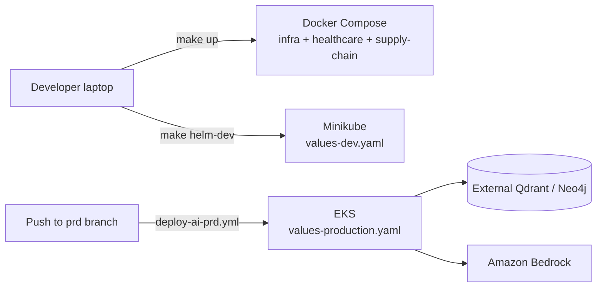

# 03 — Platform Blueprint

This document describes **how the platform is deployed**: the deployment modes, the compose stacks, the Helm chart, secrets, observability wiring and the port map.

For what the components do, see [Architecture](02_architecture.md). For data flows, see [Data Platform](04_data_platform.md). For day-2 operations, see the [Operation Runbook](08_operation_runbook.md).

## 1. Deployment modes

| Mode | Entry point | Use for | Data stores |
| --- | --- | --- | --- |
| Local compose | `make up`, `make up-hc`, `make up-sc` | Development and demos on one machine | Containers on `graphrag-net` |
| Minikube + Helm | `make helm-dev` | Rehearsing the Kubernetes deployment | In-cluster Kafka, Neo4j, Qdrant |
| Production compose | `infra/environments/production/docker-compose.ai.yml` | Single-host agent + web deployment | External Qdrant and Neo4j |
| EKS + Helm | `.github/workflows/deploy-ai-prd.yml` | Production | External Qdrant and Neo4j |


```mermaid
flowchart LR
    dev[Developer laptop] -->|make up| compose[Docker Compose<br/>infra + healthcare + supply-chain]
    dev -->|make helm-dev| mk[Minikube<br/>values-dev.yaml]
    prd[Push to prd branch] -->|deploy-ai-prd.yml| eks[EKS<br/>values-production.yaml]
    eks --> ext[(External Qdrant / Neo4j)]
    eks --> bedrock[Amazon Bedrock]
```

## 2. Local compose

### Stacks

The Makefile runs three compose projects on one external Docker network, `graphrag-net`, which `make up` creates and `make down` removes.

| Project | Compose file | Contents |
| --- | --- | --- |
| `infra` | `infra/compose/docker-compose.infra.yml` | Zookeeper, three Kafka brokers, Schema Registry, Conduktor (+ Postgres), Ollama, Prometheus, Blackbox exporter, Grafana, LocalStack 3.8.0, MLflow v2.21.3 |
| `healthcare` | `infra/compose/docker-compose.healthcare.yml` | `kafka-init`, Qdrant, Neo4j 5.26.2 + `neo4j-init`, Flink JobManager/TaskManager, `flink-app`, producer, `agent-service`, `provider-web` |
| `supplychain` | `infra/compose/docker-compose.supply-chain.yml` | `sc-kafka-init`, `qdrant-sc`, `neo4j-sc` + `neo4j-sc-init`, `sc-flink-*`, `sc-producer`, `sc-agent-service`, `sc-webapp` |

Common targets:

| Target | Effect |
| --- | --- |
| `make up` | Infra + both domains |
| `make up-hc` / `make up-sc` | Infra + one domain |
| `make build-hc` / `make build-sc` / `make build-all` | Build domain images |
| `make restart` / `make restart-sc` | Recreate one domain |
| `make down` | Stop everything and remove the network |
| `make clean` | Stop everything, remove volumes, prune Docker |
| `make fresh` | `clean`, `up`, then `pull-model` (Ollama `llama3.1`) |

### Startup order

Only the infra stack defines healthchecks (Schema Registry, LocalStack, MLflow). The domain overlays rely on `depends_on` conditions:

1. Kafka brokers start; `kafka-init` waits 30 seconds, then creates the domain topics, master-data topics and DLQs. Auto topic creation is disabled.
2. Neo4j starts; `neo4j-init` runs the bootstrap script and seed Cypher.
3. The producer starts after `kafka-init` completes successfully.
4. `flink-app` starts after `neo4j-init` and `kafka-init` complete successfully, then submits the PyFlink job to the JobManager.
5. `agent-service` starts after Qdrant and Neo4j; `provider-web` starts after `agent-service`.

The supply-chain stack follows the same order with `sc-` prefixed services.

### Kafka cluster

Three brokers, replication factor 3, `min.insync.replicas` 2, default 3 partitions. Containers use `kafka:29092`, `kafka2:29093`, `kafka3:29094`; the host uses `localhost:9092-9094`.

## 3. Kubernetes with Helm

### Chart layout

`infra/helm` is an umbrella chart with these subcharts:

| Subchart | Default | Dev | Production |
| --- | --- | --- | --- |
| `agent-service` | on | on, 1 replica, NodePort 30800, HPA off | on, 2 replicas, HPA 2–6 |
| `provider-web` | on | on, 1 replica, HPA off | on, 2 replicas, HPA 2–5 |
| `flink` | on | on, 1 TaskManager | on, 2 TaskManagers |
| `mlflow` | on | on, no persistence | on, 10Gi persistence |
| `kafka`, `neo4j`, `qdrant` | off | on | off (external services) |
| `conduktor`, `producer` | off | on | off |
| `ollama` | off | off | off |

Top-level templates: `namespace.yaml`, `networkpolicy.yaml` (enabled by default and in production, disabled in dev), `_helpers.tpl`.

Agent and web services are ClusterIP by default with CPU-based HPAs. The agent container runs as non-root.

### Minikube (dev)

`make helm-dev` runs `infra/environments/dev/setup-minikube.sh`:

1. Starts Minikube (`MINIKUBE_CPUS=4`, `MINIKUBE_MEMORY=16384`, `MINIKUBE_DRIVER=docker`).
2. Builds four images in the Minikube Docker daemon: agent-service, producer, Flink, provider-web.
3. Runs `helm upgrade --install healthcare-dev infra/helm -f infra/helm/values-dev.yaml -n healthcare-ai-dev --create-namespace`.
4. Waits for Kafka, Neo4j, Qdrant and agent-service pods.

Then `make helm-ports` forwards:

| Local URL | Service |
| --- | --- |
| `http://localhost:8000` | agent-service |
| `http://localhost:8088` | provider-web |
| `http://localhost:7474` | Neo4j |
| `http://localhost:6333/dashboard` | Qdrant |
| `http://localhost:9080` | Conduktor |

`make helm-ports-stop` kills the forwards; `make helm-dev-down` uninstalls the release.

### Production (EKS)

`deploy-ai-prd.yml` runs on push to `prd` (Helm, application, package or web changes) or manual dispatch. It assumes an AWS role, configures EKS access, runs `helm upgrade --install` with `values-production.yaml` plus secrets, waits for the agent and web rollouts, and prints pods and services. See [CI/CD Automation](07_cicd_automation.md).

Validate locally before pushing:

```bash
make helm-lint   # lint + template dev and production values
make helm-prd    # render production manifests
```

## 4. Production compose

For a single host, `infra/environments/production/` provides:

| File | Purpose |
| --- | --- |
| `docker-compose.ai.yml` | GHCR images for `agent-service` (8000) and `provider-web` (8088), `restart: unless-stopped` |
| `agent-service.env.example` | Template for Qdrant/Neo4j credentials, Bedrock tiers, MCP, policy and MLflow settings; sets `AGENT_ALLOW_ROLE_HEADER=false` |
| `docker-compose.monitoring.yml` | Blackbox exporter (9115), Prometheus (9090), Grafana (3000) |
| `monitoring/` | Production Prometheus and Blackbox configs |

## 5. Configuration and secrets

| Environment | Source of configuration | Secrets |
| --- | --- | --- |
| Local compose | Compose defaults + optional root `.env` (copy `.env.example`) | Development defaults such as `healthcare123`, `supplychain123`, `admin123`, `change_me` |
| Minikube | `values-dev.yaml` | Inline placeholder values; never reuse elsewhere |
| Production compose | `agent-service.env` | Kept out of git |
| EKS | `values-production.yaml` | `secrets: {}`; injected by an external secret manager at deploy time |

Rules:

- Never commit real credentials, tokens or production data.
- In production, set `AGENT_ALLOW_ROLE_HEADER=false` so callers cannot choose their own role.
- Override `CONDUKTOR_POSTGRES_PASSWORD`, `CONDUKTOR_ADMIN_PASSWORD` and `GRAFANA_ADMIN_PASSWORD` outside local development.

Embedding and LLM provider settings are covered in [Data Platform](04_data_platform.md#embeddings) and [AI Agents](05_ai_agents.md#llm-routing).

## 6. Observability deployment

| Component | Config | Notes |
| --- | --- | --- |
| Prometheus | `infra/observability/prometheus.yml` | 15s scrape; jobs `qdrant`, `agent_service`, `neo4j_probe`, `kafka_probe`, `flink_probe` |
| Alert rules | `infra/observability/prometheus-alerts.yml` | `Neo4jProbeDown`, `QdrantTargetDown`, `Neo4jProbeLatencyHigh`, `KafkaProbeDown`, `FlinkJobManagerProbeDown` |
| Blackbox exporter | `infra/observability/blackbox.yml` | `http_2xx` and `tcp_connect`, 5s timeout |
| Grafana | `infra/observability/grafana/` | Dashboards `healthcare-monitoring-overview` and `kafka-flink-service-health` |
| MLflow | compose `mlflow`, Helm `mlflow` | LangGraph and LLM traces; see [AI Agents](05_ai_agents.md#observability) |

## 7. Port map

| Stack | Service | Host port(s) |
| --- | --- | --- |
| Infra | Zookeeper | 2181 |
| Infra | Kafka brokers | 9092, 9093, 9094 |
| Infra | Schema Registry | 8081 |
| Infra | Conduktor | 8085 |
| Infra | Ollama | 11434 |
| Infra | Prometheus | 9090 |
| Infra | Blackbox exporter | 9115 |
| Infra | Grafana | 3000 |
| Infra | LocalStack | 4566, 4510–4559 |
| Infra | MLflow | 5000 |
| Healthcare | agent-service | 8000 |
| Healthcare | provider-web | 8088 |
| Healthcare | Neo4j | 7474 (HTTP), 7687 (Bolt) |
| Healthcare | Qdrant | 6333 (HTTP), 6334 (gRPC) |
| Healthcare | Flink UI | 8082 |
| Supply chain | sc-agent-service | 8001 |
| Supply chain | sc-webapp | 8089 |
| Supply chain | Neo4j | 7475 (HTTP), 7688 (Bolt) |
| Supply chain | Qdrant | 6335 (HTTP), 6336 (gRPC) |
| Supply chain | Flink UI | 8083 |

## Related

- [Architecture](02_architecture.md)
- [Data Platform](04_data_platform.md)
- [AI Agents](05_ai_agents.md)
- [CI/CD Automation](07_cicd_automation.md)
- [Operation Runbook](08_operation_runbook.md)
