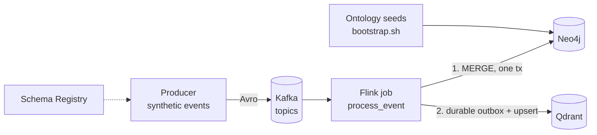

# 04 — Data Platform

This document covers the **ingest plane**: how events move from producers through
Kafka and Flink into Qdrant (vectors) and Neo4j (graph), how embeddings are computed,
and how the ontology is governed. The query side is in
[05 — AI Agents](05_ai_agents.md); deployment is in
[03 — Platform Blueprint](03_platform_blueprint.md).

The healthcare pipeline is described in full. The supply-chain pipeline follows the
same pattern; its differences are summarised at the end and detailed in
[09 — Supply-Chain Domain](09_supply_chain_domain.md).

## 1. Pipeline overview



| Component | Location |
| --- | --- |
| Producer | `domains/healthcare/data-pipelines/producer/` |
| Avro schemas | `domains/healthcare/data-pipelines/schemas/` |
| Flink job | `domains/healthcare/data-pipelines/flink-job/` |
| Shared ingest library | `packages/knowledge-core/src/knowledge_core/` |
| Ontology and seeds | `domains/healthcare/knowledge/` |

## 2. Kafka topics

The broker listens on `kafka:29092` inside the compose network. Topics are created by
the `kafka-init` service with 3 partitions and replication factor 3.

| Group | Topics |
| --- | --- |
| Transactional | `healthcare.ehr.events`, `healthcare.lab.results`, `healthcare.claims.events`, `healthcare.device.telemetry`, `healthcare.pharmacy.orders` |
| Reference (master data) | `healthcare.master.devices`, `healthcare.master.medications`, `healthcare.master.patients`, `healthcare.master.payers`, `healthcare.master.providers` |
| Dead letter | `healthcare.dlq.events` (1 partition) |

The DLQ topic is provisioned but the jobs do not yet publish to it; failed messages
are logged and retried (see [Failure handling](#failure-handling)).

### Neo4j-to-Qdrant replay coordination

Healthcare ingestion commits Neo4j first, then records the deterministic Qdrant
operation in a SQLite outbox before attempting the vector upsert. The default
database is `/var/lib/flink/qdrant-outbox.sqlite3`, configurable with
`QDRANT_OUTBOX_PATH`. This prevents a successful graph write from losing its
corresponding vector operation when Qdrant is unavailable.

The outbox provides idempotent event keys, SQLite WAL/concurrency protection,
leases for crashed workers, acknowledgement on successful upsert, and exponential
backoff on failure. Replayed writes use deterministic Qdrant point IDs and are safe
to repeat. The normal production backend is SQLite. A path ending in `.jsonl`
selects the legacy compatibility mode, which retains only failed operations and
does not provide SQLite lease or acknowledgement semantics.

Use `make topics` to list topics and `make shell-kafka` for a broker shell.

## 3. Event schema and producer

Transactional events use `medical_event.avsc`:

| Field | Type | Notes |
| --- | --- | --- |
| `event_id` | string | Globally unique; drives idempotency |
| `event_ts` | string | Event time (ISO 8601) |
| `source_system`, `source_type` | string | Provenance |
| `event_type` | string | E.g. `CLINICAL_NOTE`, `LAB_RESULT`, `MEDICATION_ORDER`, `VITAL_SIGN`, `CLAIM_STATUS` |
| `patient_id`, `encounter_id`, `provider_id` | nullable string | Entity keys |
| `payload_json` | string | Event-specific body |
| `schema_version` | string | Default `1.0.0` |

The producer generates realistic synthetic traffic: a hot subset of entities, late
events, corrections, correlated follow-ups, batch bursts and shift handoffs. It waits
for Schema Registry before publishing.

| Variable | Default | Purpose |
| --- | --- | --- |
| `EVENT_INTERVAL_SECONDS` | `1` | Tick interval |
| `TRANSACTION_EVENTS_PER_INTERVAL` | `3` | Transactional events per tick |
| `REFERENCE_EVENTS_PER_INTERVAL` | `3` | Master-data events per tick |
| `PATIENT_POOL_SIZE` / `PROVIDER_POOL_SIZE` / `DEVICE_POOL_SIZE` | `1000` / `200` / `400` | Entity pools |
| `HOT_PATIENT_POOL_SIZE` / `HOT_PROVIDER_POOL_SIZE` | `120` / `40` | Frequently-seen subset |
| `HOT_ENTITY_PROBABILITY` | `0.7` | Chance an event uses a hot entity |
| `LATE_EVENT_PROBABILITY` | `0.12` | Out-of-order event time |
| `CORRECTION_EVENT_PROBABILITY` | `0.06` | Corrections to prior events |
| `FOLLOWUP_CORRELATION_PROBABILITY` | `0.45` | Follow-ups on the same patient |
| `BATCH_BURST_PROBABILITY` / `BATCH_BURST_MULTIPLIER` | `0.3` / `3` | Bursty load |
| `SHIFT_HANDOFF_HOURS` | `7,15,23` | Hours with handoff spikes |
| `SCHEMA_REGISTRY_STARTUP_TIMEOUT_SECONDS` | `120` | Wait for Schema Registry |
| `SCHEMA_REGISTRY_RETRY_INTERVAL_SECONDS` | `3` | Poll interval while waiting |

## 4. Flink jobs

Two entry points share the same processor
(`app/pipeline_service.py`):

| Job | File | Consumer group | Delivery |
| --- | --- | --- | --- |
| Sync consumer | `healthcare_graph_rag_job.py` | `healthcare-graphrag-processor` | Manual commit after each message; `auto.offset.reset=earliest` |
| PyFlink streaming | `healthcare_graph_rag_pyflink_job.py` | `healthcare-graphrag-pyflink-<topic>` | Flink checkpoints; starts from earliest offsets |

The PyFlink job is the one submitted by compose:

```bash
sleep 35 && flink run -m flink-jobmanager:8081 -d -py /app/healthcare_graph_rag_pyflink_job.py
```

| Variable | Default |
| --- | --- |
| `KAFKA_BOOTSTRAP_SERVERS` | `kafka:29092` |
| `SCHEMA_REGISTRY_URL` | `http://schema-registry:8081` |
| `QDRANT_URL` / `QDRANT_COLLECTION` | `http://qdrant:6333` / `healthcare_events` |
| `NEO4J_URI` / `NEO4J_USER` | `bolt://neo4j:7687` / `neo4j` |
| `NEO4J_PASSWORD` | Set per environment (local compose default only) |
| `FLINK_KAFKA_GROUP_ID` | `healthcare-graphrag-pyflink` |
| `FLINK_CHECKPOINT_INTERVAL_MS` | `10000` |
| `FLINK_JOB_PARALLELISM` | `1` |

The image is built on Flink 1.20.5 with Python 3.11 and Java 17, and bakes the
embedding model into `/opt/hf-cache` (see [Embeddings](#embeddings)).

### Processing flow

Each transactional message goes through `process_event`:

1. Deserialize the Avro record.
2. Enrich it from cached reference (master) data.
3. Normalize codes against the ontology mappings and stamp `ontology_version`.
4. Build the `clinical_text` used for retrieval.
5. Choose an embedding domain with `domain_for_event_type` (clinical, claims or device).
6. Compute the vector with `stable_embedding(text, domain=domain)`.
7. Write to **Neo4j first**, in a single transaction (`MERGE` statements plus rule-derived edges).
8. Upsert the point into **Qdrant**.

Messages from reference topics go to `process_reference_event`, which updates master
nodes and the enrichment cache. Messages from unknown topics are skipped.

The `app/` package is split by responsibility: `normalization`, `ontology_loader`,
`reference_data`, `rules_engine`, `text_processing`, `graph_writes`, `storage`,
`pipeline_service` and `runner`.

### Idempotency and ordering

- Neo4j writes use `MERGE` on unique keys, so a replay does not duplicate nodes or edges.
- Qdrant point IDs are deterministic: the MD5 of `event_id` (`qdrant_point_id`).
- Writing Neo4j before Qdrant means a vector never points at a missing graph node.
  If the Qdrant write fails, the message is reprocessed and both writes converge.

### Failure handling

- The sync consumer (`knowledge_core.runner.run_consumer_loop`) commits only after a
  successful write. On failure it logs the event key, sleeps one second and continues;
  the uncommitted offset is redelivered after a restart or rebalance.
- The PyFlink job relies on checkpointing every 10 seconds; on failure Flink restarts
  from the last checkpoint and replays, which is safe because writes are idempotent.

## 5. Qdrant

One collection per domain (`healthcare_events`, `supplychain_events`), sized from the
embedding dimension, with cosine distance. `build_qdrant_payload` in
`knowledge_core.storage` produces this payload:

| Field | Purpose |
| --- | --- |
| `event_id`, `event_ts`, `event_type`, `event_family` | Identity and time |
| `source_system`, `source_type` | Provenance |
| `patient_id` (healthcare) / `entity_id` (supply chain) | Filter keys |
| `enriched`, `reference_hit_count` | Enrichment quality |
| `ontology_version` | Ontology used to normalize the event |
| `evidence_class` | Always `vector_event_text` |
| `trust_level`, `phi_class`, `retention_class` | Governance labels used by response policy |
| `text` | The embedded text |
| `payload` | Normalized event body |

## 6. Neo4j knowledge graph

### Entities

Patient, Encounter, ClinicalEvent, Observation, Condition, Symptom, Medication,
MedicationOrder, Device, DeviceReading, Claim, Procedure, Provider, Payer,
AdverseEvent, AdverseOutcome, ICD10Code and SourceSystem.

### Relationships

| Area | Relationship types |
| --- | --- |
| Context | `ABOUT_PATIENT`, `FROM_SOURCE`, `DURING_ENCOUNTER` |
| Clinical | `HAS_CONDITION`, `HAS_SYMPTOM`, `HAS_OBSERVATION`, `MAY_INDICATE`, `CODED_AS` |
| Medication | `HAS_MEDICATION_ORDER`, `ORDERS_MEDICATION`, `HAS_KNOWN_REACTION`, `CONTRAINDICATED_FOR`, `INTERACTS_WITH` |
| Safety | `REPORTED_ADVERSE_REACTION`, `ASSOCIATED_WITH_MEDICATION`, `TRIGGERED_BY_EVENT` |
| Devices | `HAS_DEVICE_READING`, `MEASURED_BY` |
| Claims | `HAS_CLAIM`, `FOR_PROCEDURE`, `SUBMITTED_TO`, `RESULTED_IN` |
| Master data | `MANAGED_BY`, `SEEN_BY`, `REGISTERED_DEVICE`, `KNOWN_MEDICATION`, `COVERED_BY` |

### Seeds and bootstrap

`domains/healthcare/knowledge/graph-seeds/` contains:

- `init.cypher` — uniqueness constraints and indexes.
- `generated_ontology_seeds.cypher` — reference knowledge (drug interactions,
  contraindications) generated from the ontology.
- `bootstrap.sh` — waits for Neo4j, applies both files, then verifies that the
  `CONTRAINDICATED_FOR` and `INTERACTS_WITH` edge counts are non-zero. It exits non-zero
  if verification fails, so a broken seed fails the stack start rather than silently
  degrading medication-safety answers.

## 7. Ontology governance

The ontology is the contract between ingest and the agents. It lives in
`domains/healthcare/knowledge/ontology/`:

| File | Content |
| --- | --- |
| `entities.yaml` | Entity definitions (version, status, owner header) |
| `relationships.yaml` | Allowed relationship types and endpoints |
| `vocabularies.yaml` | Controlled vocabularies |
| `provenance.yaml` | Provenance and trust classes |
| `graph_seeds.yaml` | Source for the generated seed Cypher |
| `mappings/*_mappings.yaml` | Code mappings: cpt, device, icd10, lab, medication, patient, payer, provider |
| `rules/*.yaml` | Derivation rules: `claims_outcomes`, `drug_safety`, `lab_signals` |

Changes follow this workflow:

1. Edit the YAML files (CODEOWNERS requires review from the ontology owner).
2. Regenerate seeds with `generate_ontology_seed_cypher`.
3. Run `make validate-ontology`, which checks structure, terminology coverage and drift
   between the YAML and the generated Cypher.
4. CI repeats these checks and runs a Neo4j bootstrap smoke test
   (see [07 — CI/CD Automation](07_cicd_automation.md)).

See [ADR-0003](adrs/0003-ontology-governance-and-seed-generation.md).

## Embeddings

Embeddings are computed by one function, `knowledge_core.embedding.stable_embedding`,
which both the Flink jobs (ingest) and the agent services (query) import. Using the
same function and configuration on both sides is a hard requirement: vectors from
different models are not comparable.

| Setting | Dev (default) | Production |
| --- | --- | --- |
| `EMBEDDING_PROVIDER` | `local` | `databricks` |
| Model | `sentence-transformers/all-MiniLM-L6-v2`, in-process | `databricks-gte-large-en` serving endpoint |
| Dimensions | 384 | 1024 |
| Token window | 256 | 8192 |

| Variable | Purpose |
| --- | --- |
| `EMBEDDING_PROVIDER` | `local` or `databricks`; anything else fails at import |
| `EMBEDDING_MODEL` | Local model name |
| `EMBEDDING_MODEL_CLINICAL` / `_CLAIMS` / `_DEVICE` | Optional per-domain local model override |
| `DATABRICKS_EMBEDDING_ENDPOINT` | Serving endpoint (default `databricks-gte-large-en`) |
| `DATABRICKS_HOST`, `DATABRICKS_TOKEN` | Required for the Databricks provider; inject from a secret store |
| `EMBEDDING_DIM` | Overrides the provider default dimension |
| `EMBEDDING_REQUIRE_MODEL` | When true, fail instead of falling back |
| `EMBEDDING_TIMEOUT_SECONDS` | Databricks request timeout (default 30) |

Behaviour:

- Event types map to a domain: `VITAL_SIGN` → device, `CLAIM_STATUS` → claims,
  everything else → clinical. Domains only matter if per-domain models are configured.
- Local vectors are fitted to the configured dimension and L2-normalized.
- Databricks responses are L2-normalized and cached in-process (LRU, 4096 entries).
  A dimension mismatch raises an error instead of truncating.
- If the model is unavailable and `EMBEDDING_REQUIRE_MODEL` is false, a deterministic
  MD5 bag-of-words vector is used. This is for unit tests only; the Flink and agent
  images set `EMBEDDING_REQUIRE_MODEL=true` and bake MiniLM into `/opt/hf-cache`.

Switching provider or model changes the vector space. To switch:

1. Set the new provider variables on **both** the Flink job and the agent service.
2. Delete and recreate the Qdrant collections with the new dimension.
3. Replay the Kafka topics from the earliest offset (new consumer group or reset offsets).

For a Qdrant-only outage, restore Qdrant and restart or allow the Flink job to
replay the SQLite outbox. Do not delete the outbox database during recovery;
deleting it discards pending graph-to-vector reconciliation work.

## 8. Supply-chain pipeline

The supply-chain pipeline reuses `knowledge-core` and the same job structure. The
differences:

| Aspect | Supply chain |
| --- | --- |
| Topics | `supplychain.purchase.orders`, `.shipment.updates`, `.quality.results`, `.disruption.alerts`, `.inventory.levels`; reference `supplychain.master.{suppliers,parts,facilities}` |
| Schema | `supply_chain_event.avsc` with nullable `entity_id`, `facility_id`, `supplier_id` |
| Consumer groups | `supplychain-graphrag-processor` (sync), `supplychain-graphrag-pyflink` (PyFlink) |
| Qdrant | `supplychain_events`, filter key `entity_id` |
| Graph | Supplier, Part, Facility, Shipment, PurchaseOrder, QualityInspection, DisruptionEvent, RiskSignal |
| DLQ | None |

Details are in [09 — Supply-Chain Domain](09_supply_chain_domain.md).

## Related

- [02 — Architecture](02_architecture.md)
- [05 — AI Agents](05_ai_agents.md)
- [08 — Operation Runbook](08_operation_runbook.md)
- [ADR-0001 Dual persistence](adrs/0001-dual-persistence-qdrant-neo4j.md)
- [ADR-0002 Qdrant streaming vector store](adrs/0002-qdrant-streaming-vector-store.md)
