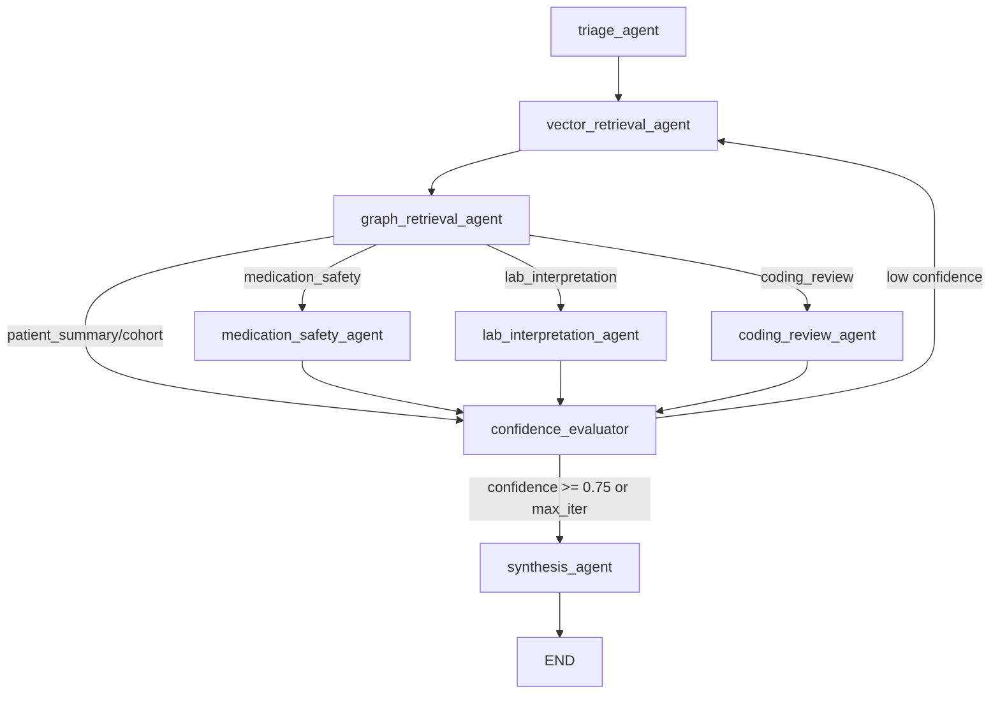

# MCP Layer Design (Minimal)

## Purpose

This document defines a minimal Model Context Protocol (MCP) layer so AI clients can call a stable healthcare toolset without coupling to internal service details.

Goals:

- Reuse existing FastAPI, Qdrant, Neo4j, and Kafka capabilities.
- Expose a small, auditable, provider-agnostic tool surface.
- Start local-first and evolve to production controls with minimal rework.

## ADR References

- [ADR-0005: Embed FastMCP in rag-api](adrs/0005-embed-fastmcp-in-rag-api.md)
- [ADR-0004: Local-first LLM with provider routing](adrs/0004-local-first-llm-provider-routing.md)

Skill composition roadmap strategy is described in [03_target_architecture.md](03_target_architecture.md), with actionable backlog sequencing in [12_future_improvements.md](12_future_improvements.md).

## Architecture Placement

```text
AI Client (Copilot, Claude Desktop, custom agent)
  -> Embedded MCP endpoint at /mcp (domains/healthcare/agents/app.py)
  -> domain/ modules:
     - retrieval.py (Neo4j graph_search + Qdrant vector_search)
     - synthesis.py (LLM prompt + generation)
     - response_policy.py (sanitization + budget)
     - harness.py (retry, guards, prompt registry)
  -> langgraph_agents/ (optional multi-agent routing)
  -> External stores:
     - Neo4j (data-platform/healthcare/neo4j)
     - Qdrant (data-platform/healthcare via flink-app)
     - Ollama (infra)
```

MCP is embedded in the healthcare agents service (ADR-0005). The standalone mcp-server scaffold has been removed.

## 1) Tool Inventory

Use a minimal toolset while covering high-value workflows.

| Tool Name | Purpose | Backing Service |
| --- | --- | --- |
| `skills_plan_get` | Resolve Business Goals -> Agent -> Skills -> Context -> Ontology -> MCP -> Tools plan | rag-api skills layer |
| `patient_context_get` | Retrieve patient-centric graph context summary | Neo4j via rag-api or direct adapter |
| `vector_evidence_search` | Retrieve top-k vector evidence for question/patient | Qdrant via rag-api or direct adapter |
| `graphrag_answer_generate` | Generate grounded answer from vector + graph evidence | rag-api |
| `risk_summary_generate` | Generate concise risk summary for one patient | rag-api + prompt policy |
| `timeline_explain` | Explain patient progression over a bounded time window | rag-api |
| `medication_risk_assess` | Assess contraindications, interactions, and adverse reaction risks | rag-api + Neo4j context |
| `coding_gap_detect` | Surface coding and claims consistency gaps | rag-api + Neo4j/Qdrant evidence |
| `cohort_risk_summary` | Summarize cross-patient risk signals for cohort triage | rag-api + Qdrant/Neo4j |
| `evidence_bundle_export` | Return traceable evidence bundle for audit/review | rag-api aggregation |

Notes:

- Keep tool names stable; evolve behavior via versioned schemas.
- Add async tools optionally when needed (`ai_task_submit`, `ai_task_status_get`).
- Skill-composed tool expansion roadmap is documented in [05_ai_agents.md](05_ai_agents.md), [03_target_architecture.md](03_target_architecture.md), and [12_future_improvements.md](12_future_improvements.md).

## 2) Request/Response Schemas

Minimal JSON Schema contracts for v1.

### `patient_context_get`

Request schema:

```json
{
  "$schema": "https://json-schema.org/draft/2020-12/schema",
  "type": "object",
  "required": ["patient_id"],
  "properties": {
    "patient_id": { "type": "string", "minLength": 1 },
    "include_claims": { "type": "boolean", "default": true },
    "include_interactions": { "type": "boolean", "default": true }
  },
  "additionalProperties": false
}
```

Response schema:

```json
{
  "$schema": "https://json-schema.org/draft/2020-12/schema",
  "type": "object",
  "required": ["patient_id", "graph_context", "retrieved_at"],
  "properties": {
    "patient_id": { "type": "string" },
    "graph_context": { "type": "array", "items": { "type": "object" } },
    "retrieved_at": { "type": "string", "format": "date-time" },
    "trace_id": { "type": "string" }
  },
  "additionalProperties": false
}
```

### `vector_evidence_search`

Request schema:

```json
{
  "$schema": "https://json-schema.org/draft/2020-12/schema",
  "type": "object",
  "required": ["question"],
  "properties": {
    "question": { "type": "string", "minLength": 3 },
    "patient_id": { "type": ["string", "null"] },
    "top_k": { "type": "integer", "minimum": 1, "maximum": 20, "default": 5 }
  },
  "additionalProperties": false
}
```

Response schema:

```json
{
  "$schema": "https://json-schema.org/draft/2020-12/schema",
  "type": "object",
  "required": ["question", "vector_context", "retrieved_at"],
  "properties": {
    "question": { "type": "string" },
    "vector_context": {
      "type": "array",
      "items": {
        "type": "object",
        "required": ["event_id", "score"],
        "properties": {
          "event_id": { "type": "string" },
          "patient_id": { "type": ["string", "null"] },
          "event_type": { "type": ["string", "null"] },
          "score": { "type": "number" },
          "text": { "type": ["string", "null"] }
        },
        "additionalProperties": true
      }
    },
    "retrieved_at": { "type": "string", "format": "date-time" },
    "trace_id": { "type": "string" }
  },
  "additionalProperties": false
}
```

### `graphrag_answer_generate`

Request schema:

```json
{
  "$schema": "https://json-schema.org/draft/2020-12/schema",
  "type": "object",
  "required": ["question"],
  "properties": {
    "question": { "type": "string", "minLength": 3 },
    "patient_id": { "type": ["string", "null"] },
    "response_style": { "type": "string", "enum": ["concise", "clinical", "audit"] }
  },
  "additionalProperties": false
}
```

Response schema:

```json
{
  "$schema": "https://json-schema.org/draft/2020-12/schema",
  "type": "object",
  "required": ["answer", "vector_context", "graph_context", "retrieved_at"],
  "properties": {
    "answer": { "type": "string" },
    "patients": { "type": "array", "items": { "type": "string" } },
    "vector_context": { "type": "array", "items": { "type": "object" } },
    "graph_context": { "type": "array", "items": { "type": "object" } },
    "retrieved_at": { "type": "string", "format": "date-time" },
    "trace_id": { "type": "string" }
  },
  "additionalProperties": false
}
```

### `risk_summary_generate`

Request schema:

```json
{
  "$schema": "https://json-schema.org/draft/2020-12/schema",
  "type": "object",
  "required": ["patient_id"],
  "properties": {
    "patient_id": { "type": "string", "minLength": 1 },
    "time_window_hours": { "type": "integer", "minimum": 1, "maximum": 720, "default": 72 }
  },
  "additionalProperties": false
}
```

Response schema:

```json
{
  "$schema": "https://json-schema.org/draft/2020-12/schema",
  "type": "object",
  "required": ["patient_id", "summary", "risk_signals", "retrieved_at"],
  "properties": {
    "patient_id": { "type": "string" },
    "summary": { "type": "string" },
    "risk_signals": { "type": "array", "items": { "type": "string" } },
    "retrieved_at": { "type": "string", "format": "date-time" },
    "trace_id": { "type": "string" }
  },
  "additionalProperties": false
}
```

### `evidence_bundle_export`

Request schema:

```json
{
  "$schema": "https://json-schema.org/draft/2020-12/schema",
  "type": "object",
  "required": ["question"],
  "properties": {
    "question": { "type": "string", "minLength": 3 },
    "patient_id": { "type": ["string", "null"] },
    "include_raw_payload": { "type": "boolean", "default": false }
  },
  "additionalProperties": false
}
```

### `skills_plan_get`

Request schema:

```json
{
  "$schema": "https://json-schema.org/draft/2020-12/schema",
  "type": "object",
  "required": ["business_goal"],
  "properties": {
    "business_goal": { "type": "string", "minLength": 3 },
    "agent": { "type": ["string", "null"] }
  },
  "additionalProperties": false
}
```

Response schema:

```json
{
  "$schema": "https://json-schema.org/draft/2020-12/schema",
  "type": "object",
  "required": [
    "flow",
    "business_goal",
    "agent",
    "skills",
    "context_requirements",
    "ontology_dependencies",
    "mcp_tools",
    "runtime_tools",
    "retrieved_at"
  ],
  "properties": {
    "flow": { "type": "array", "items": { "type": "string" } },
    "business_goal": { "type": "string" },
    "goal_description": { "type": "string" },
    "agent": { "type": "string" },
    "skills": { "type": "array", "items": { "type": "object" } },
    "context_requirements": { "type": "array", "items": { "type": "string" } },
    "ontology_dependencies": { "type": "array", "items": { "type": "string" } },
    "mcp_tools": { "type": "array", "items": { "type": "string" } },
    "runtime_tools": { "type": "array", "items": { "type": "string" } },
    "retrieved_at": { "type": "string", "format": "date-time" },
    "trace_id": { "type": "string" }
  },
  "additionalProperties": false
}
```

Response schema:

```json
{
  "$schema": "https://json-schema.org/draft/2020-12/schema",
  "type": "object",
  "required": ["question", "vector_context", "graph_context", "answer", "retrieved_at"],
  "properties": {
    "question": { "type": "string" },
    "patients": { "type": "array", "items": { "type": "string" } },
    "vector_context": { "type": "array", "items": { "type": "object" } },
    "graph_context": { "type": "array", "items": { "type": "object" } },
    "answer": { "type": "string" },
    "retrieved_at": { "type": "string", "format": "date-time" },
    "trace_id": { "type": "string" },
    "guardrails": {
      "type": "object",
      "properties": {
        "evidence_text_redacted": { "type": "boolean" },
        "evidence_access_level": { "type": "string", "enum": ["none", "bounded"] },
        "graph_access_level": { "type": "string", "enum": ["standard", "broader"] },
        "raw_payload_requested": { "type": "boolean" },
        "raw_payload_returned": { "type": "boolean" },
        "response_truncated": { "type": "boolean" }
      }
    }
  },
  "additionalProperties": false
}
```

## 3) Auth and Audit Model

Minimal model that runs locally and scales to production.

### AuthN/AuthZ

Local demo (embedded mode):

- Run without bearer-token enforcement by default for local simplicity.
- Enforce role-based authorization through a tool policy in embedded rag-api for both `/query` and MCP tool entrypoints.

Optional standalone mode:

- Static API token in MCP server config.
- Optional allowlist of tool names per token.

Production:

- Service-to-service auth with OAuth2 client credentials or workload identity.
- Tool-level authorization policy:
  - `read_only`: patient_context_get, vector_evidence_search
  - `generation`: query, graphrag_answer_generate, risk_summary_generate
  - `export`: evidence_bundle_export
- Environment-scoped policies (`dev`, `stage`, `prod`).

### Audit

Log one structured audit event per tool call:

- `timestamp`
- `trace_id`
- `tool_name`
- `caller_id` (service principal or token id)
- `input_hash` (SHA-256 of normalized request)
- `patient_scope` (explicit IDs or `cohort`)
- `outcome` (`success` or `error`)
- `latency_ms`
- `response_size_bytes`

Do not log raw PHI payloads. Prefer hashes, IDs, and minimal metadata.

### Data Protection Controls

- Redact or tokenize sensitive fields before returning tool output when policy requires.
- Return guardrails metadata that records evidence-access mode and response truncation state.
- Enforce max response sizes and timeouts per tool.
- Add per-tool rate and burst limits.

## 4) Rollout Stages: Local Demo to Production

### Stage 0: Local Design and Contract Freeze

1. Finalize tool contracts and JSON schemas in this document.
2. MCP tool surface is implemented in the agents service over the shared query orchestration.
3. Contract tests with static fixtures and CI validation are in place.

Exit criteria:

- All tool schemas validated.
- Basic happy-path tests pass locally.

Current status:

- Completed in current implementation (embedded MCP in the agents service with 10 tools).

### Stage 1: Local Demo Integration

1. Validate initialize handshake against `http://localhost:8000/mcp`.
2. Keep non-protocol diagnostics available at `/mcp/health`.
3. Validate from at least one MCP client.

Exit criteria:

- End-to-end calls from MCP client succeed.
- Trace IDs link MCP calls to API logs.

Current status:

- Completed for local stack (`/mcp` and `/mcp/health` active, smoke test script present).

### Stage 2: Staging Hardening

1. Add centralized auth (service identity).
2. Add policy gates per tool and environment.
3. Add SLO dashboards (latency, error rate, tool call volume).
4. Add resilience controls (timeouts, retries, circuit breaker).

Exit criteria:

- Security review passed.
- SLO monitoring and alerts active.

### Stage 3: Production Launch

1. Enable production identity and secret management.
2. Enable audited tool access with retention policy.
3. Roll out in canary mode to selected clients.
4. Expand tool set only after stability is proven.

Exit criteria:

- Stable error budget.
- Audit completeness verified.
- Operational runbook published.

## Current Implementation Note

The embedded MCP layer in `domains/healthcare/agents/app.py` ships ten tools and shares the same retrieval + guardrail core used by `POST /query`.

When LangGraph mode is enabled (`RAG_API_LANGGRAPH_ENABLED=true`), MCP tool calls route through the multi-agent StateGraph with specialist agents for medication safety, lab interpretation, and coding review.

When MLflow tracing is enabled (`MLFLOW_TRACKING_URI`), every MCP tool execution is traced as a nested span hierarchy visible in the MLflow Tracing UI. Trace IDs from the audit log can be correlated with MLflow spans for end-to-end observability.
# Skills Layer

## Purpose

This project now includes an explicit Skills layer that operationalizes the flow:

Business Goals -> Agent -> Skills -> Context -> Ontology -> MCP -> Tools

The standardization and CI validation policy for this layer is formalized in [ADR-0006](adrs/0006-skills-layer-standardization-and-validation.md).

The layer is runtime-backed (not documentation-only):

- Skill catalog and goal mappings are defined in [agents/config/skills_layer.json](../domains/healthcare/agents/config/skills_layer.json).
- Resolution logic is implemented in [agents/skills_layer.py](../domains/healthcare/agents/skills_layer.py).
- LangGraph multi-agent orchestration maps skills to specialized agent nodes in [agents/langgraph_agents/agents.py](../domains/healthcare/agents/langgraph_agents/agents.py).
- Runtime access is exposed through:
  - REST: POST /skills/plan
  - MCP tool: skills_plan_get

## Layer Model

### 1) Business Goals

Business goals are top-level outcomes (for example, clinical triage, medication safety review, claims denial prevention).

Each goal defines:

- description
- default_agent
- ordered list of skill IDs

### 2) Agent

Agent identity is a planner/runtime persona that orchestrates the skill sequence for a goal.

- Default agent comes from goal configuration.
- Caller can override via optional agent field in skills_plan_get.
- In LangGraph mode, the triage agent classifies requests and routes to specialist agents (`medication_safety_agent`, `lab_interpretation_agent`, `coding_review_agent`) based on request type.

### 3) Skills

Each skill describes a reusable unit of capability:

- context_requirements
- ontology_dependencies
- mcp_tools
- runtime_tools

### 4) Context and Ontology

The resolver aggregates:

- union of required context fields
- union of ontology dependencies

This makes prerequisites explicit before tool execution.

### 5) MCP and Tools

The resolver emits:

- mcp_tools: MCP tools expected to be called
- runtime_tools: underlying system tools/services (neo4j, qdrant, rag_api, ollama)

## API Contract

### REST

POST /skills/plan

Request:

```json
{
  "business_goal": "medication_safety_review",
  "agent": "medication_safety_agent"
}
```

Response includes:

- flow
- business_goal
- agent
- skills
- context_requirements
- ontology_dependencies
- mcp_tools
- runtime_tools
- retrieved_at
- trace_id

### MCP

Tool: skills_plan_get

Arguments:

- business_goal (required)
- agent (optional)

## Role and Policy

skills_plan_get is authorized in read_only role via [agents/config/tool_policies.json](../domains/healthcare/agents/config/tool_policies.json).

## Validation

Contracts are tested in [agents/tests/test_contracts.py](../domains/healthcare/agents/tests/test_contracts.py), including:

- successful plan generation for known business goal
- deterministic flow shape and tool outputs
- proper error handling for unknown goals

Agent Skills package compliance is enforced with:

- generator: [domains/healthcare/scripts/generate_agent_skills.py](../domains/healthcare/scripts/generate_agent_skills.py)
- validator: [domains/healthcare/scripts/validate_agent_skills.py](../domains/healthcare/scripts/validate_agent_skills.py)
- shared library: [scripts/lib/skill_generator.py](../scripts/lib/skill_generator.py), [scripts/lib/skill_validator.py](../scripts/lib/skill_validator.py)

CI also includes an optional upstream validation pass using `skills-ref validate`.
The workflow behavior is:

- use `skills-ref` directly when already present on the runner
- otherwise attempt a best-effort on-the-fly install (`python -m pip install --user skills-ref`)
- if install still fails, log a skip message and continue without failing the workflow

Run locally:

```bash
python domains/healthcare/scripts/generate_agent_skills.py
python domains/healthcare/scripts/generate_agent_skills.py --check
python domains/healthcare/scripts/validate_agent_skills.py
```

For supply-chain:

```bash
python domains/supply-chain/scripts/generate_agent_skills.py
python domains/supply-chain/scripts/generate_agent_skills.py --check
python domains/supply-chain/scripts/validate_agent_skills.py
```

Generated skill packages are stored under [healthcare/skills](../domains/healthcare/skills) and [supply-chain/skills](../domains/supply-chain/skills) and include one `SKILL.md` per skill folder plus supporting references.
# ReAct Controller Specification

## Purpose

This specification defines a concrete ReAct-style controller for the current GraphRAG runtime.

Note: The ReAct controller is one of three query orchestration modes. See [05_ai_agents.md](05_ai_agents.md) for the comparison between single-pass, ReAct, and LangGraph multi-agent modes. The LangGraph multi-agent mode provides a more capable alternative with specialist agents and MLflow tracing.

Design intent:

- keep existing planner, retrieval, and guardrails behavior,
- add an explicit iterative Reason -> Act -> Observe loop,
- keep all outputs policy-shaped and auditable,
- make loop behavior testable with deterministic unit tests.

## Scope

In scope:

- request-time controller state schema,
- loop execution pseudocode,
- stop and recovery criteria,
- test plan mapped to existing test modules.

Out of scope (initial version):

- cross-request long-term memory,
- autonomous background workflows,
- major changes to MCP tool contracts.

## Current File Mapping

Primary implementation and integration touchpoints:

- `domains/healthcare/agents/app.py`
  - request handling and `POST /query`
  - composition root: settings, clients, audit logging, tool metrics
- `domains/healthcare/agents/domain/retrieval.py`
  - embedding, vector search, graph search (Cypher query)
- `domains/healthcare/agents/domain/synthesis.py`
  - prompt construction and LLM synthesis
- `domains/healthcare/agents/domain/response_policy.py`
  - truncation, sanitization, budget enforcement, confidence estimation
- `domains/healthcare/agents/domain/planner.py`
  - request classification and retrieval plan selection
- `domains/healthcare/agents/domain/evidence.py`
  - deterministic ranking for vector and graph contexts
- `domains/healthcare/agents/skills_layer.py`
  - business goal to skill/tool resolution
- `domains/healthcare/agents/config/tool_policies.json`
  - role to tool authorization policy
- `domains/healthcare/agents/tests/test_contracts.py`
  - API and tool contract, guardrail, and policy tests
- `domains/healthcare/agents/tests/test_planner_evaluation.py`
  - planner fixture-driven route/plan assertions
- `domains/healthcare/agents/tests/test_planner_edge_cases.py`
  - deterministic planner/ranking edge assertions

Implemented files:

- `domains/healthcare/agents/domain/react_controller.py` — ReAct loop state and execution logic
- `domains/healthcare/agents/tests/test_react_controller.py` — deterministic loop tests

Not yet implemented from this spec:

- Policy-aware action selection (current implementation always uses `vector_and_graph_retrieve`)
- Observation character budget (`RAG_API_REACT_OBSERVATION_CHAR_BUDGET`)
- Action authorization via `_authorize` within the loop
- Retry with downgraded inputs on retrieval failure
- Detailed observation objects and plan history in state
- ReAct-specific Prometheus metrics and audit fields

The LangGraph multi-agent mode (ADR-0007) provides the richer specialist routing that the Phase 2 ReAct design proposed. See [05_ai_agents.md](05_ai_agents.md) for details.

## Runtime Configuration

Environment settings in `domains/healthcare/agents/app.py` `Settings`:

- `RAG_API_REACT_ENABLED` (default: `false`)
- `RAG_API_REACT_MAX_ITERS` (default: `3`, min: `1`, max: `6`)
- `RAG_API_REACT_MIN_CONFIDENCE` (default: `0.75`, range: `0.0-1.0`)
- `RAG_API_REACT_MAX_NO_PROGRESS_STEPS` (default: `1`)
- `RAG_API_REACT_OBSERVATION_CHAR_BUDGET` (default: `1200`)

Design rule: if `RAG_API_REACT_ENABLED=false`, retain current single-pass behavior.

## State Schema

State is request-scoped only and should not be persisted as mutable memory across requests.

```json
{
  "trace_id": "uuid",
  "started_at": "ISO-8601",
  "caller_role": "generation|read_only|export",
  "question": "string",
  "patient_id": "string|null",
  "request_type": "patient_summary|medication_safety|lab_interpretation|cohort_triage|...",
  "iteration": 0,
  "max_iterations": 3,
  "status": "running|completed|stopped|failed",
  "final_reason": "string|null",
  "confidence": 0.0,
  "no_progress_count": 0,
  "seen_event_ids": [],
  "seen_patient_ids": [],
  "plan_history": [
    {
      "iteration": 0,
      "plan_name": "string",
      "reason": "string",
      "top_k": 5,
      "query_text": "string"
    }
  ],
  "steps": [
    {
      "iteration": 0,
      "thought": "short deterministic rationale",
      "selected_action": "vector_evidence_search|patient_context_get|graphrag_answer_generate|...",
      "action_input": {
        "question": "string",
        "patient_id": "string|null",
        "top_k": 5
      },
      "observation": {
        "vector_hits": 0,
        "graph_patients": 0,
        "new_event_ids": 0,
        "new_patient_ids": 0,
        "error": "string|null"
      },
      "confidence_after": 0.0,
      "stop_candidate": false,
      "stop_reason": "string|null"
    }
  ],
  "aggregated_context": {
    "vector_context": [],
    "graph_context": []
  },
  "guardrails": {
    "evidence_text_redacted": true,
    "evidence_access_level": "none|bounded",
    "graph_access_level": "standard|broader",
    "max_context_items": 5,
    "max_response_bytes": 50000,
    "response_truncated": false,
    "raw_payload_returned": false
  }
}
```

### Notes on schema fields

- `thought` is deterministic and short. Do not store chain-of-thought style private reasoning.
- `selected_action` must be authorized by current role policy before execution.
- `aggregated_context` remains subject to existing response shaping and byte-budget trimming.

## Action Set and Role Constraints

Initial action set should reuse existing runtime call paths:

- `vector_evidence_search` -> calls `vector_context` (+ ranking)
- `patient_context_get` -> calls `graph_context` (+ ranking)
- `graphrag_answer_generate` -> calls synthesis over accumulated evidence
- `skills_plan_get` (optional for business-goal routed flows)

Role policy source of truth remains `domains/healthcare/agents/config/tool_policies.json`.

If an action is not allowed for role:

- record observation error `unauthorized_action`,
- increment `no_progress_count`,
- select next allowed action in same iteration if available,
- otherwise stop with `policy_blocked`.

## Loop Pseudocode

```python
def run_query_react(question: str, patient_id: str | None, caller_role: str) -> dict:
    state = init_state(question, patient_id, caller_role)

    while state.status == "running" and state.iteration < state.max_iterations:
        # Reason
        request_type = classify_request_type(question, patient_id)
        plan = select_retrieval_plan(
            request_type=request_type,
            question=derive_query_text(question, state),
            patient_id=patient_id,
            max_top_k=settings.max_context_items,
        )
        state.plan_history.append(plan_to_record(plan, state.iteration))

        # Act selection (deterministic policy)
        action = choose_action(plan, state)
        if not is_action_authorized(action, caller_role):
            record_policy_block(state, action)
            if should_stop(state):
                break
            continue

        # Act
        result = execute_action(action, plan, question, patient_id, state)

        # Observe
        obs = summarize_observation(result, state)
        append_step(state, action, plan, obs)

        # Aggregate evidence
        merge_context(state.aggregated_context, result)

        # Evaluate confidence/progress
        state.confidence = estimate_confidence(state, obs)
        if obs.new_event_ids == 0 and obs.new_patient_ids == 0:
            state.no_progress_count += 1
        else:
            state.no_progress_count = 0

        # Stop checks
        reason = evaluate_stop_reason(state, obs)
        if reason is not None:
            state.status = "completed"
            state.final_reason = reason
            break

        state.iteration += 1

    if state.status == "running":
        state.status = "stopped"
        state.final_reason = "max_iterations_reached"

    answer = synthesize_answer(
        question=question,
        vector_ctx=state.aggregated_context["vector_context"],
        graph_ctx=state.aggregated_context["graph_context"],
    )

    payload = build_response_payload(state, answer)
    payload = apply_existing_guardrails_and_budget(payload)
    write_audit_event(payload, state)
    return payload
```

### Deterministic choose_action policy (v1)

1. If request type is cohort and no graph context yet -> `patient_context_get`.
2. If no vector evidence yet -> `vector_evidence_search`.
3. If medication safety request and graph context lacks medications/interactions -> `patient_context_get`.
4. If confidence >= threshold and both evidence channels non-empty -> `graphrag_answer_generate`.
5. Otherwise alternate between vector and graph action that produced new evidence last iteration.

## Stop Criteria

Stop checks are evaluated after every observation and before next iteration.

Primary stop reasons:

- `confidence_reached`: `confidence >= RAG_API_REACT_MIN_CONFIDENCE` and both evidence channels non-empty.
- `max_iterations_reached`: `iteration >= RAG_API_REACT_MAX_ITERS`.
- `no_progress_limit`: `no_progress_count > RAG_API_REACT_MAX_NO_PROGRESS_STEPS`.
- `policy_blocked`: no authorized action remains for role.
- `tool_error_budget_exhausted`: repeated action execution errors in same request.
- `response_budget_guard`: predicted response size would exceed `RAG_API_MAX_RESPONSE_BYTES` unless stopped.

Secondary fail-safe behavior:

- On transient action errors, retry once with downgraded action inputs (`top_k` reduced).
- On repeated error, switch to alternate evidence source action.
- If all actions fail, return bounded response with explicit guardrail metadata and `final_reason` set.

## API Contract Changes

Minimal, backward-compatible contract extension for `POST /query` and generation MCP tools:

Add optional `react` block in response:

```json
{
  "react": {
    "enabled": true,
    "iterations": 2,
    "final_reason": "confidence_reached",
    "confidence": 0.82,
    "actions": [
      {"iteration": 0, "action": "vector_evidence_search", "new_event_ids": 4},
      {"iteration": 1, "action": "patient_context_get", "new_patient_ids": 1}
    ]
  }
}
```

Privacy rule: do not return internal `thought` text by default.

## Metrics and Audit Additions

Add optional metrics labels/counters in `domains/healthcare/agents/app.py`:

- `rag_api_react_iterations` (histogram)
- `rag_api_react_stop_total{reason=...}` (counter)
- `rag_api_react_action_total{action=..., outcome=...}` (counter)

Audit event additions:

- `react.enabled`
- `react.iterations`
- `react.final_reason`
- `react.action_trace` (action names and outcome summary only)

## Test Plan Mapped to Current Suite

### 1. Unit tests: new `domains/healthcare/agents/tests/test_react_controller.py`

Core deterministic tests:

1. `test_stops_on_confidence_after_dual_evidence`
- Asserts stop reason `confidence_reached`.

2. `test_stops_on_max_iterations`
- Asserts capped loop and final reason.

3. `test_no_progress_triggers_stop`
- Simulates repeated empty observations.

4. `test_unauthorized_action_causes_policy_block`
- Uses role with restricted tools.

5. `test_error_fallback_switches_action`
- First action fails, second succeeds.

6. `test_response_remains_within_budget_after_loop`
- Verifies byte budget and truncation metadata.

### 2. Contract tests: extend `domains/healthcare/agents/tests/test_contracts.py`

Add focused tests:

1. `test_query_react_block_present_when_enabled`
2. `test_query_react_block_absent_when_disabled`
3. `test_query_react_respects_role_policy`
4. `test_query_react_guardrails_match_existing_defaults`

### 3. Planner tests: optional extension in `domains/healthcare/agents/tests/test_planner_edge_cases.py`

Add action-selection edge assertions:

1. `test_react_choose_action_prefers_missing_channel`
2. `test_react_choose_action_for_medication_safety_prefers_graph_when_interactions_missing`

### 4. Fixtures: new `domains/healthcare/agents/tests/fixtures/react_cases.json`

Fixture fields:

- `id`
- `question`
- `patient_id`
- `mock_vector_result`
- `mock_graph_result`
- `expected_actions`
- `expected_stop_reason`
- `expected_iterations`

## Rollout Plan

Phase 1 (dark launch):

- implement controller module,
- keep `RAG_API_REACT_ENABLED=false` by default,
- run tests in CI.

Phase 2 (limited enablement):

- enable in lower environment,
- capture metrics and audit traces,
- validate no regression on latency and response budget.

Phase 3 (general availability):

- set default on for generation role,
- keep role and policy constraints unchanged,
- publish runbook updates and troubleshooting notes.

## Acceptance Criteria

Functional:

- ReAct loop executes deterministically with bounded iterations.
- Existing single-pass path remains available and unchanged when disabled.
- All role policies and guardrails still apply.

Quality:

- New tests pass plus no regression in existing planner/contract suites.
- Loop stop reasons are observable through metrics and audit logs.
- Response budget trimming remains effective under iterative aggregation.

Operational:

- No new required external dependencies.
- No changes required to existing MCP transport contract.
- Can be rolled back instantly by setting `RAG_API_REACT_ENABLED=false`.
# Multi-Agent Architecture Comparison

## Overview

This document provides a technical comparison of the three query orchestration modes available in the healthcare agents service. Use it to understand trade-offs for latency, reasoning depth, observability, and deployment complexity when selecting a mode for a given workload.

| Aspect | Single-Pass | ReAct Controller | LangGraph Multi-Agent |
|--------|------------|-----------------|----------------------|
| File | `domain/planner.py` | `domain/react_controller.py` | `langgraph_agents/` |
| Orchestration | Sequential function calls | Bounded iteration loop | StateGraph with conditional edges |
| Agent count | 0 (procedural) | 0 (single loop) | 8 nodes (5 specialist + 3 control) |
| Routing | Keyword heuristics | Same heuristics, repeated per iteration | Triage agent → conditional edges |
| Parallelism | None | None | Sequential today; `Send()` available for future parallel dispatch |
| Observability | Prometheus metrics + audit log | Iteration metadata in response | LangSmith traces + MLflow spans + agent message trail |
| Confidence gate | None | Binary (both channels = 1.0) | Same heuristic, with re-retrieval loop |
| Tool selection | Fixed: vector + graph | Fixed: vector + graph per iteration | Per-agent tool binding |

## Architecture

### Current: Single-Pass Pipeline

```
Question → classify_request_type() → select_retrieval_plan()
         → vector_context() → rank_vector_context()
         → graph_context() → rank_graph_context()
         → ask_ollama()
         → response
```

One linear pass. No agent reasoning, no tool selection, no iteration.
The planner uses keyword matching, not LLM-based classification.

### Current: ReAct Controller

```
Question → loop:
             classify → plan → vector_search → graph_lookup
             → merge unseen results → estimate_confidence
             → if confident or no progress: break
         → ask_ollama(aggregated evidence)
         → response
```

Bounded loop (max 3 iterations, capped at 6). Every iteration repeats the
same vector+graph retrieval. There is no action selection—the action is
always `vector_and_graph_retrieve`. The spec doc describes richer behavior
(retries, policy-blocked actions, observation history) that is not
implemented.

### New: LangGraph Multi-Agent



Eight LangGraph nodes with typed shared state (5 specialist agents + 3 control/infrastructure nodes):

| Agent | Responsibility |
|-------|---------------|
| `triage_agent` | Classify question, select retrieval plan |
| `vector_retrieval_agent` | Qdrant similarity search + evidence ranking |
| `graph_retrieval_agent` | Neo4j patient graph traversal + evidence ranking |
| `medication_safety_agent` | Interaction, contraindication, adverse event analysis |
| `lab_interpretation_agent` | Lab signal and abnormal observation extraction |
| `coding_review_agent` | Claims gap detection and ICD-10 mapping analysis |
| `confidence_evaluator` | Evidence completeness scoring, loop control |
| `synthesis_agent` | Grounded answer generation via Ollama |

## Key Differences

### 1. Agent Separation of Concerns

**Single-Pass / ReAct**: All logic in `run_query()` or `run_react_query_loop()`.
One function handles classification, retrieval, ranking, and synthesis.

**LangGraph**: Each agent is a standalone node with a single responsibility.
Agents share state through `HealthcareAgentState` TypedDict with reducer
fields for automatic list merging.

### 2. Conditional Routing

**Single-Pass / ReAct**: Request type affects only the retrieval plan parameters
(query text prefix, top-k cap). No specialist behavior.

**LangGraph**: After graph retrieval, `_route_specialist()` dispatches to
domain-specific agents based on `request_type`:
- `medication_safety` → deep interaction/contraindication analysis
- `lab_interpretation` → abnormal observation and lab signal extraction
- `coding_review` → claims gap detection, ICD-10 mapping audit
- Others → skip specialist, go directly to confidence evaluation

### 3. Observability via LangSmith and MLflow

**Single-Pass**: Prometheus counters/histograms + JSON audit log.

**ReAct**: Same as single-pass, plus iteration metadata in the response
(`react.actions` array).

**LangGraph**: Two complementary tracing backends:

**LangSmith** (when `LANGSMITH_API_KEY` is set):
- Each agent node's execution time and I/O
- State transitions and conditional edge decisions
- Retry loops and confidence progression
- Agent message trail (`messages` field in state)

**MLflow** (when `MLFLOW_TRACKING_URI` is set):
- Nested span hierarchy (`CHAIN` → `AGENT` → `RETRIEVER` / `LLM`)
- Per-span latency, outcome, and healthcare-specific attributes
- Cross-mode evaluation with six healthcare scorers
- Experiment tracking and comparison artifacts
- MLflow UI at http://localhost:5000

MLflow tracing also works for single-pass and ReAct modes, wrapping the full pipeline in a `healthcare_query_{mode}` root span.

Enable by setting:
```bash
# LangSmith
export LANGSMITH_API_KEY=<your-key>
export LANGSMITH_PROJECT=healthcare-graphrag

# MLflow
export MLFLOW_TRACKING_URI=http://localhost:5000
export MLFLOW_EXPERIMENT_NAME=healthcare-graphrag

# LangGraph mode
export RAG_API_LANGGRAPH_ENABLED=true
```

### 4. Evaluation Framework

The `langgraph_agents/evaluation.py` module provides four scoring metrics:

| Metric | What it measures |
|--------|-----------------|
| `routing_accuracy` | Did triage classify to the expected request type? |
| `agent_coverage` | Were all expected specialist agents activated? |
| `evidence_completeness` | Did both vector and graph channels contribute? |
| `answer_quality` | Non-empty, non-error, reasonable-length answer? |

Run evaluation across all three modes to compare:

```python
from langgraph_agents.evaluation import run_evaluation_suite

# LangGraph mode
lg_scores = run_evaluation_suite(run_langgraph_query, mode="langgraph")

# Single-pass mode (disable ReAct)
sp_scores = run_evaluation_suite(run_query, mode="single_pass")

# ReAct mode (enable ReAct)
react_scores = run_evaluation_suite(run_query, mode="react")
```

### 5. State Management

**Single-Pass**: Local variables in `_run_query_single_pass()`.

**ReAct**: Mutable `seen_event_ids` / `seen_graph_patient_ids` sets and
`merged_vector` / `merged_graph` lists inside the loop function.

**LangGraph**: `HealthcareAgentState` TypedDict with `Annotated` reducer
fields. Lists use `operator.add` for automatic append-merge across nodes.
State is immutable within each node; updates are returned as dicts.

## Configuration

| Environment Variable | Default | Purpose |
|---------------------|---------|---------|
| `RAG_API_LANGGRAPH_ENABLED` | `false` | Enable LangGraph multi-agent mode |
| `LANGGRAPH_MAX_ITERATIONS` | `3` | Max confidence re-retrieval loops |
| `LANGSMITH_API_KEY` | (none) | Enable LangSmith tracing |
| `LANGSMITH_PROJECT` | `healthcare-graphrag` | LangSmith project name |
| `MLFLOW_TRACKING_URI` | (none) | Enable MLflow tracing (e.g. `http://mlflow:5000`) |
| `MLFLOW_EXPERIMENT_NAME` | `healthcare-graphrag` | MLflow experiment name |

## File Structure

```
domains/healthcare/agents/
├── langgraph_agents/
│   ├── __init__.py          # Public API
│   ├── state.py             # HealthcareAgentState TypedDict
│   ├── agents.py            # Agent node functions
│   ├── graph.py             # StateGraph builder + runner
│   ├── tools.py             # LangChain tool wrappers
│   ├── evaluation.py        # Lightweight evaluation helpers
│   ├── mlflow_tracing.py    # MLflow span decorators and trace wrappers
│   └── mlflow_eval.py       # MLflow evaluation harness (delegates to evaluation.py)
├── domain/
│   ├── retrieval.py         # Embedding, vector search, graph search (Cypher)
│   ├── synthesis.py         # Prompt construction and LLM synthesis
│   ├── response_policy.py   # Truncation, sanitization, budget enforcement, confidence
│   ├── planner.py           # Request classification and retrieval planning
│   ├── evidence.py          # Deterministic evidence ranking
│   ├── react_controller.py  # ReAct loop orchestration
│   └── models.py            # Shared types (RequestType, RetrievalPlan)
├── app.py                   # Composition root: settings, clients, HTTP routes, MCP tools
└── tests/
    ├── test_langgraph_agents.py
    └── test_mlflow_integration.py
```

## Migration Path

The three modes coexist. Set environment variables to select:

```bash
# Single-pass (default)
unset RAG_API_REACT_ENABLED
unset RAG_API_LANGGRAPH_ENABLED

# ReAct
export RAG_API_REACT_ENABLED=true

# LangGraph (takes priority)
export RAG_API_LANGGRAPH_ENABLED=true
```

The LangGraph path reuses the same retrieval functions (`vector_context`,
`graph_context`), ranking functions (`rank_vector_context`,
`rank_graph_context`), and LLM synthesis (`ask_ollama`) as the other modes.
The response schema is compatible—`langgraph` metadata replaces `react`
metadata when LangGraph is active.
