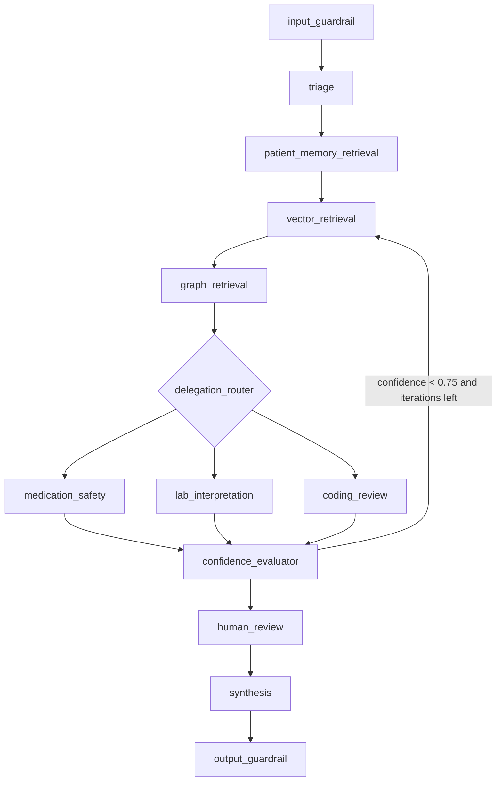

# 05 — AI Agents

This document describes the agent services that answer questions over the knowledge platform built in [04 — Data Platform](04_data_platform.md). Most of it covers the healthcare agent. The supply-chain agent uses the same building blocks with a smaller feature set; see [09 — Supply Chain Domain](09_supply_chain_domain.md). How the agents are tested and gated is in [06 — Quality Assurance](06_quality_assurance.md).

## 1. Service layout

Each domain ships one FastAPI service. The service hosts the REST API, the LangGraph orchestrator and an embedded MCP server, all in one process.

| Concern | Healthcare module (`domains/healthcare/agent-service/src/healthcare_agent/`) |
| --- | --- |
| HTTP API, schemas, response shaping | `api/routes.py`, `api/schemas.py`, `api/responses.py` |
| Agent definitions and node functions | `agents/registry.py`, `agents/nodes.py` |
| Graph, planner, memory, HITL, query service | `orchestration/` |
| Vector and graph retrieval, ranking | `retrieval/search.py`, `retrieval/ranking.py` |
| LLM providers, routing, synthesis, structured output | `generation/` |
| Guardrails, harness, response policy | `safety/` |
| MCP server and skills | `tools/mcp_server.py`, `tools/skills.py` |
| Tracing | `observability/tracing.py` |
| Offline evaluation | `evaluation/` |
| Settings and policy files | `config/settings.py`, `config/tool_policies.json`, `config/skills_layer.json` |

Code shared by both domains lives in `packages/agent-core` (`agent_core`):

| Module | Provides |
| --- | --- |
| `ports` | `VectorStore`, `GraphStore`, `LLMProvider`, `SessionStore`, and `Tracer` protocols, plus `NoopTracer` |
| `runtime` | `AgentRuntime`, which holds the wired dependencies |
| `settings` | `AgentServiceSettings`, the base Pydantic settings class |
| `policy` | `ToolPolicy` and `AuthorizationError` for role-based tool access |
| `governance` | `ToolGovernance`, which checks policy and writes audit events around each tool call |
| `audit` | `AuditEvent`, `JsonlAuditSink` and `hash_payload` |
| `guardrails` | `detect_prompt_injection` and `check_length` |
| `mcp_server` | `build_mcp_server`, `register_tools`, `register_skills_surface`, `ToolSpec`, tool annotations and transport security |
| `streaming` | `format_sse` |
| `metrics` | `ServiceMetrics` for Prometheus |

Embeddings and store clients come from `packages/knowledge-core`; see [04 — Data Platform](04_data_platform.md#embeddings). The decision to split these layers is recorded in [ADR 0010](adrs/0010-layered-agentic-architecture.md).

## 2. Graph flow

`orchestration/graph.py` builds a LangGraph `StateGraph` over the `HealthcareAgentState` `TypedDict`.


```mermaid
flowchart TD
  IG[input_guardrail] --> T[triage]
  T --> PM[patient_memory_retrieval]
  PM --> VR[vector_retrieval]
  VR --> GR[graph_retrieval]
  GR --> DR{delegation_router}
  DR --> MS[medication_safety]
  DR --> LI[lab_interpretation]
  DR --> CR[coding_review]
  MS --> CE[confidence_evaluator]
  LI --> CE
  CR --> CE
  CE -- "confidence < 0.75 and iterations left" --> VR
  CE --> HR[human_review]
  HR --> S[synthesis]
  S --> OG[output_guardrail]
```

1. `input_guardrail` rejects prompt-injection attempts and over-length questions.
2. `triage` classifies the request type and builds a `RetrievalPlan` (`name`, `query_text`, `top_k`, `reason`).
3. `patient_memory_retrieval` loads active, consented facts for an explicit patient scope; `vector_retrieval` and `graph_retrieval` collect source evidence.
4. One or more specialists run. When a request needs several, `delegation_router` sends it to each of them.
5. `confidence_evaluator` scores the evidence. Below 0.75 it loops back to retrieval, up to `LANGGRAPH_MAX_ITERATIONS` times (default 3, capped at 6).
6. `human_review` runs only when HITL is enabled; see [Memory and human review](#7-memory-and-human-review).
7. `synthesis` writes the answer and `output_guardrail` checks it before it is returned.

## 3. Agents

The agents are registered in `agents/registry.py`. `GET /agents` lists them as cards with `name`, `description`, `capabilities` and `accepted_inputs`.

| Agent | Role |
| --- | --- |
| `triage` | Classifies the request and plans retrieval |
| `vector_retrieval` | Semantic search in Qdrant |
| `graph_retrieval` | Patient, medication and claim context from Neo4j |
| `medication_safety` | Interactions and contraindications |
| `lab_interpretation` | Abnormal lab signals and trends |
| `coding_review` | Diagnosis and claim coding gaps |
| `synthesis` | Writes the grounded answer |

## Request types

The triage planner (`orchestration/planner.py`) maps each question to one request type. The type sets the retrieval plan and which specialist runs.

| Request type | Typical question | Specialist |
| --- | --- | --- |
| `patient_summary` | "Summarize patient P123" | none (synthesis only) |
| `medication_safety` | "Any interaction risks for this patient's drugs?" | `medication_safety` |
| `lab_interpretation` | "Explain the recent abnormal labs" | `lab_interpretation` |
| `coding_review` | "Are there coding gaps on recent claims?" | `coding_review` |
| `cohort_triage` | "Which patients need follow-up first?" | delegated as needed |

## 4. Retrieval and ranking

- **Vector search** (`retrieval/search.py`) embeds the query with the same model that was used at ingest (`stable_embedding` from `knowledge_core`). It searches each domain in the `healthcare_events` collection separately, then merges the results by score.
- **Graph search** runs parameterized Cypher for patient context: encounters, medications, interactions, contraindications and claims.
- **Ranking** (`retrieval/ranking.py`) combines semantic relevance, recency and graph signal. Ties are broken by event ID, so the order is stable.
- Patient context reads are cached, so repeated turns in a session don't hit Neo4j again.

## LLM routing

`generation/factory.py` builds the LLM gateway from settings:

1. **Primary provider** comes from `LLM_PROVIDER` and `LLM_MODEL` (default `ollama` and `llama3.1`). The supported providers are Ollama, OpenAI, Anthropic, Bedrock and Databricks (`generation/providers.py`).
2. **Fallback**: if `LLM_FALLBACK_PROVIDER` is set, the primary is wrapped in `FallbackProvider`. When the primary returns a result that starts with `LLM error:`, the fallback is called.
3. **Tier routing**: if any of `LLM_MODEL_SIMPLE`, `LLM_MODEL_MODERATE` or `LLM_MODEL_COMPLEX` differs from `LLM_MODEL`, a `ModelRouter` is added.
   - Each tier takes a `provider:model` spec.
   - `classify_complexity` scores the question and sorts it into a tier.
   - The router drops to a cheaper tier when the tier's rolling latency exceeds `LLM_LATENCY_TARGET_MS`, or when the estimated hourly spend exceeds `LLM_COST_BUDGET_HOURLY_USD`. A value of 0 turns that check off.

In dev, every tier uses the same local model, so routing is a no-op. The `model_routing` field of a response reports the provider, model and tier that served it. The design is in [ADR 0004](adrs/0004-local-first-llm-provider-routing.md).

## 5. Synthesis and structured output

`generation/synthesis.py` builds the prompt from the ranked evidence, the specialist findings and the session summary. It calls the gateway with `LLM_TIMEOUT_SECONDS` (default 120) and `LLM_MAX_TOKENS` (default 1200), and retries when it fails.

When the request sets `structured: true`, `generation/structured_output.py` validates the answer into a Pydantic model with these fields:

- `summary`
- `key_findings`
- `risks`, each with `category`, `severity`, `description` and evidence source
- `interactions`
- `lab_signals`
- `confidence`

The validated model is returned as `structured_response`.

## 6. Streaming

`POST /query/stream` returns Server-Sent Events, formatted with `agent_core.streaming.format_sse`:

| Event | Payload |
| --- | --- |
| `meta` | `trace_id`, `orchestrator: "langgraph"` |
| `step` | One per completed node, with allowlisted scalar fields only. Evidence is never streamed. |
| `result` | The same body as `POST /query` |
| `error` | A structured error message |

Authorization runs before the stream opens, so a denied caller gets a plain `401` rather than an `error` event. The web client falls back to `POST /query` when the stream endpoint returns `404` or `405`.

## 7. Memory and human review

**Session memory** (`orchestration/memory.py`):

- Each `session_id` keeps its last 20 turns for `SESSION_TTL_SECONDS` (default 3600).
- The store is in-process by default. Set `SESSION_STORE_BACKEND=redis` and `REDIS_URL` to share sessions across replicas.
- `QueryService` loads a short summary of recent turns into `session_context` and records each new turn.
- Session memory is transient conversational continuity; it is not a longitudinal patient record.

**Durable patient memory** (`orchestration/memory.py` and `QueryService`):

- `PatientMemoryFact` stores a normalized, patient-scoped fact with source provenance, confidence, observation time, and optional expiry.
- `PatientMemoryPolicy` governs consent, retention, category allowlists, and fact limits. Writes are rejected without consent and facts outside retention or expiry are filtered on load.
- The governed write path minimizes stored PHI, attaches provenance, deduplicates facts, and keeps records isolated by `patient_id`.
- `InMemoryPatientMemoryStore` is the default provider-neutral adapter; `RedisPatientMemoryStore` is a Redis-ready persistence shim.
- The graph loads durable facts through `patient_memory_retrieval` into separate trusted state fields. Patient memory is not concatenated into session history and is available to synthesis only as an explicitly labeled context channel.
- Patient memory is not a replacement for the source graph/vector evidence or a clinician decision; retention and consent policy remain authoritative.

**Web UI clinical activity workflow:**

1. A clinician selects or enters a patient and runs an example or custom clinical query.
2. When the answer completes, the Web UI copies the patient ID and answer into the governed-memory panel as a reviewable `clinical_summary` draft.
3. The clinician edits the fact, selects provenance, and explicitly confirms patient consent.
4. The **Save governed memory** action remains disabled until consent is confirmed, then calls `POST /patient-memory` with `X-Caller-Role: memory_write`.
5. The API validates consent, provenance, patient scope, retention, and fact limits before persisting to the configured patient-memory store.

The answer is never persisted automatically. This review step prevents an AI-generated answer from becoming longitudinal memory without clinician approval and explicit consent.

**Human-in-the-loop** (`orchestration/hitl.py`):

- Enable it with `HITL_ENABLED=true`.
- When confidence is below `HITL_CONFIDENCE_THRESHOLD` (default 0.75), `human_review` calls LangGraph `interrupt`. The response then has `status: "pending_review"`, a `thread_id`, and a `human_review` payload. The payload holds counts and routing metadata only, never raw evidence.
- A reviewer calls `POST /query/resume` with the `thread_id`, a `decision` (`approve` or `reject`) and an optional `note`. An unknown thread returns `404`.
- `HITL_MAX_PENDING` (default 1000) caps the number of open reviews.
- The checkpointer is LangGraph's `InMemorySaver`, so pending reviews only exist in the process that created them. Multi-replica deployments need a shared checkpointer or sticky routing.

## 8. HTTP API

Healthcare agent, port 8000. The caller role comes from the `X-Caller-Role` header when `AGENT_ALLOW_ROLE_HEADER` is true; otherwise `AGENT_DEFAULT_CALLER_ROLE` is used.

| Method and path | Purpose |
| --- | --- |
| `GET /health` | Liveness and dependency status |
| `GET /metrics` | Prometheus metrics |
| `GET /mcp/health` | MCP transport (`streamable-http`), mount path (`/mcp`) and skills status |
| `GET /agents` | Agent cards |
| `POST /skills/plan` | Skill plan for a `business_goal` (3–128 chars) and `agent` |
| `POST /query` | Run the graph |
| `POST /query/stream` | Run the graph and stream progress (SSE) |
| `POST /query/resume` | Approve or reject a paused run |
| `POST /patient-memory` | Store consented, provenance-bearing normalized patient facts |
| `GET /` | Redirects to `/docs` (OpenAPI UI) |

`POST /query` request fields:

| Field | Notes |
| --- | --- |
| `question` | Required. Up to `AGENT_MAX_QUESTION_CHARS` (1000). |
| `patient_id` | Optional, up to 128 chars |
| `structured` | Optional; returns `structured_response` |
| `session_id` | Optional, up to 64 chars; turns on multi-turn memory |
| `top_k` | Optional, default 5 |

The response contains:

- `question`, `request_type`, `retrieval_plan`, `patients`
- `vector_context`, `graph_context`, `answer`
- `retrieved_at`, `trace_id`, `guardrails`
- when applicable: `structured_response`, `model_routing`, `langgraph`, `status`, `thread_id`, `human_review`

Errors: `401` for an unauthorized role, `400` for invalid input, `503` when a backing store is unavailable.

## 9. MCP tools and skills

The MCP server is built with `agent_core.mcp_server.build_mcp_server` and mounted at `/mcp` using Streamable HTTP. Its name comes from `MCP_SERVER_NAME` (default `HealthcareGraphRAG MCP`). Every tool call goes through `ToolGovernance`, which checks the role policy, writes an audit event with hashed arguments, and runs blocking work off the event loop. The design is in [ADR 0005](adrs/0005-embed-fastmcp-in-rag-api.md).

| Tool | Role needed |
| --- | --- |
| `patient_context_get` | `read_only` |
| `vector_evidence_search` | `read_only` |
| `skills_plan_get` | `read_only` |
| `graphrag_answer_generate` | `generation` |
| `risk_summary_generate` | `generation` |
| `timeline_explain` | `generation` |
| `medication_risk_assess` | `generation` |
| `coding_gap_detect` | `generation` |
| `cohort_risk_summary` | `generation` |
| `evidence_bundle_export` | `export` |
| `patient_memory_write` | `memory_write` |

Role-to-tool rules are in `config/tool_policies.json`. Override the file with `AGENT_TOOL_POLICY_PATH`.

**Skills** are reusable, multi-tool workflows. They are declared in `config/skills_layer.json`, which must have `business_goals` and `skills` keys; override it with `AGENT_SKILLS_LAYER_PATH`. The healthcare skills are:

- `patient-snapshot`
- `grounded-answer`
- `medication-safety-graph-review`
- `risk-signal-detection`
- `claim-outcome-risk-review`
- `evidence-bundle-export`

The skills are exposed through `POST /skills/plan`, the `skills_plan_get` tool, and MCP resources and prompts. `make generate-skills` and `make validate-skills` keep the generated skill files in sync; see [ADR 0006](adrs/0006-skills-layer-standardization-and-validation.md).

MCP transport options: `MCP_STATELESS_HTTP`, `MCP_JSON_RESPONSE`, `MCP_DNS_REBINDING_PROTECTION`, `MCP_ALLOWED_HOSTS` and `MCP_ALLOWED_ORIGINS`.

## 10. Guardrails and response policy

| Layer | Module | Checks |
| --- | --- | --- |
| Input | `safety/guardrails.py` | Prompt injection, length |
| Output | `safety/guardrails.py` | Clinical directives must carry an "advisory" or "clinical review" caveat |
| Grounding | `safety/harness.py` | The answer must cite retrieved evidence |
| Response policy | `safety/response_policy.py` | Role-based redaction, truncation, byte limits |

The response policy limits are:

- `AGENT_MAX_CONTEXT_ITEMS` (5)
- `AGENT_MAX_EVIDENCE_CHARS` (240)
- `AGENT_MAX_ANSWER_CHARS` (2000)
- `AGENT_MAX_RESPONSE_BYTES` (50000)

The `guardrails` block in each response reports the redaction level, access level, limits, any truncation, and any flags raised. Answers are decision support, not clinical advice.

## Observability

MLflow tracing is optional and is independent from Prometheus metrics and the governance audit log.

### Enable tracing locally

Start the infrastructure and healthcare services, then set the tracking configuration before starting the agent service:

```bash
make up
export MLFLOW_TRACKING_URI=http://localhost:5000
export MLFLOW_EXPERIMENT_NAME=healthcare-graphrag
make query-hc
```

Open [http://localhost:5000](http://localhost:5000) to view the experiment. The MLflow health check is:

```bash
make mlflow
```

In Docker Compose, the healthcare overlay already supplies `http://mlflow:5000` as the service-to-service URI. In Kubernetes, use the same cluster service name. The browser URL is different from the URI used inside the agent container: use `http://localhost:5000` from the host and `http://mlflow:5000` from the cluster network.

### What is traced

`healthcare_agent.observability.tracing` creates the following spans:

| Span | Type | Contents |
| --- | --- | --- |
| `healthcare_query_<mode>` | `CHAIN` | Query mode, request type, latency, patient/vector/graph counts, answer length |
| `agent:<name>` | `AGENT` | Agent name, iteration, action, message count, latency |
| `vector_search` / `graph_search` | `RETRIEVER` | Bounded inputs/results, result count and latency |
| `llm_generate` | `LLM` | Context counts, model-routing attributes, answer length, latency and error state |
| `@mlflow_trace` functions | Configured type | Bounded inputs/outputs, outcome, latency and error type |

Use the API response `trace_id` to correlate the request with application logs and audit records. The MLflow span name is the operation name; `trace_id` is the platform correlation identifier and may not be the MLflow UI's internal trace identifier.

### Privacy and data handling

Tracing is observability, not authorization. Existing response guardrails still apply, but MLflow is an additional data store. Do not add raw patient records, access tokens, credentials, or unrestricted prompts to span attributes. The tracing helpers bound collections and strings, but `_safe_repr` does **not** de-identify data. Prefer counts, classifications, IDs that are already approved for observability, and hashes where correlation is required.

Disable tracing by leaving `MLFLOW_TRACKING_URI` empty. The wrappers then call the original functions directly and do not contact MLflow. This mode is used by unit tests and offline evaluation.

### Failure behavior

Span failures are recorded with `outcome=error`, `error_type`, a bounded error message, and `latency_ms`; the original exception is re-raised. Successful spans include `outcome=success`. A tracing failure must not convert a successful agent response into a different response contract.

- **Metrics**: `GET /metrics` exposes Prometheus counters and histograms for HTTP method, path, status and duration.
- **Audit**: tool calls are appended as JSON lines to `AGENT_AUDIT_LOG_PATH` (default `logs/agent_audit.log`). Arguments are hashed, not stored.

## 11. Configuration reference

The service settings are Pydantic `BaseSettings` classes (`config/settings.py`, which extends `agent_core.settings.AgentServiceSettings`). Variables prefixed `AGENT_` are governance settings shared by both domains.

| Variable | Default | Purpose |
| --- | --- | --- |
| `QDRANT_URL`, `QDRANT_COLLECTION` | `http://qdrant:6333`, `healthcare_events` | Vector store |
| `NEO4J_URI`, `NEO4J_USER`, `NEO4J_PASSWORD` | `bolt://neo4j:7687`, `neo4j`, (secret) | Graph store |
| `LLM_PROVIDER`, `LLM_MODEL` | `ollama`, `llama3.1` | Primary LLM |
| `LLM_FALLBACK_PROVIDER`, `LLM_FALLBACK_MODEL` | empty | Fallback LLM |
| `LLM_MODEL_SIMPLE`, `LLM_MODEL_MODERATE`, `LLM_MODEL_COMPLEX` | empty (use `LLM_MODEL`) | Tier models (`provider:model`) |
| `LLM_LATENCY_TARGET_MS`, `LLM_COST_BUDGET_HOURLY_USD` | `0` (off) | Router downgrade triggers |
| `LLM_TIMEOUT_SECONDS`, `LLM_MAX_TOKENS` | `120`, `1200` | Generation limits |
| `OLLAMA_URL` | `http://ollama:11434` | Ollama endpoint |
| `EMBEDDING_PROVIDER`, `EMBEDDING_MODEL`, … | see [04](04_data_platform.md#embeddings) | Must match the ingest pipeline |
| `LANGGRAPH_MAX_ITERATIONS` | `3` (max 6) | Retrieval retry loop |
| `HITL_ENABLED`, `HITL_CONFIDENCE_THRESHOLD`, `HITL_MAX_PENDING` | off, `0.75`, `1000` | Human review |
| `SESSION_STORE_BACKEND`, `REDIS_URL`, `SESSION_TTL_SECONDS` | `memory`, —, `3600` | Session memory |
| `PATIENT_MEMORY_STORE_BACKEND` | `memory` | Durable patient-memory adapter (`memory` or `redis`) |
| `PATIENT_MEMORY_RETENTION_SECONDS` | `2592000` | Maximum stored fact age |
| `PATIENT_MEMORY_MAX_FACTS` | `100` | Per-patient fact cap |
| `PATIENT_MEMORY_CONSENT_REQUIRED` | `true` | Require explicit consent for writes |
| `MCP_SERVER_NAME` and `MCP_*` transport options | see [section 9](#9-mcp-tools-and-skills) | MCP server |
| `MLFLOW_TRACKING_URI` | empty | MLflow tracking server URL; non-empty enables tracing |
| `MLFLOW_EXPERIMENT_NAME` | `healthcare-graphrag` | Experiment selected by the tracing and evaluation helpers |
| `AGENT_DEFAULT_CALLER_ROLE`, `AGENT_ALLOW_ROLE_HEADER` | `generation`, `true` | Caller role |
| `AGENT_TOOL_POLICY_PATH`, `AGENT_SKILLS_LAYER_PATH` | bundled files | Policy and skills overrides |
| `AGENT_ALLOW_ORIGINS` | `*` | CORS |

Set `AGENT_ALLOW_ROLE_HEADER=false` and a narrow `AGENT_ALLOW_ORIGINS` in production. Supply secrets from the platform's secret store; see [07 — CI/CD Automation](07_cicd_automation.md).

## 12. Related

- [ADR 0004 — Local-first LLM provider routing](adrs/0004-local-first-llm-provider-routing.md)
- [ADR 0005 — Embed FastMCP in the RAG API](adrs/0005-embed-fastmcp-in-rag-api.md)
- [ADR 0006 — Skills layer standardization](adrs/0006-skills-layer-standardization-and-validation.md)
- [ADR 0007 — LangGraph multi-agent orchestration](adrs/0007-langgraph-multi-agent-orchestration.md)
- [ADR 0008 — MLflow tracing and evaluation](adrs/0008-mlflow-tracing-and-evaluation.md)
- [ADR 0010 — Layered agentic architecture](adrs/0010-layered-agentic-architecture.md)
