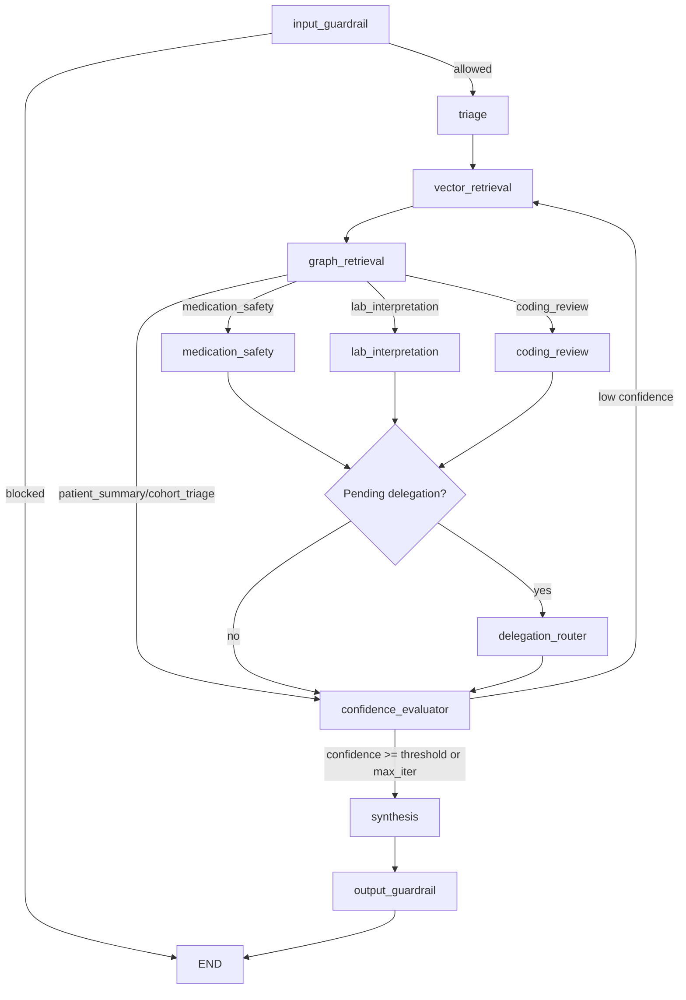

# MCP Layer Design (Minimal)

## Purpose

This document defines a minimal Model Context Protocol (MCP) layer so AI clients can call a stable healthcare toolset without coupling to internal service details.

Goals:

- Reuse existing FastAPI, Qdrant, Neo4j, and Kafka capabilities.
- Expose a small, auditable, provider-agnostic tool surface.
- Start local-first and evolve to production controls with minimal rework.

## ADR References

- [ADR-0005: Embed FastMCP in rag-api](adrs/0005-embed-fastmcp-in-rag-api.md)
- [ADR-0004: Local-first LLM with provider routing](adrs/0004-local-first-llm-provider-routing.md)

Skill composition roadmap strategy and actionable backlog sequencing are described in [03_platform_blueprint.md](03_platform_blueprint.md).

## Architecture Placement

```text
AI Client (Copilot, Claude Desktop, custom agent)
  -> Embedded MCP endpoint at /mcp (domains/healthcare/agent-service/src/healthcare_agent/main.py)
  -> healthcare_agent modules:
     - orchestration/query_service.py (shared REST, SSE, and MCP query path)
     - orchestration/graph.py, state.py, runtime.py, planner.py, memory.py
     - agents/nodes.py and agents/registry.py (specialist agent nodes and cards)
     - retrieval/search.py and retrieval/ranking.py (Qdrant + Neo4j context)
     - generation/synthesis.py, model_router.py, factory.py, providers.py
     - safety/guardrails.py, harness.py, response_policy.py
     - api/responses.py (response shaping); tool policy/audit in agent_core.governance
     - tools/mcp_server.py, langchain_tools.py, skills.py
     - evaluation/ and observability/ modules
  -> External stores:
     - Neo4j (domains/healthcare/knowledge/graph-seeds)
     - Qdrant (populated by domains/healthcare/data-pipelines/flink-job)
     - Ollama (infra)
```

MCP is embedded in the healthcare agents service (ADR-0005). The standalone mcp-server scaffold has been removed.

## 1) Tool Inventory

Use a minimal toolset while covering high-value workflows.

| Tool Name | Purpose | Backing Service |
| --- | --- | --- |
| `skills_plan_get` | Resolve Business Goals -> Agent -> Skills -> Context -> Ontology -> MCP -> Tools plan | agent-service skills layer |
| `patient_context_get` | Retrieve patient-centric graph context summary | Neo4j via agent-service or direct adapter |
| `vector_evidence_search` | Retrieve top-k vector evidence for question/patient | Qdrant via agent-service or direct adapter |
| `graphrag_answer_generate` | Generate grounded answer from vector + graph evidence | agent-service |
| `risk_summary_generate` | Generate concise risk summary for one patient | agent-service + prompt policy |
| `timeline_explain` | Explain patient progression over a bounded time window | agent-service |
| `medication_risk_assess` | Assess contraindications, interactions, and adverse reaction risks | agent-service + Neo4j context |
| `coding_gap_detect` | Surface coding and claims consistency gaps | agent-service + Neo4j/Qdrant evidence |
| `cohort_risk_summary` | Summarize cross-patient risk signals for cohort triage | agent-service + Qdrant/Neo4j |
| `evidence_bundle_export` | Return traceable evidence bundle for audit/review | agent-service aggregation |

Notes:

- Keep tool names stable; evolve behavior via versioned schemas.
- Add async tools optionally when needed (`ai_task_submit`, `ai_task_status_get`).
- Skill-composed tool expansion roadmap is documented in [03_platform_blueprint.md](03_platform_blueprint.md).

## 2) Request/Response Schemas

Minimal JSON Schema contracts for v1.

### `patient_context_get`

Request schema:

```json
{
  "$schema": "https://json-schema.org/draft/2020-12/schema",
  "type": "object",
  "required": ["patient_id"],
  "properties": {
    "patient_id": { "type": "string", "minLength": 1 },
    "include_claims": { "type": "boolean", "default": true },
    "include_interactions": { "type": "boolean", "default": true }
  },
  "additionalProperties": false
}
```

Response schema:

```json
{
  "$schema": "https://json-schema.org/draft/2020-12/schema",
  "type": "object",
  "required": ["patient_id", "graph_context", "retrieved_at"],
  "properties": {
    "patient_id": { "type": "string" },
    "graph_context": { "type": "array", "items": { "type": "object" } },
    "retrieved_at": { "type": "string", "format": "date-time" },
    "trace_id": { "type": "string" }
  },
  "additionalProperties": false
}
```

### `vector_evidence_search`

Request schema:

```json
{
  "$schema": "https://json-schema.org/draft/2020-12/schema",
  "type": "object",
  "required": ["question"],
  "properties": {
    "question": { "type": "string", "minLength": 3 },
    "patient_id": { "type": ["string", "null"] },
    "top_k": { "type": "integer", "minimum": 1, "maximum": 20, "default": 5 }
  },
  "additionalProperties": false
}
```

Response schema:

```json
{
  "$schema": "https://json-schema.org/draft/2020-12/schema",
  "type": "object",
  "required": ["question", "vector_context", "retrieved_at"],
  "properties": {
    "question": { "type": "string" },
    "vector_context": {
      "type": "array",
      "items": {
        "type": "object",
        "required": ["event_id", "score"],
        "properties": {
          "event_id": { "type": "string" },
          "patient_id": { "type": ["string", "null"] },
          "event_type": { "type": ["string", "null"] },
          "score": { "type": "number" },
          "text": { "type": ["string", "null"] }
        },
        "additionalProperties": true
      }
    },
    "retrieved_at": { "type": "string", "format": "date-time" },
    "trace_id": { "type": "string" }
  },
  "additionalProperties": false
}
```

### `graphrag_answer_generate`

Request schema:

```json
{
  "$schema": "https://json-schema.org/draft/2020-12/schema",
  "type": "object",
  "required": ["question"],
  "properties": {
    "question": { "type": "string", "minLength": 3 },
    "patient_id": { "type": ["string", "null"] },
    "response_style": { "type": "string", "enum": ["concise", "clinical", "audit"] }
  },
  "additionalProperties": false
}
```

Response schema:

```json
{
  "$schema": "https://json-schema.org/draft/2020-12/schema",
  "type": "object",
  "required": ["answer", "vector_context", "graph_context", "retrieved_at"],
  "properties": {
    "answer": { "type": "string" },
    "patients": { "type": "array", "items": { "type": "string" } },
    "vector_context": { "type": "array", "items": { "type": "object" } },
    "graph_context": { "type": "array", "items": { "type": "object" } },
    "retrieved_at": { "type": "string", "format": "date-time" },
    "trace_id": { "type": "string" }
  },
  "additionalProperties": false
}
```

### `risk_summary_generate`

Request schema:

```json
{
  "$schema": "https://json-schema.org/draft/2020-12/schema",
  "type": "object",
  "required": ["patient_id"],
  "properties": {
    "patient_id": { "type": "string", "minLength": 1 },
    "time_window_hours": { "type": "integer", "minimum": 1, "maximum": 720, "default": 72 }
  },
  "additionalProperties": false
}
```

Response schema:

```json
{
  "$schema": "https://json-schema.org/draft/2020-12/schema",
  "type": "object",
  "required": ["patient_id", "summary", "risk_signals", "retrieved_at"],
  "properties": {
    "patient_id": { "type": "string" },
    "summary": { "type": "string" },
    "risk_signals": { "type": "array", "items": { "type": "string" } },
    "retrieved_at": { "type": "string", "format": "date-time" },
    "trace_id": { "type": "string" }
  },
  "additionalProperties": false
}
```

### `evidence_bundle_export`

Request schema:

```json
{
  "$schema": "https://json-schema.org/draft/2020-12/schema",
  "type": "object",
  "required": ["question"],
  "properties": {
    "question": { "type": "string", "minLength": 3 },
    "patient_id": { "type": ["string", "null"] },
    "include_raw_payload": { "type": "boolean", "default": false }
  },
  "additionalProperties": false
}
```

### `skills_plan_get`

Request schema:

```json
{
  "$schema": "https://json-schema.org/draft/2020-12/schema",
  "type": "object",
  "required": ["business_goal"],
  "properties": {
    "business_goal": { "type": "string", "minLength": 3 },
    "agent": { "type": ["string", "null"] }
  },
  "additionalProperties": false
}
```

Response schema:

```json
{
  "$schema": "https://json-schema.org/draft/2020-12/schema",
  "type": "object",
  "required": [
    "flow",
    "business_goal",
    "agent",
    "skills",
    "context_requirements",
    "ontology_dependencies",
    "mcp_tools",
    "runtime_tools",
    "retrieved_at"
  ],
  "properties": {
    "flow": { "type": "array", "items": { "type": "string" } },
    "business_goal": { "type": "string" },
    "goal_description": { "type": "string" },
    "agent": { "type": "string" },
    "skills": { "type": "array", "items": { "type": "object" } },
    "context_requirements": { "type": "array", "items": { "type": "string" } },
    "ontology_dependencies": { "type": "array", "items": { "type": "string" } },
    "mcp_tools": { "type": "array", "items": { "type": "string" } },
    "runtime_tools": { "type": "array", "items": { "type": "string" } },
    "retrieved_at": { "type": "string", "format": "date-time" },
    "trace_id": { "type": "string" }
  },
  "additionalProperties": false
}
```

Response schema:

```json
{
  "$schema": "https://json-schema.org/draft/2020-12/schema",
  "type": "object",
  "required": ["question", "vector_context", "graph_context", "answer", "retrieved_at"],
  "properties": {
    "question": { "type": "string" },
    "patients": { "type": "array", "items": { "type": "string" } },
    "vector_context": { "type": "array", "items": { "type": "object" } },
    "graph_context": { "type": "array", "items": { "type": "object" } },
    "answer": { "type": "string" },
    "retrieved_at": { "type": "string", "format": "date-time" },
    "trace_id": { "type": "string" },
    "guardrails": {
      "type": "object",
      "properties": {
        "evidence_text_redacted": { "type": "boolean" },
        "evidence_access_level": { "type": "string", "enum": ["none", "bounded"] },
        "graph_access_level": { "type": "string", "enum": ["standard", "broader"] },
        "raw_payload_requested": { "type": "boolean" },
        "raw_payload_returned": { "type": "boolean" },
        "response_truncated": { "type": "boolean" }
      }
    }
  },
  "additionalProperties": false
}
```

## 3) Auth and Audit Model

Minimal model that runs locally and scales to production.

### AuthN/AuthZ

Local demo (embedded mode):

- Run without bearer-token enforcement by default for local simplicity.
- Enforce role-based authorization through a tool policy in embedded agent-service for both `/query` and MCP tool entrypoints.

Optional standalone mode:

- Static API token in MCP server config.
- Optional allowlist of tool names per token.

Production:

- Service-to-service auth with OAuth2 client credentials or workload identity.
- Tool-level authorization policy:
  - `read_only`: patient_context_get, vector_evidence_search
  - `generation`: query, graphrag_answer_generate, risk_summary_generate
  - `export`: evidence_bundle_export
- Environment-scoped policies (`dev`, `stage`, `prod`).

### Audit

Log one structured audit event per tool call:

- `timestamp`
- `trace_id`
- `tool_name`
- `caller_id` (service principal or token id)
- `input_hash` (SHA-256 of normalized request)
- `patient_scope` (explicit IDs or `cohort`)
- `outcome` (`success` or `error`)
- `latency_ms`
- `response_size_bytes`

Do not log raw PHI payloads. Prefer hashes, IDs, and minimal metadata.

### Data Protection Controls

- Redact or tokenize sensitive fields before returning tool output when policy requires.
- Return guardrails metadata that records evidence-access mode and response truncation state.
- Enforce max response sizes and timeouts per tool.
- Add per-tool rate and burst limits.

## 4) Rollout Stages: Local Demo to Production

### Stage 0: Local Design and Contract Freeze

1. Finalize tool contracts and JSON schemas in this document.
2. MCP tool surface is implemented in the agents service over the shared query orchestration.
3. Contract tests with static fixtures and CI validation are in place.

Exit criteria:

- All tool schemas validated.
- Basic happy-path tests pass locally.

Current status:

- Completed in current implementation (embedded MCP in the agents service with 10 tools).

### Stage 1: Local Demo Integration

1. Validate initialize handshake against `http://localhost:8000/mcp`.
2. Keep non-protocol diagnostics available at `/mcp/health`.
3. Validate from at least one MCP client.

Exit criteria:

- End-to-end calls from MCP client succeed.
- Trace IDs link MCP calls to API logs.

Current status:

- Completed for local stack (`/mcp` and `/mcp/health` active, smoke test script present).

### Stage 2: Staging Hardening

1. Add centralized auth (service identity).
2. Add policy gates per tool and environment.
3. Add SLO dashboards (latency, error rate, tool call volume).
4. Add resilience controls (timeouts, retries, circuit breaker).

Exit criteria:

- Security review passed.
- SLO monitoring and alerts active.

### Stage 3: Production Launch

1. Enable production identity and secret management.
2. Enable audited tool access with retention policy.
3. Roll out in canary mode to selected clients.
4. Expand tool set only after stability is proven.

Exit criteria:

- Stable error budget.
- Audit completeness verified.
- Operational runbook published.

## Current Implementation Note

The embedded MCP layer is wired from `domains/healthcare/agent-service/src/healthcare_agent/main.py`, while the ten healthcare MCP tools live in `tools/mcp_server.py`. They share `QueryService.run_query` and `QueryService.stream` with `POST /query` and `POST /query/stream`.

ADR-0012 removed the former ReAct and single-pass query paths. LangGraph is now the only healthcare orchestrator for REST, SSE, and MCP calls, with specialist agents for medication safety, lab interpretation, and coding review.

`POST /query/stream` always runs the LangGraph orchestrator and returns Server-Sent Events: `meta` (trace ID), `step` per graph node (allowlisted scalar fields only, no evidence or answer text), then `result` (same payload as `/query`) or `error` (generic message and trace ID). Authorization is checked before the stream opens, and each stream writes one audit entry. See [ADR-0010](adrs/0010-layered-agentic-architecture.md) for the layered target architecture and phased roadmap.

When MLflow tracing is enabled (`MLFLOW_TRACKING_URI`), every MCP tool execution is traced as a nested span hierarchy visible in the MLflow Tracing UI. Trace IDs from the audit log can be correlated with MLflow spans for end-to-end observability.

# Skills Layer

## Purpose

This project now includes an explicit Skills layer that operationalizes the flow:

Business Goals -> Agent -> Skills -> Context -> Ontology -> MCP -> Tools

The standardization and CI validation policy for this layer is formalized in [ADR-0006](adrs/0006-skills-layer-standardization-and-validation.md).

The layer is runtime-backed (not documentation-only):

- Skill catalog and goal mappings are defined in [agent-service/src/healthcare_agent/config/skills_layer.json](../domains/healthcare/agent-service/src/healthcare_agent/config/skills_layer.json).
- Resolution logic is implemented in [agent-service/src/healthcare_agent/tools/skills.py](../domains/healthcare/agent-service/src/healthcare_agent/tools/skills.py).
- LangGraph multi-agent orchestration maps skills to specialized agent nodes in [agent-service/src/healthcare_agent/agents/nodes.py](../domains/healthcare/agent-service/src/healthcare_agent/agents/nodes.py).
- Runtime access is exposed through:
  - REST: POST /skills/plan
  - MCP tool: skills_plan_get

## Layer Model

### 1) Business Goals

Business goals are top-level outcomes (for example, clinical triage, medication safety review, claims denial prevention).

Each goal defines:

- description
- default_agent
- ordered list of skill IDs

### 2) Agent

Agent identity is a planner/runtime persona that orchestrates the skill sequence for a goal.

- Default agent comes from goal configuration.
- Caller can override via optional agent field in skills_plan_get.
- In LangGraph mode, the triage agent classifies requests and routes to specialist agents (`medication_safety_agent`, `lab_interpretation_agent`, `coding_review_agent`) based on request type.

### 3) Skills

Each skill describes a reusable unit of capability:

- context_requirements
- ontology_dependencies
- mcp_tools
- runtime_tools

### 4) Context and Ontology

The resolver aggregates:

- union of required context fields
- union of ontology dependencies

This makes prerequisites explicit before tool execution.

### 5) MCP and Tools

The resolver emits:

- mcp_tools: MCP tools expected to be called
- runtime_tools: underlying system tools/services (neo4j, qdrant, agent_service, ollama)

## API Contract

### REST

POST /skills/plan

Request:

```json
{
  "business_goal": "medication_safety_review",
  "agent": "medication_safety_agent"
}
```

Response includes:

- flow
- business_goal
- agent
- skills
- context_requirements
- ontology_dependencies
- mcp_tools
- runtime_tools
- retrieved_at
- trace_id

### MCP

Tool: skills_plan_get

Arguments:

- business_goal (required)
- agent (optional)

## Role and Policy

skills_plan_get is authorized in read_only role via [agent-service/src/healthcare_agent/config/tool_policies.json](../domains/healthcare/agent-service/src/healthcare_agent/config/tool_policies.json).

## Validation

Contracts are tested in [agent-service/tests/integration/test_contracts.py](../domains/healthcare/agent-service/tests/integration/test_contracts.py), including:

- successful plan generation for known business goal
- deterministic flow shape and tool outputs
- proper error handling for unknown goals

Agent Skills package compliance is enforced with:

- generator: [domains/healthcare/scripts/generate_agent_skills.py](../domains/healthcare/scripts/generate_agent_skills.py)
- validator: [domains/healthcare/scripts/validate_agent_skills.py](../domains/healthcare/scripts/validate_agent_skills.py)
- shared library: [scripts/lib/skill_generator.py](../scripts/lib/skill_generator.py), [scripts/lib/skill_validator.py](../scripts/lib/skill_validator.py)

CI also includes an optional upstream validation pass using `skills-ref validate`.
The workflow behavior is:

- use `skills-ref` directly when already present on the runner
- otherwise attempt a best-effort on-the-fly install (`python -m pip install --user skills-ref`)
- if install still fails, log a skip message and continue without failing the workflow

Run locally:

```bash
python domains/healthcare/scripts/generate_agent_skills.py
python domains/healthcare/scripts/generate_agent_skills.py --check
python domains/healthcare/scripts/validate_agent_skills.py
```

For supply-chain:

```bash
python domains/supply-chain/scripts/generate_agent_skills.py
python domains/supply-chain/scripts/generate_agent_skills.py --check
python domains/supply-chain/scripts/validate_agent_skills.py
```

Generated skill packages are stored under [healthcare/skills](../domains/healthcare/knowledge/skills) and [supply-chain/skills](../domains/supply-chain/knowledge/skills) and include one `SKILL.md` per skill folder plus supporting references.

# LangGraph Multi-Agent Query Path

## Purpose

This section documents the current healthcare agent runtime after ADR-0012. The former ReAct controller and single-pass `/query` path were removed; LangGraph is the only query path for `POST /query`, `POST /query/stream`, and MCP tools. There is no rollback environment flag, and `/query` responses do not include a `react` block.

## Runtime File Mapping

Primary implementation and integration touchpoints:

- `domains/healthcare/agent-service/src/healthcare_agent/main.py` — slim composition root that wires `HealthcareAgentSettings`, Qdrant/Neo4j adapters (`vector_context`, `graph_context`), LLM gateway, LangGraph runtime ports, FastAPI, and MCP.
- `domains/healthcare/agent-service/src/healthcare_agent/config/settings.py` — `HealthcareAgentSettings`, a `pydantic-settings` class extending `agent_core.settings.AgentServiceSettings`; environment variable names intentionally retain the `AGENT_*`, `LLM_*`, `QDRANT_URL`, and `NEO4J_*` prefixes.
- `domains/healthcare/agent-service/src/healthcare_agent/api/routes.py` — HTTP routes including `/query` and `/query/stream`.
- `packages/agent-core/src/agent_core/governance.py` — shared `ToolGovernance` role policy, audit logging, and tool metrics (used by the healthcare agent service).
- `domains/healthcare/agent-service/src/healthcare_agent/api/responses.py` — `ResponseShaper` response shaping.
- `domains/healthcare/agent-service/src/healthcare_agent/orchestration/query_service.py` — `QueryService.run_query` and `QueryService.stream`, the shared query service used by HTTP and MCP.
- `domains/healthcare/agent-service/src/healthcare_agent/orchestration/graph.py` — LangGraph `StateGraph` builder.
- `domains/healthcare/agent-service/src/healthcare_agent/orchestration/runtime.py` — runtime ports for graph execution.
- `domains/healthcare/agent-service/src/healthcare_agent/agents/nodes.py` — specialist agent node functions.
- `domains/healthcare/agent-service/src/healthcare_agent/agents/registry.py` — agent cards and capability registry.
- `domains/healthcare/agent-service/src/healthcare_agent/tools/mcp_server.py` — `HealthcareMcpTools` with the ten healthcare MCP tools.
- `domains/healthcare/agent-service/src/healthcare_agent/tools/langchain_tools.py` — LangChain tool wrappers.
- `domains/healthcare/agent-service/src/healthcare_agent/tools/skills.py` — skills-plan resolution.
- `domains/healthcare/agent-service/src/healthcare_agent/retrieval/search.py` and `retrieval/ranking.py` — Qdrant/Neo4j retrieval and deterministic ranking.
- `domains/healthcare/agent-service/src/healthcare_agent/generation/factory.py` — `build_llm_provider`.
- `domains/healthcare/agent-service/src/healthcare_agent/safety/` — guardrails, harness, and response policy.
- `domains/healthcare/agent-service/src/healthcare_agent/evaluation/` — gates, LangSmith, MLflow evaluation, retrieval benchmarks, and grounding scorecards.
- `packages/agent-core/src/agent_core/metrics.py` — shared Prometheus `agent_service_*` collectors.
- `domains/healthcare/agent-service/src/healthcare_agent/observability/tracing.py` — MLflow tracing helpers.

## LangGraph Flow


```mermaid
graph TD
    S[input_guardrail] -->|allowed| A[triage]
    S -->|blocked| I[END]
    A --> B[vector_retrieval]
    B --> C[graph_retrieval]
    C -->|medication_safety| D[medication_safety]
    C -->|lab_interpretation| E[lab_interpretation]
    C -->|coding_review| F[coding_review]
    C -->|patient_summary/cohort_triage| G[confidence_evaluator]
    D --> J{Pending delegation?}
    E --> J
    F --> J
    J -->|yes| K[delegation_router]
    J -->|no| G
    K --> G
    G -->|confidence >= threshold or max_iter| H[synthesis]
    G -->|low confidence| B
    H --> O[output_guardrail]
    O --> I
```

Eleven LangGraph nodes share typed state (two guardrails, three retrieval nodes, three specialist nodes, two control nodes, and synthesis). Node names are registered in `orchestration/graph.py`; the implementing functions live in `agents/nodes.py`:

| Node | Function | Responsibility |
|------|----------|----------------|
| `input_guardrail` | `input_guardrail` | Block unsafe or out-of-scope requests before any retrieval |
| `triage` | `triage_agent` | Classify question and select retrieval plan |
| `vector_retrieval` | `vector_retrieval_agent` | Qdrant similarity search and evidence ranking |
| `graph_retrieval` | `graph_retrieval_agent` | Neo4j patient graph traversal and evidence ranking |
| `medication_safety` | `medication_safety_agent` | Interaction, contraindication, and adverse event analysis |
| `lab_interpretation` | `lab_interpretation_agent` | Lab signal and abnormal observation extraction |
| `coding_review` | `coding_review_agent` | Claims gap detection and ICD-10 mapping analysis |
| `delegation_router` | `delegation_router` | Resolve specialist-to-specialist capability requests |
| `confidence_evaluator` | `confidence_evaluator` | Evidence completeness scoring and loop control |
| `synthesis` | `synthesis_agent` | Grounded answer generation through the configured provider |
| `output_guardrail` | `output_guardrail` | Validate and shape the final answer before it is returned |

## Observability and Configuration

| Environment Variable | Default | Purpose |
|---------------------|---------|---------|
| `LANGGRAPH_MAX_ITERATIONS` | `3` | Max confidence re-retrieval loops |
| `LANGSMITH_API_KEY` | (none) | Enable LangSmith tracing |
| `LANGSMITH_PROJECT` | `healthcare-graphrag` | LangSmith project name |
| `MLFLOW_TRACKING_URI` | (none) | Enable MLflow tracing (for example `http://mlflow:5000`) |
| `MLFLOW_EXPERIMENT_NAME` | `healthcare-graphrag` | MLflow experiment name |

Operational names were aligned in ADR-0012 Phase 3b: the environment prefix is `AGENT_*` (legacy `RAG_API_*` names were removed in Phase 4 and are ignored), Prometheus collectors are `agent_service_*`, the Helm chart and Kubernetes service are `agent-service`, the Compose service is `agent-service` (container `healthcare-agent-service`), and the CI workflow is `agent-service-contracts.yml`.

## Test Notes

Planner-only local checks run through the renamed script:

```bash
./domains/healthcare/scripts/test_planner.sh
```

Tests patch module-level adapters on `healthcare_agent.main` (`vector_context`, `graph_context`, `ask_ollama`, and `queries.run_query`) and call MCP tools as `main.mcp_tools.<tool>(...)`.
