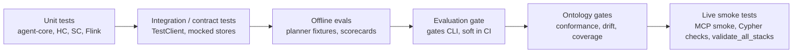

# 06 — Quality Assurance

This document describes how the platform is verified: which test layers exist, what each suite asserts, how evaluation gates score agent behaviour, and how to run live smoke checks. CI wiring for these suites is described in [07 — CI/CD Automation](07_cicd_automation.md); runtime design under test is in [05 — AI Agents](05_ai_agents.md) and [04 — Data Platform](04_data_platform.md).

## 1. QA strategy

Quality is layered from fast, hermetic tests to live-stack smoke checks. Every layer except the last runs without Kafka, Flink, Neo4j, Qdrant or an LLM.



| Layer | Scope | External services | Where it runs |
| --- | --- | --- | --- |
| Unit | Pure functions, agents, planner, memory, HITL, embeddings | None | CI + `make test-unit` |
| Integration | HTTP/MCP contracts, MLflow tracing, ontology conformance | Mocked | CI + `make test-integration` |
| Evals | Planner routing fixtures, evaluation stage 4 | None | CI + `make test-evals` |
| Ontology | Loader, runtime rules, seeds, drift, terminology coverage | None (bootstrap smoke uses fixtures) | CI `ontology-conformance` |
| Smoke | End-to-end queries, MCP tools, graph content | Full local stack | Manual / `make validate` |

## 2. Test inventory

| Package | Path | Suites |
| --- | --- | --- |
| `agent-core` | `packages/agent-core/tests/unit/` | `test_agent_core`, `test_mcp_server` |
| Healthcare agent | `domains/healthcare/agent-service/tests/unit/` | `test_agent_delegation`, `test_embedding_parity`, `test_harness`, `test_hitl_and_graph_cache`, `test_langgraph_agents`, `test_layered_runtime`, `test_loop_hardening`, `test_memory`, `test_model_router`, `test_planner_edge_cases`, `test_provider_failover`, `test_retrieval`, `test_schemas`, `test_structured_output`, `test_tool_catalog` |
| Healthcare agent | `domains/healthcare/agent-service/tests/integration/` | `test_contracts`, `test_mlflow_integration`, `test_ontology_conformance` |
| Healthcare agent | `domains/healthcare/agent-service/tests/evals/` | `test_evaluation_stage4`, `test_planner_evaluation` (fixtures in `evals/fixtures/`) |
| Supply-chain agent | `domains/supply-chain/agent-service/tests/unit/` | `test_domain`, `test_embedding`, `test_graph_cache`, `test_schemas`, `test_tool_catalog` |
| Supply-chain agent | `domains/supply-chain/agent-service/tests/integration/` | `test_contracts` |
| Healthcare Flink | `domains/healthcare/data-pipelines/flink-job/tests/` | `test_embedding`, `test_embedding_provider`, `test_graph_writes`, `test_ontology_loader`, `test_pipeline_service`, `test_runtime_rules`, `test_seed_generation`, `test_storage` |
| Supply-chain Flink | `domains/supply-chain/data-pipelines/flink-job/tests/` | `test_job_embedding` |
| Bootstrap | `domains/*/scripts/test_neo4j_bootstrap.py` | Seed and constraint bootstrap smoke |

Agent-service suites use `pytest` through the uv workspace; Flink suites use `unittest` with the Flink requirements and `packages/knowledge-core` installed.

## 3. Contract tests

`tests/integration/test_contracts.py` drives the FastAPI app in-process with `TestClient`. Qdrant, Neo4j and the LLM are replaced with fakes, and the harness reloads the module per test and unregisters `agent_service_*` Prometheus collectors so metrics do not leak between cases.

The healthcare suite asserts:

- **Redaction and audit** — identifiers are masked in responses and every call writes an audit event.
- **Role policy** — `read_only` callers receive 401 on `/query`; `X-Caller-Role` is honoured only when `AGENT_ALLOW_ROLE_HEADER=true`.
- **Evidence modes** — `generation` returns bounded evidence by default; `export` returns bounded text and raw payload requests are denied.
- **Response budget** — oversized responses are trimmed to `AGENT_MAX_RESPONSE_BYTES` and flagged with `guardrails.response_truncated`.
- **Skills planning** — `/skills/plan` returns a plan for known goals and a structured error for unknown goals, including planner metadata.
- **MCP tool shapes** — `timeline_explain`, `medication_risk_assess`, `coding_gap_detect` and `cohort_risk_summary` return the documented schemas (see [05 — AI Agents](05_ai_agents.md#9-mcp-tools-and-skills)).

The supply-chain suite covers the same policy surface for its own tools and roles.

## 4. Planner suites

The planner is deterministic, so its behaviour is pinned by fixtures rather than LLM judgements.

| Suite | Assertions |
| --- | --- |
| `tests/evals/test_planner_evaluation.py` + `fixtures/planner_route_fixtures.json` | Request-type classification for medication safety, lab interpretation, coding review, cohort triage and patient summary; precedence between overlapping intents; every plan step has `name`, `query_text`, `top_k`, `reason`; `top_k` stays bounded |
| `tests/unit/test_planner_edge_cases.py` | Ambiguous precedence, empty patient scope falls back to cohort routing, non-positive `max_top_k`, deterministic vector ranking, deterministic cohort ranking |

Request types and routing rules are documented in [05 — AI Agents](05_ai_agents.md#request-types).

## 5. Evaluation gates and MLflow evaluation

The `healthcare_agent.evaluation` package scores agent runs offline.

| Module | Responsibility |
| --- | --- |
| `gates.py` | `GateThresholds` (routing 0.6, evidence 0.5, answer 0.5, overall 0.55) and a CLI: `--results-file`, `--min-score` |
| `agent_eval.py` | `run_evaluation_suite` over a case set |
| `grounding_scorecard.py` | `score_grounding(answer, context_texts)` — overlap of answer claims with retrieved evidence |
| `mlflow_eval.py` | Scorers for routing, coverage, evidence, answer, safety caveat and latency (30 s budget); `run_mlflow_evaluation`; `compare_modes` for A/B of agent modes |
| `retrieval_benchmark.py` | `precision_at_k`, `recall_at_k`, `score_all` |

Run the gate against stored results:

```bash
cd domains/healthcare/agent-service
uv run --package healthcare-agent-service \
  python -m healthcare_agent.evaluation.gates \
  --results-file tests/evals/fixtures/evaluation_results.json --min-score 0.5
```

In CI the gate runs with `--min-score 0.5` as a **soft gate** (`continue-on-error: true`): regressions are visible but do not block merges. MLflow runs and traces are browsed via `make mlflow` (see [05 — AI Agents](05_ai_agents.md#observability)).

## 6. Retrieval and embedding tests

- **Embedding parity** — `test_embedding_parity` (healthcare) and `test_embedding` (supply-chain) assert that the agent query embedder uses the same provider, model and dimension as the Flink ingest embedder, so vectors are comparable.
- **Provider selection** — `test_embedding_provider` (Flink) and `test_job_embedding` cover `EMBEDDING_PROVIDER=local` (MiniLM, 384 dims) and `databricks` (`databricks-gte-large-en`, 1024 dims), including dimension checks. See [04 — Data Platform](04_data_platform.md#embeddings).
- **Retrieval** — `test_retrieval` checks filter construction and ranking; `retrieval_benchmark.py` computes precision/recall@k against labelled fixtures.
- **Graph cache** — `test_hitl_and_graph_cache` / `test_graph_cache` verify cache hits, TTL expiry and key isolation.

## 7. Graph logic checks

Ontology and seed correctness is gated in CI (see [07 — CI/CD Automation](07_cicd_automation.md#3-ontology-conformance-workflow)). Against a running stack, these Cypher checks confirm the clinical rules materialised correctly:

```bash
make neo4j-hc   # or: docker exec -it healthcare-neo4j cypher-shell -u neo4j -p "$NEO4J_PASSWORD"
```

```cypher
// Lab thresholds, e.g. Potassium >= 5.5 -> Hyperkalemia
MATCH (l:LabTest)-[r:MAY_INDICATE]->(c:Condition) RETURN l.name, r.threshold, c.name LIMIT 10;

// Contraindication with reason
MATCH (m:Medication {name:'Metformin'})-[r:CONTRAINDICATED_FOR]->(c:Condition)
RETURN c.name, r.reason;  // expect CKD, lactic_acidosis_risk

// Adverse outcome catalogue (expect 6 codes)
MATCH (a:AdverseOutcome) RETURN count(a);

// Known reactions (expect >= 20)
MATCH ()-[r:HAS_KNOWN_REACTION]->() RETURN count(r);

// Interactions carry a mechanism
MATCH ()-[r:INTERACTS_WITH]->() WHERE r.mechanism IS NULL RETURN count(r);  // expect 0

// Patient-reported reactions
MATCH ()-[r:REPORTED_ADVERSE_REACTION]->() RETURN count(r);
```

## 8. Grounding and response styles

Answers must be grounded in retrieved evidence and cite it. `score_grounding` is used both offline and in MLflow evaluation. The `response_style` request field (`concise`, `clinical`, `audit`) changes format only — not evidence selection or guardrails — and is covered by `test_structured_output`.

## 9. Live smoke tests

With the stack running (`make up` — see [08 — Operation Runbook](08_operation_runbook.md)):

```bash
make validate                                   # cross-domain stack validation
make query-hc                                   # sample healthcare query
make query-sc                                   # sample supply-chain query
python domains/healthcare/scripts/mcp_smoke_test.py   # MCP initialize, list and call tools
domains/healthcare/scripts/test_planner.sh      # planner routes over HTTP
```

## 10. Running locally

| Command | Runs |
| --- | --- |
| `make sync` | `uv sync` for the workspace |
| `make lint` | Ruff (`E,F,I`, line length 120) over `packages domains scripts` |
| `make test-unit` | Unit suites for agent-core, healthcare and supply-chain |
| `make test-integration` | Contract, MLflow and ontology integration suites |
| `make test-evals` | Healthcare offline evaluation suites |
| `make test-core` / `test-hc` / `test-sc` | All suites for one package |
| `make validate-skills` | Generated skill packages are in sync and valid |
| `make validate-ontology` | Ontology configs for both domains |
| `make validate-docs` | Markdown lint |

Flink suites:

```bash
python -m unittest discover -s domains/healthcare/data-pipelines/flink-job/tests
python -m unittest discover -s domains/supply-chain/data-pipelines/flink-job/tests
```

## 11. Known gaps

- No adversarial tests for prompt or Cypher injection through graph content.
- No curated golden question set executed against a live LLM in CI.
- The evaluation gate is soft; promoting it to a hard gate requires a stable baseline.
- Supply-chain has no offline evaluation suite.

## Related

- [05 — AI Agents](05_ai_agents.md)
- [07 — CI/CD Automation](07_cicd_automation.md)
- [08 — Operation Runbook](08_operation_runbook.md)
