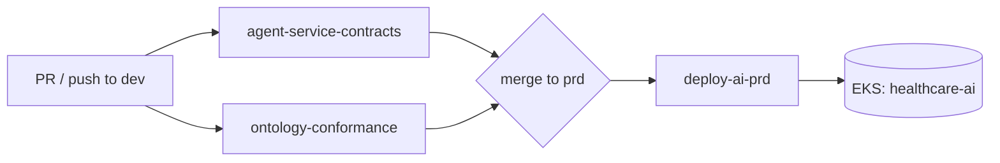
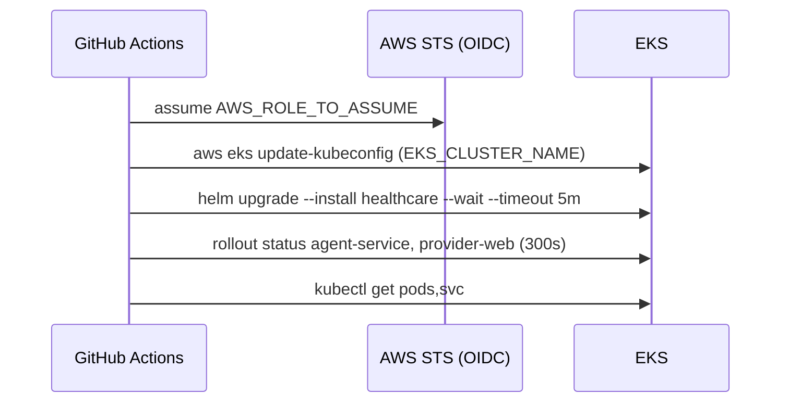
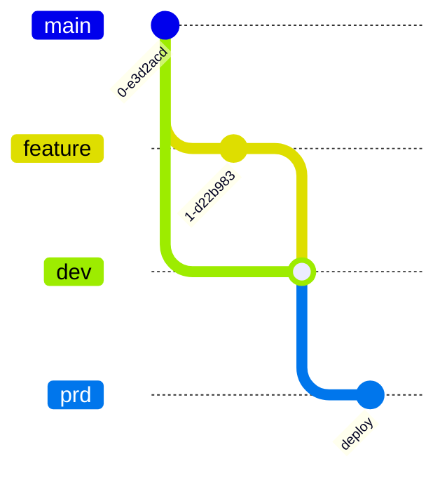

# 07 — CI/CD Automation

This guide covers how code moves from a branch to a running cluster. It describes the three GitHub Actions workflows, the branch model, ownership rules, and the version matrix. For what the tests check, see [06 — Quality Assurance](06_quality_assurance.md). For Helm charts, environments, and secrets, see [03 — Platform Blueprint](03_platform_blueprint.md).

## 1. Pipeline overview



| Workflow | File | Trigger | Purpose |
| --- | --- | --- | --- |
| Agent-service contracts | `.github/workflows/agent-service-contracts.yml` | push / PR to `dev` (path filtered) | Skills sync, lint, unit/integration/eval tests, image builds, Helm lint |
| Ontology conformance | `.github/workflows/ontology-conformance.yml` | push / PR to `dev` (path filtered) | Ontology loader, runtime rules, seeds, terminology, drift, bootstrap |
| Production deploy | `.github/workflows/deploy-ai-prd.yml` | push to `prd` (path filtered), `workflow_dispatch` | Helm upgrade of the healthcare release on EKS |

All workflows run on `ubuntu-latest`. Path filters keep doc-only changes from triggering builds.

## 2. Agent-service contracts workflow

Path filters include `pyproject.toml`, `uv.lock`, `packages/**`, both agent services, both skill trees and their generator/validator scripts, `scripts/lib/**`, `domains/*/scripts/**`, and Python files under `domains/*/data-pipelines/`.

| Job | Steps | Blocking |
| --- | --- | --- |
| `skills-layer-validation` | `generate_agent_skills.py --check` and `validate_agent_skills.py` for both domains; optional upstream `skills-ref validate` (skipped if it cannot be installed) | Yes, except `skills-ref` |
| `ruff-lint` | `ruff check` with uv | Yes |
| `contract-tests` | `uv sync --frozen` for `agent-core`, `healthcare-agent-service`, `supply-chain-agent-service`; `pytest tests/unit` for all three; `pytest tests/integration` for both domains; healthcare `tests/evals`; evaluation gates CLI | Yes, except the gates step |
| `container-build` | `docker build` for both agent-service Dockerfiles (repo-root context) | Yes |
| `helm-lint` | `helm lint infra/helm`; `helm template` with dev and production values | Yes |

`uv sync --frozen` fails if `uv.lock` is out of date. Run `uv lock` locally and commit the lockfile with any dependency change.

## 3. Ontology conformance workflow

This workflow guards the ontology, seed Cypher, and the healthcare Flink job. Every job installs the healthcare Flink `pyproject.toml` and `./packages/knowledge-core`.

| Job | Runs |
| --- | --- |
| `ontology-loader-tests` | `flink-job/tests/test_ontology_loader.py` |
| `runtime-rule-tests` | `flink-job/tests/test_runtime_rules.py` |
| `module-unit-tests` | `test_storage`, `test_graph_writes`, `test_pipeline_service` |
| `seed-generation-tests` | `test_seed_generation`, then `scripts/validate_ontology.py` |
| `terminology-coverage-gate` | `scripts/validate_terminology_coverage.py` |
| `ontology-drift-gate` | `scripts/validate_ontology_drift.py` |
| `bootstrap-smoke-test` | `test_neo4j_bootstrap.py` for healthcare and supply-chain |

When you change an ontology YAML, regenerate the seeds (`generate_ontology_seed_cypher.py`) and commit `generated_ontology_seeds.cypher` in the same PR. Otherwise the drift gate fails.

The supply-chain Flink unit tests are not in this workflow. Run them locally (see [06 — Quality Assurance](06_quality_assurance.md)).

## 4. Production deploy workflow

`deploy-ai-prd.yml` deploys the healthcare umbrella chart to EKS. It triggers on push to `prd` when any of these change: the workflow file, `infra/helm/**`, the healthcare agent-service or webapp, `packages/**`, `pyproject.toml`, or `uv.lock`. It can also be run manually.



The workflow runs:

```bash
helm upgrade --install healthcare infra/helm \
  -f infra/helm/values-production.yaml \
  -n healthcare-ai --create-namespace \
  --set agent-service.secrets.NEO4J_PASSWORD="$NEO4J_PASSWORD" \
  --set agent-service.secrets.ANTHROPIC_API_KEY="$ANTHROPIC_API_KEY" \
  --wait --timeout 5m
```

| Kind | Name | Use |
| --- | --- | --- |
| Permission | `id-token: write`, `contents: read` | OIDC federation, no static AWS keys |
| Repository variable | `AWS_ROLE_TO_ASSUME` | IAM role trusted for this repo |
| Repository variable | `AWS_REGION` | Cluster region |
| Repository variable | `EKS_CLUSTER_NAME` | Target cluster |
| Secret | `NEO4J_PASSWORD` | Passed to the agent-service secret |
| Secret | `ANTHROPIC_API_KEY` | Fallback LLM key |

`values-production.yaml` ships `secrets: {}`. The two `--set` flags are the only secrets the workflow injects. Other secrets, such as `DATABRICKS_TOKEN` for `EMBEDDING_PROVIDER=databricks`, must come from an external secret manager. See [03 — Platform Blueprint](03_platform_blueprint.md#5-configuration-and-secrets).

The workflow does not build or push images. It deploys the image tags already set in the values file.

## 5. Evaluation gate policy

The gates step runs offline against committed fixtures:

```bash
uv run --package healthcare-agent-service python -m healthcare_agent.evaluation.gates \
  --results-file tests/evals/fixtures/evaluation_results.json --min-score 0.5
```

It is a blocking gate. A failing score fails the job and blocks a merge. Metric definitions are in [06 — Quality Assurance](06_quality_assurance.md#5-evaluation-gates-and-mlflow-evaluation).

## 6. Branch and release flow



1. Open a PR from a feature branch into `dev`. The contracts and ontology workflows must pass.
2. Promote `dev` to `prd` with a PR or fast-forward merge.
3. A push to `prd` that touches deployable paths triggers `deploy-ai-prd`.
4. To redeploy without a code change, run the workflow manually with `workflow_dispatch`.

To roll back, revert on `prd` and let the workflow redeploy, or run `helm rollback healthcare -n healthcare-ai`.

## 7. Code ownership

`.github/CODEOWNERS` assigns `@wchen-dea` as required reviewer for:

- `domains/healthcare/knowledge/ontology/` and `domains/supply-chain/knowledge/ontology/`
- Both `knowledge/graph-seeds/generated_ontology_seeds.cypher` files
- Healthcare `validate_ontology.py`, `validate_terminology_coverage.py`, and `generate_ontology_seed_cypher.py`

Ontology changes change graph semantics for every consumer, so they need an explicit owner review. See [ADR 0003](adrs/0003-ontology-governance-and-seed-generation.md).

## 8. Helm and environments summary

| Environment | Entry point | Release / namespace | Notes |
| --- | --- | --- | --- |
| Local compose | `make up`, `make up-hc`, `make up-sc` | n/a | Full stack, local embeddings |
| Minikube dev | `make helm-dev` (`infra/environments/dev/setup-minikube.sh`) | `healthcare-dev` / `healthcare-ai-dev` | `values-dev.yaml`, 1 replica, NodePort 30800 |
| Production (EKS) | `deploy-ai-prd.yml` (`make helm-prd` renders a dry-run) | `healthcare` / `healthcare-ai` | `values-production.yaml`, HPA, external Neo4j/Qdrant, Bedrock |
| Production compose | `infra/environments/production/docker-compose.ai.yml` | n/a | Single-host AI tier plus monitoring compose |

Chart layout, values, and secret handling are described in [03 — Platform Blueprint](03_platform_blueprint.md#3-kubernetes-with-helm).

## 9. Version matrix

| Component | Version |
| --- | --- |
| Python | 3.11 (packages declare `>=3.11,<3.14`) |
| Java | 17 |
| Flink / PyFlink | 1.20.5 |
| Flink Kafka connector | 3.4.0 |
| Confluent Platform | 7.9.0 (Docker), 7.6.0 (Helm) |
| Neo4j | 5.26.2 (Docker), 5-community (Helm) |
| Neo4j Python driver | 5.24.0 |
| Qdrant | v1.12.1 |
| qdrant-client | 1.11.3 |
| confluent-kafka | 2.5.3 |
| FastAPI | 0.115.0 |
| LangGraph | >=0.4.1 |
| langchain-core | >=0.3 |
| MCP SDK | 1.28.0 |
| MLflow | v2.21.3 |
| sentence-transformers | 3.0.1 |
| Conduktor | 1.25.1 |

The upper bound `<3.14` exists because `mcp==1.28.0` and `fastapi==0.115.0` do not resolve together on Python 3.14.

## 10. Configuration guidelines

- Pin runtime dependencies in each package `pyproject.toml` and commit `uv.lock`. CI uses `--frozen`.
- Keep secrets out of values files. Pass them with `--set` from CI secrets or mount them from a secret manager.
- Use repository variables, not secrets, for non-sensitive identifiers such as role ARN, region, and cluster name.
- Set `AGENT_ALLOW_ROLE_HEADER=false` in every shared environment so callers cannot choose their own role.
- Keep `EMBEDDING_PROVIDER` and `EMBEDDING_DIM` the same for ingest and query. Changing them needs a Qdrant re-index. See [04 — Data Platform](04_data_platform.md#embeddings).

## 11. Local equivalents

| CI step | Local command |
| --- | --- |
| Ruff | `make lint` |
| Unit tests | `make test-unit` |
| Integration tests | `make test-integration` |
| Evaluation suites | `make test-evals` |
| Skills sync and validation | `make validate-skills` |
| Ontology validation | `make validate-ontology` |
| Helm lint and template | `make helm-lint` |
| Docs lint | `make validate-docs` |
| Full stack validation | `make validate` |

## Related

- [03 — Platform Blueprint](03_platform_blueprint.md)
- [06 — Quality Assurance](06_quality_assurance.md)
- [08 — Operation Runbook](08_operation_runbook.md)
- [ADR 0011 — uv workspace](adrs/0011-uv-workspace-packaging.md)
