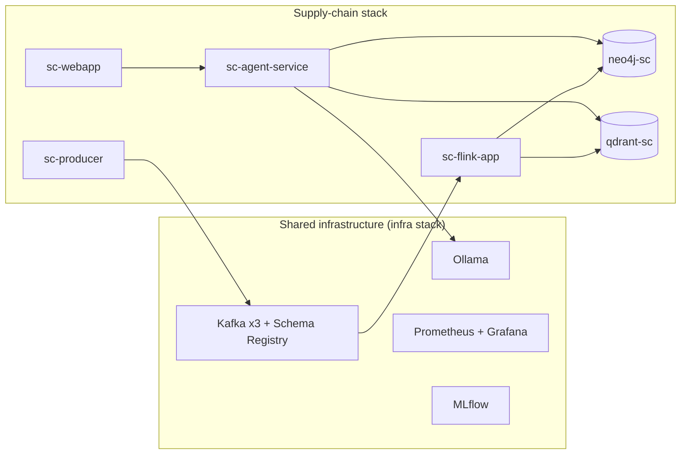
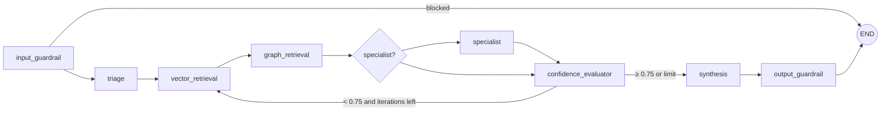

# 09 — Supply Chain Domain

The supply-chain resilience domain runs alongside the healthcare domain. It shares the platform layers described in [02 — Architecture](02_architecture.md) and the shared Python packages in `packages/`. Its graph, vector store, topics and agent are its own. This document covers only what is specific to supply chain. For shared mechanics, see [04 — Data Platform](04_data_platform.md) and [05 — AI Agents](05_ai_agents.md).

## 1. Scope

The domain ingests synthetic procurement and logistics events and answers grounded questions about:

- supplier risk and single-source exposure
- shipment tracking and delays
- quality inspections and defect trends
- disruption impact on parts and facilities
- inventory exposure and reorder planning

Compared with healthcare, the supply-chain agent is intentionally simpler:

| Capability | Healthcare | Supply chain |
| --- | --- | --- |
| Agent port | 8000 | 8001 |
| SSE streaming | Yes | No |
| Multi-turn memory | Yes | No |
| Human review (HITL) | Yes | No |
| LLM provider | Ollama, with optional routing | Ollama only (`LLM_TIMEOUT_SECONDS=300`) |
| Flink tests in CI | Yes | No |

## 2. Shared and isolated resources



| Resource | Value |
| --- | --- |
| Compose file | `infra/compose/docker-compose.supply-chain.yml`, project `supplychain` |
| Services | `neo4j-sc`, `neo4j-sc-init`, `qdrant-sc`, `sc-kafka-init`, `sc-producer`, `sc-flink-jobmanager`, `sc-flink-taskmanager`, `sc-flink-app`, `sc-agent-service`, `sc-webapp` |
| Container prefix | `supplychain-` |
| Neo4j | HTTP 7475, Bolt 7688 |
| Qdrant | HTTP 6335, gRPC 6336, collection `supplychain_events` |
| Flink UI | 8083 |
| Agent API | 8001 |
| Web app | 8089 |
| Kafka topics | `supplychain.*` |

## 3. Event model

The producer (`domains/supply-chain/data-pipelines/producer/produce_events.py`) emits Avro records that follow `schemas/supply_chain_event.avsc`.

| Topic | Event type | Kind |
| --- | --- | --- |
| `supplychain.purchase.orders` | `PURCHASE_ORDER` | Transactional |
| `supplychain.shipment.updates` | `SHIPMENT_UPDATE` | Transactional |
| `supplychain.quality.results` | `QUALITY_RESULT` | Transactional |
| `supplychain.disruption.alerts` | `DISRUPTION_ALERT` | Transactional |
| `supplychain.inventory.levels` | `INVENTORY_LEVEL` | Transactional |
| `supplychain.master.suppliers` | `SUPPLIER_MASTER_UPSERT` | Reference |
| `supplychain.master.parts` | `PART_MASTER_UPSERT` | Reference |
| `supplychain.master.facilities` | `FACILITY_MASTER_UPSERT` | Reference |

Producer defaults:

| Variable | Default |
| --- | --- |
| `EVENT_INTERVAL_SECONDS` | `1` |
| `TRANSACTION_EVENTS_PER_INTERVAL` | `3` |
| `REFERENCE_EVENTS_PER_INTERVAL` | `3` |
| Supplier / facility / part pools | 200 / 100 / 500 |
| Late-event probability | `0.10` |

## 4. Stream processing

The Flink job (`data-pipelines/flink-job/`) consumes all eight topics and:

1. Deserializes Avro (or JSON) and parses `payload_json`.
2. Builds event-specific searchable text.
3. Embeds the text with the shared adapter (see [section 6](#6-embeddings)).
4. Upserts one Qdrant point per event. The point ID is derived from the MD5 of `event_id`, so replays are idempotent.
5. Writes the graph through `SupplyChainPipelineService`. It records a base `SupplyChainEvent` and dispatches to idempotent `MERGE` handlers in `app/graph_writes.py`. Reference events go straight to the master-data handlers.

The synchronous processor commits Kafka offsets only after a record succeeds and retries failures after one second. The PyFlink job checkpoints every 10 s with parallelism 1. There is no dead-letter topic. Day-to-day job operations are in [08 — Operations Runbook](08_operation_runbook.md#6-flink-operations).

## 5. Knowledge model

### Graph

| Node | Description |
| --- | --- |
| `Supplier` | Organization providing parts or materials |
| `Part` | Component, material or finished good |
| `Facility` | Factory, warehouse, distribution center or port |
| `Shipment` | Tracked movement of goods |
| `PurchaseOrder` | Contractual order |
| `QualityInspection` | Inbound or in-process quality check |
| `DisruptionEvent` | Supply chain disruption |
| `RiskSignal` | Computed risk indicator |
| `SupplyChainEvent`, `SourceSystem` | Provenance |

Key relationships: `SUPPLIES`, `DEPENDS_ON` (bill of materials), `SHIPPED_FROM`, `SHIPPED_TO`, `DISRUPTED_BY`, `AFFECTS_PART`, `HAS_RISK_SIGNAL`, `HOLDS_INVENTORY`. Every node label has a uniqueness constraint in `knowledge/graph-seeds/init.cypher`.

### Ontology and risk rules

The ontology lives in `domains/supply-chain/knowledge/ontology/` (`entities.yaml`, `relationships.yaml`, `vocabularies.yaml`, `provenance.yaml`, `graph_seeds.yaml`). It is governed as described in [ADR 0003](adrs/0003-ontology-governance-and-seed-generation.md). `rules/risk_signals.yaml` defines five risk rules:

| Rule | Trigger |
| --- | --- |
| Single-source dependency | A part has only one supplier |
| Lead-time volatility | `actual_lead_days > expected_lead_days * 1.5` |
| Quality failure | `defect_rate > 0.05` |
| Geopolitical exposure | Supplier located in a high-risk region |
| Disruption cascade | Disruption hits a sole-source supplier |

`knowledge/graph-seeds/bootstrap.sh` waits for Neo4j, then applies `init.cypher` and the generated seeds through `cypher-shell`.

## 6. Embeddings

Supply chain uses the same provider-neutral adapter as healthcare (`knowledge_core.embedding`). Both `sc-flink-app` and `sc-agent-service` must run with identical settings.

| `EMBEDDING_PROVIDER` | Model | Dimensions | Where it runs |
| --- | --- | --- | --- |
| `local` (dev default) | `all-MiniLM-L6-v2` | 384 | Inside the Flink and agent images |
| `databricks` (production) | `databricks-gte-large-en` | 1024 | Databricks Model Serving |

The `supplychain_events` collection is sized from the provider. A dimension mismatch fails fast. Changing provider means recreating the collection and re-ingesting; follow [the re-index procedure](08_operation_runbook.md#7-embedding-provider-switch-and-re-index). The design rationale is in [04 — Data Platform](04_data_platform.md#embeddings).

## 7. Agent service

The agent lives in `domains/supply-chain/agent-service/src/supply_chain_agent/`.



- **Specialists:** `supplier_risk`, `disruption_impact`, `quality_review`, `inventory_planning`.
- **Iterations:** `LANGGRAPH_MAX_ITERATIONS` defaults to 3 and is capped at 6.
- **Graph retrieval:** resolves the entity as a `Supplier`, `Part` or `Facility`, then collects supplied parts, risk signals, disruptions, inspections and inventory.
- **Vector retrieval:** filters by `entity_id`, `supplier_id` or `facility_id` when an entity is given.

### Request types

The keyword planner selects a request type, prefixes the retrieval query and caps `top_k` at 8.

| Request type | Trigger keywords |
| --- | --- |
| `supplier_risk` | risk, single source, geopolitical, exposure |
| `shipment_tracking` | shipment, transit, delivery, delayed, customs |
| `quality_review` | quality, defect, inspection, rejection |
| `disruption_impact` | disruption, shutdown, closure, strike, disaster |
| `inventory_planning` | inventory, stock, reorder, days of supply |
| `procurement_overview` | default |

### HTTP API

| Method and path | Purpose |
| --- | --- |
| `GET /health` | Liveness, returns `{"status": "ok", "domain": "supply-chain"}` |
| `GET /metrics` | Prometheus metrics |
| `GET /mcp/health` | MCP transport and skills-layer status |
| `POST /query` | `question` (3–1,000 chars) and optional `entity_id` |
| `POST /skills/plan` | `business_goal` and optional `agent` |

Unknown request fields are rejected. The caller role comes from the `X-Caller-Role` header.

### MCP tools and skills

The embedded MCP server is named `SupplyChainGraphRAG MCP` and serves streamable HTTP at `/mcp`. `config/tool_policies.json` authorizes tools by role:

| Role | Tools |
| --- | --- |
| `read_only` | `skills_plan_get`, `supplier_context_get`, `vector_evidence_search` |
| `generation` | Query, planning, answer generation, risk summary, disruption impact and inventory reorder tools |
| `export` | `evidence_bundle_export` |

`config/skills_layer.json` maps four business goals to six skills packaged under `knowledge/skills/`: `supplier-risk-review`, `disruption-impact-assessment`, `quality-supplier-scorecard`, `inventory-exposure-check`, `grounded-answer` and `evidence-bundle-export`.

### Evaluation

`evaluation/scenarios.py` has five scenarios, one per non-default request type. `evaluation/mlflow_eval.py` scores routing accuracy, agent coverage, evidence completeness and answer quality. Gates are described in [06 — Quality Assurance](06_quality_assurance.md#5-evaluation-gates-and-mlflow-evaluation).

## 8. Quick start

```bash
make compose-up-sc        # infra + supply chain; `make compose-up` starts both domains
```

Without the Makefile:

```bash
docker compose -f infra/compose/docker-compose.infra.yml -p infra up -d
docker compose -f infra/compose/docker-compose.supply-chain.yml -p supplychain up -d
```

Check the graph:

```bash
docker exec supplychain-neo4j cypher-shell -u neo4j -p "$NEO4J_PASSWORD" \
  "MATCH (n) RETURN labels(n)[0] AS label, count(n) AS cnt ORDER BY cnt DESC;"
```

Ask a question:

```bash
curl -s localhost:8001/query -H 'Content-Type: application/json' \
  -H 'X-Caller-Role: generation' \
  -d '{"question": "Which suppliers are single-source risks?"}' | jq .answer
```

Credentials come from the environment (`NEO4J_PASSWORD`). Never hardcode them in scripts or docs.

## 9. Repository layout

```text
domains/supply-chain/
├── agent-service/          # supply_chain_agent: api, orchestration, agents, retrieval, safety, tools, config
├── data-pipelines/
│   ├── flink-job/          # sync and PyFlink jobs; app/graph_writes.py, app/pipeline_service.py
│   ├── producer/           # produce_events.py
│   └── schemas/            # supply_chain_event.avsc
├── knowledge/
│   ├── ontology/           # entities, relationships, vocabularies, provenance, rules
│   ├── graph-seeds/        # init.cypher, generated_ontology_seeds.cypher, bootstrap.sh
│   └── skills/             # SKILL.md packages
├── scripts/                # seed and skill generators, validators, query examples
└── webapp/                 # static UI served on 8089
```

## Related

- [02 — Architecture](02_architecture.md)
- [04 — Data Platform](04_data_platform.md)
- [05 — AI Agents](05_ai_agents.md)
- [08 — Operations Runbook](08_operation_runbook.md)
- [10 — Healthcare Landscape](10_healthcare_landscape.md)
- [ADR 0009 — Domain module extraction](adrs/0009-domain-module-extraction.md)
