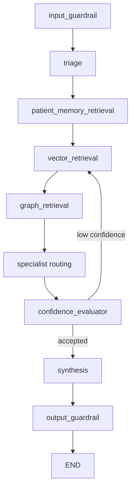

# Patient-memory service and LangGraph integration

## 1. Scope

Patient memory is a governed, patient-scoped store for minimized longitudinal facts. It is separate from:

- **Session memory:** short-lived conversation turns keyed by `session_id`.
- **Source evidence:** authoritative Qdrant and Neo4j retrieval results.
- **LangGraph checkpoints:** in-flight graph state used for HITL resume.

Patient memory is decision-support context only. It never replaces source evidence or clinician review.

## 2. Data contracts

```python
@dataclass
class PatientMemoryFact:
    key: str
    value: str
    fact_id: str | None = None
    category: str = "clinical"
    source: str = ""
    source_type: str = "unknown"
    observed_at: float = field(default_factory=time.time)
    expires_at: float | None = None
    confidence: float = 1.0
    metadata: dict[str, Any] = field(default_factory=dict)
```

Facts are normalized before persistence:

1. Trim and lowercase keys.
2. Collapse whitespace and cap key/value lengths.
3. Clamp confidence to $[0,1]$.
4. Remove direct-identifier metadata fields (`name`, `address`, `phone`, `email`, `ssn`).
5. Attach immutable write provenance.

```python
@dataclass
class PatientMemoryPolicy:
    consent_required: bool = True
    consent_granted: bool = False
    retention_seconds: int = 30 * 24 * 60 * 60
    max_facts: int = 100
    allowed_categories: set[str] = field(default_factory=set)
```

A fact is eligible when it is not expired and:

$$
now - observed\_at \le retention\_seconds
$$

`PatientMemoryRecord` isolates facts by `patient_id` and carries the policy and audit metadata.

## 3. Service API

`QueryService` is the application boundary used by HTTP and MCP transports.

```python
class QueryService:
    def load_patient_memory(
        self, patient_id: str | None
    ) -> PatientMemoryRecord | None: ...

    def write_patient_memory(
        self,
        patient_id: str,
        facts: Sequence[PatientMemoryFact | dict[str, Any]],
        provenance: dict[str, Any] | str,
        consent: bool,
        *,
        policy: PatientMemoryPolicy | None = None,
    ) -> PatientMemoryRecord: ...
```

Write behavior:

- Reject blank patient IDs.
- Reject missing consent when required.
- Reject disabled retention.
- Filter disallowed categories, empty facts, and expired facts.
- Upsert by `fact_id`, or by `category:key` when no ID is supplied.
- Enforce `max_facts`.
- Persist provenance with each fact and the record's last write metadata.
- Reject caller-supplied policies that exceed configured consent, retention, fact-count, or category ceilings.

The default adapter is `InMemoryPatientMemoryStore`. Set `PATIENT_MEMORY_STORE_BACKEND=redis` to use `RedisPatientMemoryStore` with `REDIS_URL`.

Authorized write surfaces:

- `POST /patient-memory` requires the `patient_memory_write` tool permission and patient scope.
- MCP `patient_memory_write` requires the `memory_write` role.
- Both require explicit consent and provenance and emit governance audit events.

## 4. LangGraph state and topology

The graph carries durable memory in explicit fields:

```python
class HealthcareAgentState(TypedDict, total=False):
    patient_id: str | None
    _patient_memory_record: Any
    patient_memory_context: Annotated[list[dict[str, Any]], merge_unique]
    patient_memory_facts: Annotated[list[dict[str, Any]], merge_unique]
    patient_memory_policy: dict[str, Any]
    patient_memory_metadata: dict[str, Any]
```

The graph sequence is:



`patient_memory_retrieval`:

1. Reads only the application-provided `PatientMemoryRecord`.
2. Calls `active_facts()`.
3. Writes facts to a separate trusted context channel.
4. Emits count and policy metadata, not raw memory in progress events.
5. Does not merge memory into `session_context`.

Synthesis receives memory as explicitly labeled context:

```text
Trusted longitudinal patient memory:
- allergy: penicillin
- risk: stable
```

Source vector and graph evidence remain separate arguments to the runtime synthesis adapter.

## 5. Composition and configuration

The composition root constructs:

```python
queries = QueryService(
    max_context_items=settings.max_context_items,
    orchestrator=LangGraphOrchestrator.build(),
    patient_memory_store=get_patient_memory_store(),
    patient_memory_policy=PatientMemoryPolicy(
        consent_required=settings.patient_memory_consent_required,
        retention_seconds=settings.patient_memory_retention_seconds,
        max_facts=settings.patient_memory_max_facts,
    ),
)
```

Configuration:

| Variable | Default | Purpose |
|---|---:|---|
| `PATIENT_MEMORY_STORE_BACKEND` | `memory` | `memory` or `redis` |
| `PATIENT_MEMORY_RETENTION_SECONDS` | `2592000` | Maximum fact age |
| `PATIENT_MEMORY_MAX_FACTS` | `100` | Per-patient fact cap |
| `PATIENT_MEMORY_CONSENT_REQUIRED` | `true` | Require explicit write consent |
| `REDIS_URL` | `redis://localhost:6379/0` | Redis adapter connection |

## 6. Safety and operational boundaries

- Patient memory is never loaded without an explicit `patient_id`.
- Patient memory is not used for patient discovery or cohort expansion.
- Memory is not streamed in LangGraph progress events.
- Pending HITL answers are not stored in session memory until review completes.
- Retention filtering runs on every load.
- Redis is opt-in; production deployments should use managed Redis, encryption, access controls, backups, and an operational deletion process.
- The current Redis adapter is a persistence shim; production deployments should add transactional concurrency control and audit-event export.
