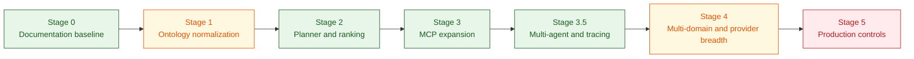

# Future Improvements Backlog

## Purpose

This document is the actionable execution backlog for the platform. It tracks what remains to build, prioritized by impact and informed by [industry landscape analysis](11_healthcare_ai_agent_landscape.md).

**For executives:** Staged delivery plan with clear completion criteria and AI-trends-driven priorities.

**For architects:** Capability gaps mapped to specific modules, with effort estimates and dependency chains.

**For engineers:** Sprint-level work items with acceptance criteria, file touchpoints, and CI integration points.

Use [03_target_architecture.md](03_target_architecture.md) for strategic architecture and capability intent.

## Current Status Summary

Completed or largely implemented:

- Stage 0 documentation and baseline architecture references,
- ontology configuration, ontology loader, and rule-pack integration in Flink modules,
- shared rag-api domain package (`domain/models.py`, `domain/planner.py`, `domain/evidence.py`, `domain/retrieval.py`, `domain/synthesis.py`, `domain/response_policy.py`),
- planner-driven query orchestration with deterministic ranking and planner metadata,
- expanded MCP tools (`timeline_explain`, `medication_risk_assess`, `coding_gap_detect`, `cohort_risk_summary`),
- planner quality suites (`test_planner_evaluation.py`, `test_planner_edge_cases.py`),
- provider adapter abstraction with Ollama runtime adapter,
- LangGraph multi-agent orchestration with eight specialized nodes and conditional routing (feature-flagged),
- MLflow tracing with nested span hierarchy across agent nodes, retrievers, and LLM calls (feature-flagged),
- MLflow evaluation harness with six healthcare-specific scorers and cross-mode comparison,
- LangSmith integration for LangGraph pipeline tracing.

Partially implemented:

- terminology governance breadth and mapping coverage,
- ontology conformance and retrieval quality benchmark depth,
- provider abstraction production test coverage (adapters implemented, failover contract tests pending),
- production privacy, policy, and rollout controls,
- LangGraph and MLflow production hardening for non-demo use.

## Remaining High-Priority Backlog

### 1. Complete Stage 4 evaluation hardening

Target outcomes:

- add retrieval benchmark suites with stable datasets and release-over-release comparison,
- add grounded answer scorecards and failure taxonomy,
- expand ontology conformance depth beyond current checks,
- add quality trend reporting in CI artifacts.

Suggested repo touchpoints:

- `domains/healthcare/agents/tests/`
- `docs/12_ai_qa.md`
- `.github/workflows/rag-api-contracts.yml`
- `.github/workflows/ontology-conformance.yml`

### 2. Expand provider adapter implementations

Target outcomes:

- add additional provider adapters behind the existing abstraction,
- keep retrieval orchestration unchanged across provider swaps,
- add adapter-focused contract tests and fallback behavior tests.

Suggested repo touchpoints:

- `domains/healthcare/agents/llm_provider.py`
- `domains/healthcare/agents/app.py`
- `domains/healthcare/agents/tests/test_contracts.py`

### 3. Finish terminology and ontology governance depth

Target outcomes:

- widen standard-code mapping coverage and validation,
- strengthen governance workflow for mapping updates,
- ensure graph seed and runtime semantic consistency remains auditable.

Suggested repo touchpoints:

- `data-platform/healthcare/config/ontology/`
- `domains/healthcare/scripts/generate_ontology_seed_cypher.py`
- `domains/healthcare/scripts/validate_ontology.py`
- `data-platform/healthcare/neo4j/generated_ontology_seeds.cypher`

### 4. Production controls for non-demo readiness (Stage 5)

Target outcomes:

- stronger policy classes and PHI handling boundaries,
- retention and lineage controls tied to ontology provenance,
- deployment-level rollout and rollback playbooks,
- explicit SLO gates for latency, freshness, and audit completeness.

Suggested repo touchpoints:

- `deploy/production/`
- `docs/13_runbook.md`
- `docs/06_technical_specs.md`
- monitoring and alerting assets

## Staged Plan Status



| Stage | Focus | Status | Notes |
| --- | --- | --- | --- |
| Stage 0 | Documentation and semantic contract baseline | Completed | Architecture, ADRs, and references are in place. |
| Stage 1 | Ontology externalization and normalization | Largely completed | Loader/normalization/rules modules exist; continue mapping depth work. |
| Stage 2 | Query planner and evidence ranking | Completed (baseline) | Planner and ranking shipped with fixture and edge-case suites. |
| Stage 3 | Skill-composed MCP expansion | Completed (current scope) | Expanded tools and policy updates shipped; continue iterative refinement as needed. |
| Stage 3.5 | Multi-agent orchestration and tracing | Implemented (feature-flagged) | LangGraph StateGraph, MLflow tracing, evaluation harness shipped; production hardening pending. |
| Stage 4 | Multi-domain support and provider abstraction | In progress | Supply-chain domain added; planner tests and provider abstraction started; benchmark/scorecard/provider breadth still open. |
| Stage 5 | Production controls for real data readiness | Pending | Requires policy/privacy/SLO rollout controls for non-demo operation. |

## Near-Term Execution Order

1. Stage 4 retrieval and grounding benchmark suites.
2. Stage 4 additional provider adapters and adapter-level tests.
3. Stage 1 terminology/ontology mapping coverage deepening.
4. Stage 5 production privacy and rollout controls.

## Two-Sprint Implementation Plan

### Sprint 1: Quality and Orchestration Hardening

- [ ] 1. Retrieval benchmark gate
Scope: Add stable retrieval fixtures and scoring script for precision@k and recall@k.
Acceptance criteria: At least 20 labeled queries in fixtures; precision@5 >= 0.70; recall@5 >= 0.75; benchmark output published as CI artifact.
CI checks: New workflow job `retrieval-benchmark` in `.github/workflows/rag-api-contracts.yml`; fails when thresholds are missed.

- [ ] 2. Grounded-answer scorecard
Scope: Add answer grounding evaluator with unsupported-claim and citation-coverage metrics.
Acceptance criteria: Golden set committed; unsupported-claim rate <= 0.10; citation coverage >= 0.80; failure taxonomy emitted per run.
CI checks: New workflow job `grounding-scorecard`; uploads JSON/Markdown report artifact and enforces thresholds.

- [ ] 3. ReAct loop hardening (phase 2)
Scope: Extend loop stop criteria, fallback behavior, and loop metadata tests.
Acceptance criteria: ReAct tests cover confidence stop, max-iteration stop, no-progress stop, and fallback path; no regression in planner suites.
CI checks: `python3 domains/healthcare/agents/tests/test_react_controller.py`; `python3 domains/healthcare/agents/tests/test_planner_evaluation.py`; `python3 domains/healthcare/agents/tests/test_planner_edge_cases.py`; aggregated via `domains/healthcare/scripts/test_react_planner.sh`.

- [ ] 4. Evidence fusion reranking
Scope: Add deterministic cross-source reranking using relevance + recency + graph signal weight.
Acceptance criteria: Ranking function documented and unit tested; top-k ordering deterministic across repeated runs; route quality improves on fixture set.
CI checks: New unit suite in `domains/healthcare/agents/tests/` and benchmark delta assertion in `retrieval-benchmark` job.

### Sprint 2: Runtime Resilience and Governance Promotion

- [x] 5. Multi-provider runtime + failover
Scope: Provider adapters and FallbackProvider implemented. Remaining: failover contract tests.
Acceptance criteria: Adapter switch by env works; timeout/5xx failover tested; retrieval orchestration unchanged.
CI checks: Extend `domains/healthcare/agents/tests/test_contracts.py` with provider/failover cases.

- [ ] 6. Ontology governance depth
Scope: Increase vocabulary mapping coverage and drift checks.
Acceptance criteria: Mapping coverage report generated; generator output parity enforced; ontology drift fails CI.
CI checks: Strengthen `.github/workflows/ontology-conformance.yml`; run `python domains/healthcare/scripts/validate_ontology.py` and fail on parity/drift mismatch.

- [ ] 7. Policy-as-code and PHI boundaries
Scope: Encode policy classes, redaction rules, and retention constraints as testable rules.
Acceptance criteria: Policy fixtures cover allowed/denied tool calls and redaction classes; export guardrails validated for all roles.
CI checks: Add policy regression suite in `domains/healthcare/agents/tests/`; run as required check in `rag-api-contracts.yml`.

- [ ] 8. Progressive delivery SLO gates
Scope: Define promotion gates for latency, error rate, and grounding score.
Acceptance criteria: Documented SLO thresholds in runbook; canary promotion checklist added; rollback trigger criteria explicit.
CI checks: Add deployment pre-check job in `.github/workflows/deploy-ai-prd.yml` validating SLO config and required artifacts.

### Exit Criteria After Sprint 2

- [ ] Retrieval and grounding quality gates are required checks on pull requests.
- [ ] ReAct and planner validation runs via a single stable command and CI job.
- [ ] At least two LLM providers are supported with tested failover.
- [ ] Ontology and policy drift checks block merges when governance constraints fail.
- [ ] Production promotion includes explicit SLO gates and rollback criteria.

## Multi-Domain Extension Backlog

### Supply Chain Domain

The `domains/supply-chain/` scaffold is in place with producer, graph_writes, pipeline service, ontology seeds, and docker-compose overlay. Remaining work:

- [ ] Full Flink consumer job for supply-chain topics (reuse healthcare runner pattern)
- [ ] Supply-chain RAG API with graph_context Cypher for supplier/part/facility traversal
- [ ] Supply-chain planner evaluation fixtures and contract tests
- [ ] Risk signal rules engine integration (single-source, lead-time, quality threshold rules)
- [ ] Supply-chain query examples script (`scripts/sc_query_examples.sh`)
- [ ] BOM cascade impact analysis: given a disruption, traverse DEPENDS_ON to find all affected assemblies
- [ ] Supplier scorecard aggregation from quality inspections, shipment lead times, and disruption history
- [ ] Neural embedding deployment for supply-chain Qdrant collection (shared MiniLM model)

### New Domain Template

To add a third domain (e.g., Insurance Claims, Cybersecurity SOC):

1. Create `domains/<name>/` with: `agents/`, `scripts/`, `skills/`, `webapp/`
2. Create `data-platform/<name>/` with: `config/ontology/`, `producer/`, `flink-app/app/`, `neo4j/`, `schemas/`
3. Define Avro envelope schema with domain-specific ID fields
4. Write docker-compose overlay with isolated Neo4j + Qdrant + topic init
5. Add Helm sub-charts or enable existing infra charts for the new domain
6. Implement graph_writes and pipeline_service for the domain's entity model
7. Add planner classifier and retrieval plan for domain request types
8. Create `generate_agent_skills.py` and `validate_agent_skills.py` in `domains/<name>/scripts/`

## AI Trends Gap Backlog

The following backlog items are derived from industry trends analysis comparing this platform against leading-edge AI systems (2025-2026) and peer projects (Multiagent-App-On-Databricks, GenAI-with-MLflow-on-Databricks).

### Stage 6: Advanced Agent Capabilities

| # | Item | Industry trend | Effort | Priority |
|---|------|---------------|--------|----------|
| 1 | **Structured output generation** — JSON-mode or schema-constrained decoding for deterministic extraction of interactions, contraindications, and risk assessments | Instructor, OpenAI JSON mode, Pydantic-constrained generation | Low | High |
| 2 | **Dynamic model routing** — route to different models based on query complexity, latency target, or cost budget | Martian, Unify, LiteLLM router | Medium | High |
| 3 | **Persistent agent memory** — cross-session context retention for longitudinal patient monitoring and escalation tracking | Mem0, Zep, Letta | Medium | High |
| 4 | **Input-side guardrails** — prompt injection detection and input validation before agent execution | Lakera Guard, NeMo Guardrails, Rebuff | Low-Medium | High |
| 5 | **Streaming responses (SSE)** — server-sent events for real-time answer streaming to the provider web UI | FastAPI StreamingResponse, LangGraph streaming | Low | Medium |
| 6 | **Evaluation-gated CI/CD** — MLflow evaluation scores as release gates that block deployment below thresholds | Mosaic AI Agent Evaluation, KPI-gated pipelines | Medium | High |
| 7 | **Adversarial evaluation (red-teaming)** — automated probing for hallucination, safety violations, and edge-case failures | Garak, promptfoo, DeepEval adversarial | Medium | Medium |
| 8 | **Confidence calibration** — selective abstention when evidence is insufficient rather than generating low-confidence answers | Conformal prediction, uncertainty quantification | Medium | Medium |

### Stage 7: Enterprise Governance and Scale

| # | Item | Industry trend | Effort | Priority |
|---|------|---------------|--------|----------|
| 9 | **Per-user identity and authorization** — propagate end-user identity through the agent pipeline for fine-grained access control | OBO tokens, Unity Catalog-style governance | Medium | High |
| 10 | **Neural reranking** — add a cross-encoder or late-interaction reranker between retrieval and synthesis | ColBERT, Cohere Rerank, cross-encoder models | Medium | Medium |
| 11 | **Inter-agent collaboration** — enable agents to delegate to each other, share intermediate state, or negotiate plans | AutoGen conversations, A2A protocol, CrewAI collaboration | High | Medium |
| 12 | **Multimodal support** — clinical image analysis (radiology, pathology) and document OCR as retrieval sources | GPT-4o vision, medical imaging models | High | Low |
| 13 | **Domain-specific fine-tuning** — LoRA or DPO fine-tuning on clinical summarization and medication safety reasoning | QLoRA, ORPO, domain distillation | High | Medium |
| 14 | **Distributed agent systems** — agent execution across multiple processes or services with shared state coordination | LangGraph Cloud, distributed orchestration | High | Low |
| 15 | **OpenTelemetry integration** — unified distributed tracing standard for correlation across Kafka, Flink, API, and agent spans | OTel collector, Jaeger, Tempo | Medium | Medium |

### Competitive Parity Items (from Multiagent-App-On-Databricks)

| # | Item | Their implementation | Our gap |
|---|------|---------------------|---------|
| 16 | **Citation enforcement in guardrails** — block responses that lack evidence references | Regex-based citation detection + `requires_evidence` flag | We redact evidence but don't enforce its presence in answers |
| 17 | **Pluggable message bus for audit** — Kafka/RabbitMQ/UC table backends | `MessageBus` interface with 5 backends | We write JSONL audit logs only; no pluggable backend |
| 18 | **React frontend with streaming** — real-time SSE to a modern UI | Vite + React + TypeScript + streaming | We have a static HTML form with synchronous responses |
| 19 | **KPI-gated release pipeline** — quantitative thresholds block promotion | `EVAL_MIN_TOOL_CALL_ACCURACY`, `EVAL_MIN_GROUNDEDNESS`, etc. | We have scorers but no CI gate that blocks deployment |
| 20 | **Multi-environment deployment** — dev/qa/stg/prod with config isolation | Databricks Asset Bundles + target configs | We have a single production bundle; no staged promotion |

### Suggested Execution Sequence

```text
Near-term (next sprint):
  #1 Structured outputs → #5 Streaming responses → #6 Evaluation-gated CI
  #4 Input guardrails → #16 Citation enforcement

Medium-term (next quarter):
  #2 Model routing → #9 Per-user identity → #10 Neural reranking
  #3 Persistent memory → #7 Adversarial evaluation → #19 KPI gates

Long-term (roadmap):
  #11 Inter-agent collaboration → #13 Fine-tuning → #12 Multimodal
  #14 Distributed agents → #15 OpenTelemetry
```
