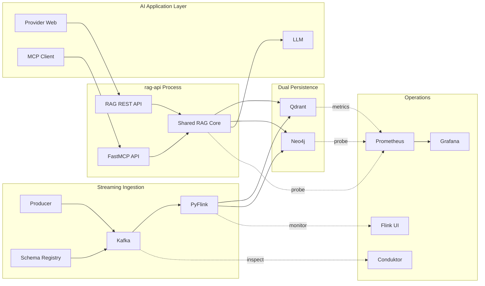
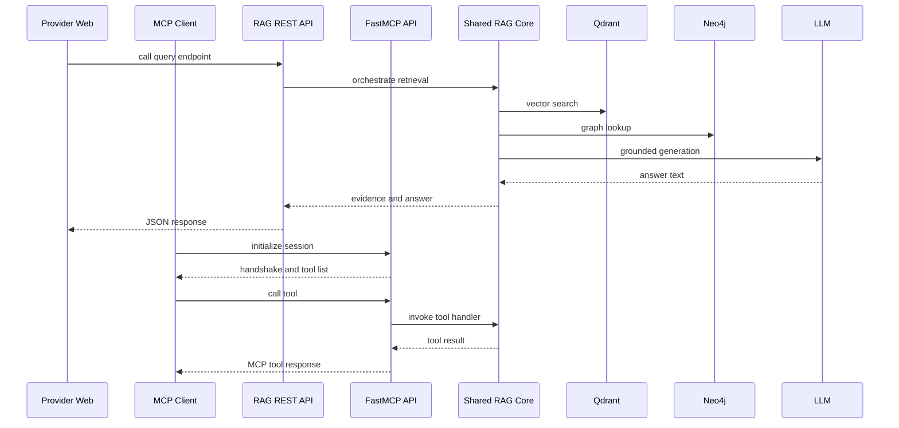
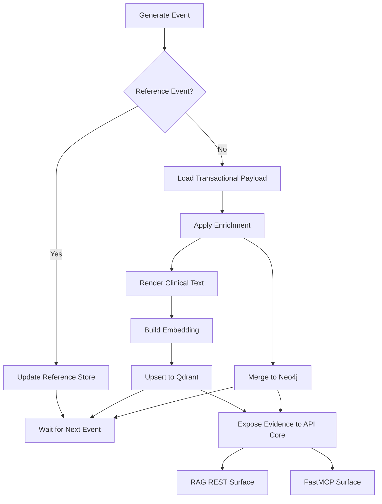
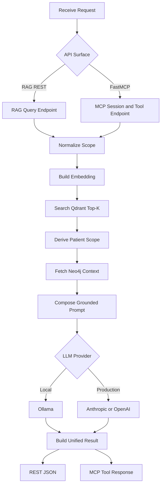

# Healthcare Hybrid GraphRAG Architecture

## Purpose

This repository demonstrates a local-first healthcare event intelligence stack that combines streaming ingestion, dual persistence (vector + graph), and grounded LLM answer generation.

It is optimized for reproducible local experimentation with clear lineage and full observability.

## ADR References

Key architecture decisions are tracked in [docs/adrs/README.md](adrs/README.md):

- [ADR-0001: Embed FastMCP in rag-api](adrs/0001-embed-fastmcp-in-rag-api.md)
- [ADR-0002: Use dual persistence (Qdrant + Neo4j)](adrs/0002-dual-persistence-qdrant-neo4j.md)
- [ADR-0003: Local-first LLM with provider routing](adrs/0003-local-first-llm-provider-routing.md)

## Why This Architecture Scales Across Healthcare Sections

The design separates stable platform capabilities from domain-specific healthcare logic.

Platform capabilities:

- streaming ingestion and replay,
- hybrid vector plus graph persistence,
- retrieval-grounded generation pipeline,
- observability and operational controls.

Domain extension points:

- Kafka topic contracts and schema variants,
- enrichment and normalization rules,
- graph labels, properties, and relationships,
- prompt templates and response policies.

This keeps new sections additive and modular.

## Healthcare Extension Matrix

| Section | Example Inputs | Graph/Vector Emphasis | Primary Users | Expected Outcome |
| --- | --- | --- | --- | --- |
| Acute Clinical Ops | EHR notes, vitals, labs, encounters | Condition progression, symptom-observation linkage | Care teams, command center | Faster deterioration signal detection and context-rich escalation |
| Medication Management | Orders, dispense records, interaction references | Medication-order linkage, interaction evidence | Pharmacists, inpatient teams | Reduced adverse-drug-risk exposure and clearer intervention rationale |
| Revenue Cycle Intelligence | Claims events, coding metadata, auth records | Clinical-claim traceability and mismatch signals | RCM analysts, coding teams | Lower denial rates and earlier documentation/coding correction |
| Payer Utilization Review | Authorization outcomes, utilization events | Coverage patterns and utilization trajectory | UM teams, payer analysts | Better high-cost-case triage and utilization governance |
| Population Health | Longitudinal events, risk tiers, chronic indicators | Cohort similarity + graph risk factors | Population health teams | Prioritized outreach and proactive risk management |
| Device and Remote Care | Telemetry, device inventory, alert streams | Device-patient-event lineage | Monitoring teams, biomedical ops | Faster anomaly triage and reduced alert fatigue |

## Extension Playbook

For each new section, follow the same sequence:

1. Define or extend topic contracts and payload schema.
2. Add enrichment rules and map new entities into graph merges.
3. Add retrieval filters and prompt templates for that workflow.
4. Validate with section-specific test queries and outcome metrics.

This keeps platform code stable while allowing domain growth by module.

## Design Patterns Used

This architecture intentionally combines several patterns so streaming ingestion, retrieval quality, and API surfaces can evolve independently.

| Pattern | Where Used | Why It Is Used Here | Current Status |
| --- | --- | --- | --- |
| Event-Driven Pipeline | producer -> Kafka -> PyFlink -> Qdrant/Neo4j | Decouples producers from downstream processing and supports replay/backfill | Implemented |
| Dual Materialized Views | Qdrant (semantic view) + Neo4j (relationship view) | Keeps retrieval optimized for both similarity search and graph reasoning | Implemented |
| Shared-Core, Multi-Interface (Hexagonal-style boundary) | One query core reused by REST and embedded MCP tools | Avoids duplicated business logic across API surfaces | Implemented |
| Policy Enforcement Point | Role/tool authorization and response guardrails in rag-api | Centralizes access control and output safety rules | Implemented |
| Contract-First Tooling | MCP tool request/response schemas and contract tests | Keeps tool semantics stable while internals change | Implemented |
| Bounded Context Window | Max question/context/evidence/answer and response-byte budgets | Prevents unbounded prompt/output growth and latency spikes | Implemented |
| Observability by Design | Prometheus metrics + Grafana latency dashboards + health probes | Makes latency and failure modes visible during iteration | Implemented |
| Adapter Pattern for LLM Providers | Provider-agnostic client sketch in architecture doc | Enables future Anthropic/OpenAI routing without rewriting retrieval | Planned extension |

### Pattern Mapping to Repository Components

- Event-Driven Pipeline: [producer/produce_events.py](../producer/produce_events.py), [flink-app/healthcare_graph_rag_pyflink_job.py](../flink-app/healthcare_graph_rag_pyflink_job.py), [docker-compose.yml](../docker-compose.yml)
- Dual Materialized Views: [flink-app/healthcare_graph_rag_job.py](../flink-app/healthcare_graph_rag_job.py), [docs/NEO4J_MODEL.md](NEO4J_MODEL.md)
- Shared-Core, Multi-Interface: [rag-api/app.py](../rag-api/app.py) (`run_query`, REST `/query`, MCP tools)
- Policy Enforcement Point: [rag-api/app.py](../rag-api/app.py) (`_authorize`, `_execute_with_audit`, guardrail shaping)
- Contract-First Tooling: [rag-api/tests/test_contracts.py](../rag-api/tests/test_contracts.py), [docs/MCP_LAYER_DESIGN.md](MCP_LAYER_DESIGN.md)
- Bounded Context Window: [rag-api/app.py](../rag-api/app.py) (`max_*` settings and truncation/budget helpers)
- Observability by Design: [monitoring/prometheus.yml](../monitoring/prometheus.yml), [monitoring/grafana/dashboards/healthcare-monitoring-overview.json](../monitoring/grafana/dashboards/healthcare-monitoring-overview.json), [docs/RUNBOOK.md](RUNBOOK.md)
- Adapter Pattern (planned): [docs/adrs/0003-local-first-llm-provider-routing.md](adrs/0003-local-first-llm-provider-routing.md)

## Architecture At A Glance

```text
Synthetic Producer
  -> Kafka topics + Schema Registry
  -> Native PyFlink DataStream job
     -> reference-state enrichment
     -> Qdrant upsert (semantic evidence)
     -> Neo4j merge (relationship evidence)
  -> FastAPI GraphRAG API
     -> vector retrieval from Qdrant
     -> graph retrieval from Neo4j
     -> response generation via Ollama
      -> embedded MCP endpoint (/mcp)

Operational Plane
  -> Flink UI
  -> Conduktor
  -> Prometheus + Blackbox Exporter
  -> Grafana dashboards + alerts
  -> Neo4j Browser + NeoDash
  -> Provider Web UI
```

## Overall Architecture Diagram



## Component Interaction Diagram



## Event Flow Diagram



## AI App Process Flow Diagram



## LLM Selection Strategy (Local and Production)

### Local Development

Current implementation uses Ollama in rag-api/app.py.

- Local endpoint via OLLAMA_URL.
- Local model choice via OLLAMA_MODEL.
- Automatic fallback to available local model tags when possible.
- No per-token API fee for local Ollama inference; cost is primarily local infrastructure (hardware and power).
- Runtime controls currently wired from env: LLM_TIMEOUT_SECONDS and LLM_MAX_TOKENS.
- Generation temperature is currently fixed in code (`0.2`).

MCP delivery in the current implementation:

- MCP is embedded in the same rag-api process.
- MCP protocol endpoint: `POST /mcp` (streamable HTTP).
- Human diagnostic endpoint: `GET /mcp/health`.

### Future Extension: Anthropic/OpenAI Routing

The current repository runtime does not yet include a provider adapter in `rag-api/app.py`.

For a future production extension, keep retrieval orchestration unchanged and swap only the generation provider behind an adapter.

Recommended provider adapter contract:

- generate(prompt, model, timeout, temperature, max_tokens) -> answer

Provider options:

- Anthropic: Messages API with model families such as Claude.
- OpenAI: Responses or Chat Completions API with GPT model families.

Recommended routing policy:

- Primary provider from environment configuration.
- Optional failover provider on timeout or 5xx failures.
- Per-use-case model profiles (latency-optimized vs quality-optimized).

Current configuration keys used by implementation:

- OLLAMA_URL
- OLLAMA_MODEL
- LLM_TIMEOUT_SECONDS
- LLM_MAX_TOKENS

Current rag-api observability metrics for query latency and throughput:

- rag_api_http_request_duration_seconds
- rag_api_tool_execution_duration_seconds
- rag_api_tool_execution_total

Use a secret manager for API keys. Do not store credentials in files or compose manifests.

## Services And Responsibilities

### Producer

producer/produce_events.py emits two event families:

- Transactional events:
  - clinical notes
  - lab results
  - device telemetry
  - medication orders
  - claims events
- Reference events:
  - patients
  - providers
  - devices
  - medications
  - payers

The producer registers a shared Avro envelope in Schema Registry and publishes Confluent Avro-serialized values to Kafka.

### Kafka + Schema Registry

Kafka is the transport and replay backbone. Topic creation is controlled by kafka-init in docker-compose.yml with fixed partitions per domain topic.

Schema Registry stores the MedicalEvent envelope under topic-value subjects for transactional and reference topics, and the schema ID is embedded in Kafka value payloads.

### Flink Runtime

docker-compose.yml starts:

- flink-jobmanager
- flink-taskmanager
- flink-app

flink-app submits healthcare_graph_rag_pyflink_job.py using flink run -py with explicit Python executable settings.

There is no demo auto-submit service in the current implementation.

### Native PyFlink Job

flink-app/healthcare_graph_rag_pyflink_job.py is the active stream job:

- Builds one KafkaSource per topic in ALL_TOPICS.
- Tags each record with its topic and unions all streams.
- Applies GraphRagSideEffectMap to route by topic type.
- Reuses HealthcareGraphRagProcessor from healthcare_graph_rag_job.py for business logic and sink writes.

Execution details:

- Checkpointing enabled via FLINK_CHECKPOINT_INTERVAL_MS.
- Parallelism controlled by FLINK_JOB_PARALLELISM.
- Starts from earliest offsets using KafkaOffsetsInitializer.earliest().
- Uses per-topic group IDs built from FLINK_KAFKA_GROUP_ID.

### Processor Logic Reuse

flink-app/healthcare_graph_rag_job.py provides:

- stable_embedding for deterministic embeddings,
- clinical_text rendering with optional reference-data expansion,
- in-memory reference store updates,
- event enrichment,
- Qdrant upserts,
- Neo4j merges by event type.

This file also retains a direct Kafka consumer main() path for fallback troubleshooting, but the active runtime path is the native PyFlink job.

### Qdrant

Qdrant stores semantic vectors in healthcare_events with payload fields such as:

- event_id
- event_ts
- event_type
- patient_id
- source metadata
- enriched/reference_hit_count
- rendered text
- normalized payload

### Neo4j

Neo4j stores patient-centric graph entities and lineage, including:

- base event lineage (ClinicalEvent, SourceSystem, Encounter),
- clinical entities (Condition, Symptom, Observation),
- medication/device/claim entities,
- reference-context links (Provider, Device, Medication, Payer).

See docs/NEO4J_MODEL.md for the full model.

### RAG API

rag-api/app.py exposes:

- GET /health
- GET /metrics
- GET /mcp/health
- POST /query
- POST /mcp (MCP streamable HTTP protocol endpoint)

Embedded MCP tools exposed from rag-api/app.py:

- patient_context_get
- vector_evidence_search
- graphrag_answer_generate
- risk_summary_generate
- evidence_bundle_export

Query flow:

1. Embed user question with stable_embedding.
2. Search Qdrant for nearest evidence, optionally filtered by patient_id.
3. Collect patient IDs from vector hits and optional request scope.
4. Pull graph summary from Neo4j for those patients.
5. Build a synthesis prompt and call Ollama /api/generate.
6. Return answer plus vector_context and graph_context.

#### Provider-Agnostic LLM Interface Sketch (Future)

The API can keep retrieval logic unchanged and swap only generation providers through an adapter.
This sketch is design guidance and is not the current implementation.

```python
from __future__ import annotations

import os
from dataclasses import dataclass
from typing import Protocol


@dataclass
class LLMConfig:
  provider: str = os.getenv("LLM_PROVIDER", "ollama")
  model: str = os.getenv("LLM_MODEL", os.getenv("OLLAMA_MODEL", "llama3.1"))
  timeout_seconds: int = int(os.getenv("LLM_TIMEOUT_SECONDS", "120"))
  max_tokens: int = int(os.getenv("LLM_MAX_TOKENS", "1200"))
  temperature: float = float(os.getenv("LLM_TEMPERATURE", "0.2"))


class LLMClient(Protocol):
  def generate(self, prompt: str, cfg: LLMConfig) -> str:
    ...


class OllamaClient:
  def __init__(self, base_url: str):
    self.base_url = base_url

  def generate(self, prompt: str, cfg: LLMConfig) -> str:
    # POST {base_url}/api/generate
    ...


class AnthropicClient:
  def __init__(self, api_key: str):
    self.api_key = api_key

  def generate(self, prompt: str, cfg: LLMConfig) -> str:
    # Call Anthropic Messages API
    ...


class OpenAIClient:
  def __init__(self, api_key: str):
    self.api_key = api_key

  def generate(self, prompt: str, cfg: LLMConfig) -> str:
    # Call OpenAI Responses or Chat Completions API
    ...


def llm_client_from_env() -> LLMClient:
  provider = os.getenv("LLM_PROVIDER", "ollama").lower()
  if provider == "anthropic":
    return AnthropicClient(api_key=os.environ["ANTHROPIC_API_KEY"])
  if provider == "openai":
    return OpenAIClient(api_key=os.environ["OPENAI_API_KEY"])
  return OllamaClient(base_url=os.getenv("OLLAMA_URL", "http://ollama:11434"))
```

Suggested integration point in [rag-api/app.py](rag-api/app.py):

- Keep query orchestration as is.
- Replace direct generation call in ask_ollama(...) with ask_llm(...).
- Build prompt exactly once, then call client.generate(prompt, cfg).

Minimal wiring sketch:

```python
LLM_CFG = LLMConfig()
LLM_CLIENT = llm_client_from_env()


def ask_llm(prompt: str) -> str:
  return LLM_CLIENT.generate(prompt, LLM_CFG)
```

Environment-driven routing variables for future adapter mode:

- LLM_PROVIDER: ollama, anthropic, or openai
- LLM_MODEL: provider-specific model name
- LLM_TIMEOUT_SECONDS: request timeout
- LLM_MAX_TOKENS: response token budget
- LLM_TEMPERATURE: sampling temperature
- OLLAMA_URL: required for local ollama mode
- ANTHROPIC_API_KEY: required for anthropic mode
- OPENAI_API_KEY: required for openai mode

Secrets should be sourced from a secret manager or runtime environment injection, never committed to repository files.

### Provider Web

webapp provides a browser interface to submit questions and view API responses without manual curl usage.

### Observability

monitoring config provides:

- Prometheus scrape and alerting,
- Blackbox probes for Kafka/Flink/Neo4j availability,
- Grafana provisioning for dashboards,
- Flink dashboard for job-level visibility,
- Conduktor for Kafka topic/cluster/schema browsing.

## Data Flow Details

### Transactional Event Path

```text
Producer transactional topic write
  -> Kafka topic
  -> PyFlink KafkaSource
  -> GraphRagSideEffectMap
  -> HealthcareGraphRagProcessor.process_event
  -> enrichment with in-memory reference cache
  -> Qdrant upsert + Neo4j merge
  -> RAG API retrieval surface
```

### Reference Event Path

```text
Producer master topic write
  -> Kafka topic
  -> PyFlink KafkaSource
  -> GraphRagSideEffectMap
  -> HealthcareGraphRagProcessor.process_reference_event
  -> in-memory reference cache mutation
  -> affects subsequent transactional enrichment
```

## Reliability And Operational Notes

- Flink starts from earliest offsets, so local restarts can replay historical topic data.
- Processor writes are designed around stable identifiers to keep upserts deterministic.
- Reference store is process memory; recovery of reference context relies on replay.
- healthcare.dlq.events currently exists for future hardening but is not populated by the active processor.

## Security And Scope

This stack is for local synthetic-demo use. It is not production-hardened. Notable simplifications:

- open CORS policy in API,
- demo credentials in compose,
- no auth between most internal services,
- Confluent Avro-on-wire with schema ID framing and subject-based enforcement.

## Evolution Paths

Recommended next improvements:

- Move reference data to managed Flink keyed state.
- Add explicit dead-letter publish and replay tooling.
- Migrate wire format to Avro or Protobuf with compatibility enforcement.
- Add API auth, role-based access control, and tighter CORS.
- Add end-to-end test suites for stream processing and retrieval quality.
