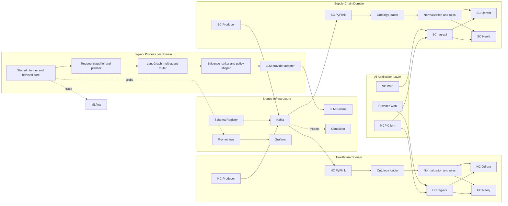
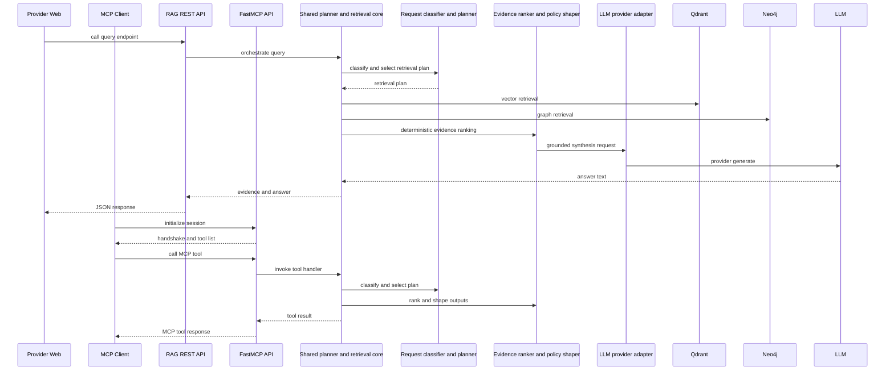
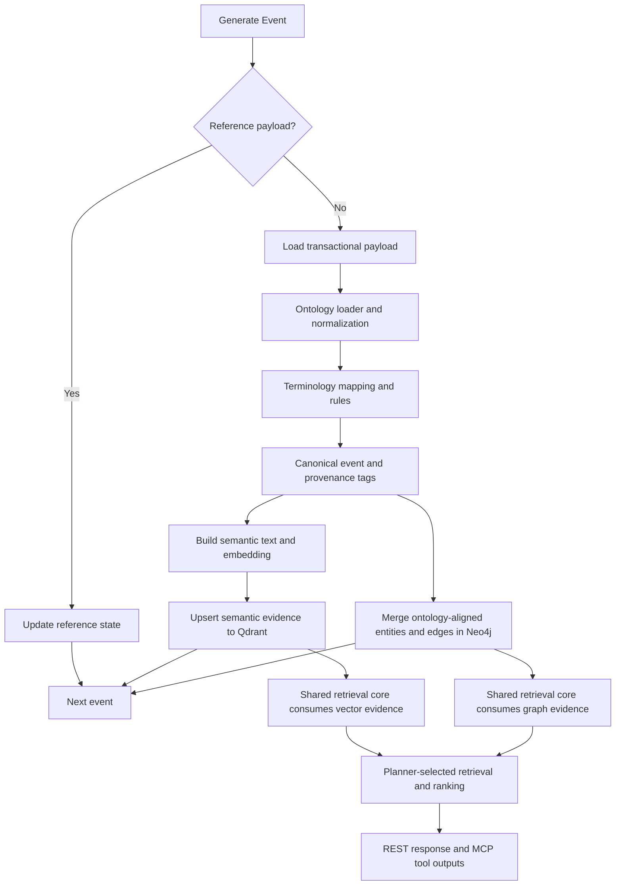
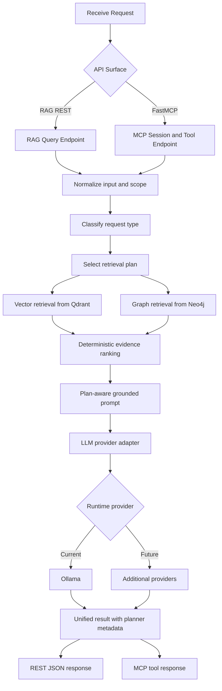

# Healthcare Hybrid GraphRAG Architecture

## Purpose

This repository demonstrates a local-first healthcare event intelligence stack that combines streaming ingestion, dual persistence (vector + graph), and grounded LLM answer generation.

It is optimized for reproducible local experimentation with clear lineage and full observability.

## ADR References

Key architecture decisions are tracked in [docs/adrs/README.md](adrs/README.md):

- [ADR-0001: Dual persistence (Qdrant + Neo4j)](adrs/0001-dual-persistence-qdrant-neo4j.md)
- [ADR-0002: Qdrant as the streaming vector store](adrs/0002-qdrant-streaming-vector-store.md)
- [ADR-0003: Ontology governance and seed generation](adrs/0003-ontology-governance-and-seed-generation.md)
- [ADR-0004: Local-first LLM with provider routing](adrs/0004-local-first-llm-provider-routing.md)
- [ADR-0005: Embed FastMCP in rag-api](adrs/0005-embed-fastmcp-in-rag-api.md)
- [ADR-0006: Skills layer standardization](adrs/0006-skills-layer-standardization-and-validation.md)
- [ADR-0007: LangGraph multi-agent orchestration](adrs/0007-langgraph-multi-agent-orchestration.md)
- [ADR-0008: MLflow tracing and evaluation](adrs/0008-mlflow-tracing-and-evaluation.md)
- [ADR-0009: Domain module extraction](adrs/0009-domain-module-extraction.md)

Roadmap design strategy is documented in [docs/target_architecture.md](target_architecture.md), and execution backlog details are maintained in [docs/future_improvements.md](future_improvements.md).

Runtime skill orchestration flow and contracts are documented in [docs/skills_layer.md](skills_layer.md).

## Why This Architecture Scales Across Healthcare Sections

The design separates stable platform capabilities from domain-specific healthcare logic.

Platform capabilities:

- streaming ingestion and replay,
- hybrid vector plus graph persistence,
- retrieval-grounded generation pipeline,
- observability and operational controls.

Domain extension points:

- Kafka topic contracts and schema variants,
- enrichment and normalization rules,
- graph labels, properties, and relationships,
- prompt templates and response policies.

This keeps new sections additive and modular.

## Multi-Domain Architecture

The platform supports parallel domain deployments sharing infrastructure (Kafka cluster, Schema Registry, monitoring) while isolating domain-specific concerns (Neo4j instance, Qdrant collection, Kafka topics, ontology rules).

| Domain | Directory | Neo4j Port | Qdrant Port | Topic Prefix |
| --- | --- | --- | --- | --- |
| Healthcare Provider | root (`domains/healthcare/producer/`, `domains/healthcare/flink-app/`, `domains/healthcare/rag-api/`) | 7474/7687 | 6333 | `healthcare.*` |
| Supply Chain Resilience | `domains/supply-chain/` | 7475/7688 | 6335 | `supplychain.*` |

Each domain brings its own: Avro envelope schema, ontology YAML (entities, seeds, rules), graph write functions, producer event generators, and RAG API planner/classifier. The streaming pipeline, embedding infrastructure, and observability stack are reused.

## Healthcare Extension Matrix

| Section | Example Inputs | Graph/Vector Emphasis | Primary Users | Expected Outcome |
| --- | --- | --- | --- | --- |
| Acute Clinical Ops | EHR notes, vitals, labs, encounters | Condition progression, symptom-observation linkage | Care teams, command center | Faster deterioration signal detection and context-rich escalation |
| Medication Management | Orders, interaction knowledge base, FAERS adverse event data | Medication-order linkage, HAS_KNOWN_REACTION adverse event detection, CONTRAINDICATED_FOR validation, INTERACTS_WITH mechanism annotation | Pharmacists, inpatient teams | Reduced adverse-drug-risk exposure, real-time pharmacovigilance signals, and clearer intervention rationale |
| Revenue Cycle Intelligence | Claims events, coding metadata, auth records | Clinical-claim traceability and mismatch signals | RCM analysts, coding teams | Lower denial rates and earlier documentation/coding correction |
| Payer Utilization Review | Authorization outcomes, utilization events | Coverage patterns and utilization trajectory | UM teams, payer analysts | Better high-cost-case triage and utilization governance |
| Population Health | Longitudinal events, risk tiers, chronic indicators | Cohort similarity + graph risk factors | Population health teams | Prioritized outreach and proactive risk management |
| Device and Remote Care | Telemetry, device inventory, alert streams | Device-patient-event lineage | Monitoring teams, biomedical ops | Faster anomaly triage and reduced alert fatigue |

## Supply Chain Extension Matrix

| Section | Example Inputs | Graph/Vector Emphasis | Primary Users | Expected Outcome |
| --- | --- | --- | --- | --- |
| Supplier Risk | Supplier profiles, geopolitical data, financial signals | SUPPLIES edges, HAS_RISK_SIGNAL, single-source DEPENDS_ON chains | Procurement, risk management | Earlier single-source and geopolitical exposure detection |
| Procurement | Purchase orders, incoterms, pricing | ORDERED_FROM, ORDERS_PART, DELIVERS_TO | Category managers, buyers | PO lifecycle visibility, cost variance analysis |
| Logistics | Shipment tracking, customs, transport modes | SHIPPED_FROM, SHIPPED_TO, CONTAINS_PART, lead-time deviation | Logistics coordinators | Delay detection, carrier performance, customs hold alerts |
| Quality | Inspections, defect rates, corrective actions | INSPECTED_PART, SUPPLIED_BY, defect_rate signals | Quality engineers, supplier management | Quality trend detection, supplier scorecard, CAPA triggers |
| Disruption | Facility alerts, natural disaster, cyber incidents | DISRUPTED_BY, AFFECTS_PART, cascade via DEPENDS_ON BOM | Supply chain command center | Impact propagation assessment, mitigation tracking |
| Inventory | Warehouse levels, reorder points, days-of-supply | HOLDS_INVENTORY, below_reorder signals | Planners, warehouse ops | Stockout risk detection, reorder optimization |

## Extension Playbook

For each new section, follow the same sequence:

1. Define or extend topic contracts and payload schema.
2. Add enrichment rules and map new entities into graph merges.
3. Add retrieval filters and prompt templates for that workflow.
4. Validate with section-specific test queries and outcome metrics.

This keeps platform code stable while allowing domain growth by module.

## Design Patterns Used

This architecture intentionally combines several patterns so streaming ingestion, retrieval quality, and API surfaces can evolve independently.

| Pattern | Where Used | Why It Is Used Here | Current Status |
| --- | --- | --- | --- |
| Event-Driven Pipeline | producer -> Kafka -> PyFlink -> Qdrant/Neo4j | Decouples producers from downstream processing and supports replay/backfill | Implemented |
| Dual Materialized Views | Qdrant (semantic view) + Neo4j (relationship view) | Keeps retrieval optimized for both similarity search and graph reasoning | Implemented |
| Shared-Core, Multi-Interface (Hexagonal-style boundary) | One query core reused by REST and embedded MCP tools | Avoids duplicated business logic across API surfaces | Implemented |
| Policy Enforcement Point | Role/tool authorization and response guardrails in rag-api | Centralizes access control and output safety rules | Implemented |
| Contract-First Tooling | MCP tool request/response schemas and contract tests | Keeps tool semantics stable while internals change | Implemented |
| Bounded Context Window | Max question/context/evidence/answer and response-byte budgets | Prevents unbounded prompt/output growth and latency spikes | Implemented |
| Observability by Design | Prometheus metrics + Grafana latency dashboards + health probes | Makes latency and failure modes visible during iteration | Implemented |
| Adapter Pattern for LLM Providers | Provider-agnostic client sketch in architecture doc | Enables Anthropic/OpenAI routing without rewriting retrieval | Roadmap |
| Multi-Agent Orchestration (LangGraph) | LangGraph StateGraph with specialist agents and conditional routing | Enables domain-specific reasoning branches and iterative confidence-gated retrieval | Implemented (feature-flagged) |
| MLflow Tracing | Nested span hierarchy across agent nodes, retrievers, and LLM calls | Enables cross-mode pipeline comparison and healthcare-specific evaluation | Implemented (feature-flagged) |

### Pattern Mapping to Repository Components

- Event-Driven Pipeline: [domains/healthcare/producer/produce_events.py](../domains/healthcare/producer/produce_events.py), [domains/healthcare/flink-app/healthcare_graph_rag_pyflink_job.py](../domains/healthcare/flink-app/healthcare_graph_rag_pyflink_job.py), [container/docker-compose.infra.yml](../container/docker-compose.infra.yml)
- Dual Materialized Views: [domains/healthcare/flink-app/healthcare_graph_rag_job.py](../domains/healthcare/flink-app/healthcare_graph_rag_job.py), [docs/neo4j_model.md](neo4j_model.md)
- Shared-Core, Multi-Interface: [domains/healthcare/rag-api/app.py](../domains/healthcare/rag-api/app.py) (`run_query`, REST `/query`, MCP tools)
- Policy Enforcement Point: [domains/healthcare/rag-api/domain/response_policy.py](../domains/healthcare/rag-api/domain/response_policy.py) (sanitization, truncation, budget), [domains/healthcare/rag-api/app.py](../domains/healthcare/rag-api/app.py) (`_authorize`, `_execute_with_audit`)
- Contract-First Tooling: [domains/healthcare/rag-api/tests/test_contracts.py](../domains/healthcare/rag-api/tests/test_contracts.py), [docs/mcp_layer_design.md](mcp_layer_design.md)
- Bounded Context Window: [domains/healthcare/rag-api/domain/response_policy.py](../domains/healthcare/rag-api/domain/response_policy.py) (`apply_response_budget`, `truncate_text`)
- Observability by Design: [monitoring/prometheus.yml](../monitoring/prometheus.yml), [monitoring/grafana/dashboards/healthcare-monitoring-overview.json](../monitoring/grafana/dashboards/healthcare-monitoring-overview.json), [docs/runbook.md](runbook.md)
- Adapter Pattern (roadmap): [docs/adrs/0004-local-first-llm-provider-routing.md](adrs/0004-local-first-llm-provider-routing.md)
- Multi-Agent Orchestration: [domains/healthcare/rag-api/langgraph_agents/](../domains/healthcare/rag-api/langgraph_agents/) (`graph.py`, `agents.py`, `state.py`)
- MLflow Tracing: [domains/healthcare/rag-api/langgraph_agents/mlflow_tracing.py](../domains/healthcare/rag-api/langgraph_agents/mlflow_tracing.py), [domains/healthcare/rag-api/langgraph_agents/mlflow_eval.py](../domains/healthcare/rag-api/langgraph_agents/mlflow_eval.py)

## Modern AI Stack Frameworks and Design Patterns Summary

This section maps the current implementation to a modern AI application stack model and highlights what is already implemented versus what remains on the roadmap.

### Framework Layer Summary

| Modern AI Stack Layer | Typical Frameworks / Technologies | This Repository Mapping | Status |
| --- | --- | --- | --- |
| Data ingestion and event backbone | Kafka, Schema Registry, stream processors | Kafka + Schema Registry + native PyFlink pipeline | Implemented |
| Retrieval stores | Vector DB + Graph DB + optional OLAP | Qdrant + Neo4j dual persistence | Implemented |
| API and tool protocol layer | FastAPI, MCP, tool contracts | FastAPI + embedded FastMCP + MCP tool contracts | Implemented |
| Agent / orchestration layer | Planner, skill registry, multi-step controller | Deterministic planner + skills layer + role-aware tool policies | Implemented (baseline) |
| LangGraph multi-agent orchestration | StateGraph with conditional routing and specialist agents | LangGraph StateGraph with triage, retrieval, specialist, and synthesis agents | Implemented (feature-flagged) |
| ReAct-style iterative control | Reason-act-observe loop controller | Feature-flagged ReAct loop path in rag-api | Implemented (phase 1 skeleton) |
| Model provider abstraction | Adapter for local and managed providers | Ollama runtime + provider adapter structure | Implemented (single provider runtime) |
| Evaluation and quality gates | Contract tests, route tests, retrieval scorecards | Contract tests + planner evaluation + planner edge suites + MLflow evaluation harness | Implemented (partial) |
| Observability and operations | Metrics, dashboards, probes, runbooks | Prometheus + Grafana + blackbox probes + MLflow tracing + runbook | Implemented |
| Production governance and safety | Privacy policy, rollout gates, SLO controls | Deployment bundle and policy foundations present | In progress |

### Design Pattern Summary

| Pattern | Modern AI Relevance | Repository Usage | Status |
| --- | --- | --- | --- |
| Event-driven architecture | Supports near-real-time AI context refresh and replay | Producer -> Kafka -> PyFlink -> dual sinks | Implemented |
| Polyglot persistence | Combines semantic similarity with relationship reasoning | Qdrant for vectors + Neo4j for graph context | Implemented |
| Shared-core multi-surface API | Prevents drift between REST and tool protocol behavior | Shared query core for REST and MCP tool endpoints | Implemented |
| Planner-first retrieval orchestration | Improves determinism before LLM synthesis | Request classification + retrieval planning + ranking | Implemented |
| ReAct iterative orchestration | Enables multi-step tool use with explicit stop criteria | ReAct controller feature flag path and response metadata | Implemented (phase 1 skeleton) |
| LangGraph multi-agent orchestration | Enables specialized domain reasoning with graph-based agent routing | StateGraph with triage, retrieval, specialist, confidence, and synthesis nodes | Implemented (feature-flagged) |
| MLflow tracing and evaluation | Enables cross-mode pipeline comparison and experiment tracking | Nested span tracing + healthcare scorers + mode comparison harness | Implemented (feature-flagged) |
| Policy enforcement point | Centralizes authorization and output controls | Role/tool checks + evidence shaping + byte budgets | Implemented |
| Adapter pattern for model providers | Decouples retrieval from generation vendor | Provider adapter abstraction with Ollama runtime | Implemented (partial breadth) |
| Contract-first evolution | Keeps external API/tool behavior stable as internals evolve | Contract test suite and MCP schema discipline | Implemented |
| Evaluation-driven promotion | Uses objective quality gates for release progression | Planner tests in place; retrieval/grounding scorecards pending | In progress |
| Progressive delivery controls | Reduces risk in production AI changes | Documented production deployment patterns; staged gates pending | In progress |

### Gap Summary for Full Modern-Stack Alignment

- Multi-provider runtime breadth is not complete yet (adapter exists, runtime is primarily Ollama today).
- Retrieval benchmark and grounded-answer scorecard automation are not fully enforced as release gates.
- Policy and privacy controls are present at foundation level but not yet complete for non-demo production governance depth.
- LangGraph and MLflow integrations are feature-flagged and require further production hardening for non-demo use.
- No structured output generation (JSON-mode extraction for downstream system integration).
- No persistent agent memory for cross-session patient context.
- No input-side prompt injection detection or adversarial guardrails.
- No dynamic model routing based on task complexity, latency, or cost.
- No streaming responses (SSE) to client applications.
- No evaluation-gated CI/CD pipeline that blocks deployment below quality thresholds.
- No per-user identity propagation or data-classification-aware access control.

### Promotion Direction

To promote from baseline-modern to production-modern AI stack maturity:

1. Expand provider adapters and add failover behavior tests.
2. Add retrieval and grounding scorecards as CI release gates.
3. Strengthen policy/privacy controls and rollout guardrails with explicit SLO criteria.

### Maturity Scorecard (1-5)

Scoring guide:

- 1 = not started
- 2 = foundational design in place
- 3 = baseline implementation working
- 4 = production hardening in progress
- 5 = production-grade with automated gates

| Layer | Current Score | Target Next Sprint | Evidence Anchor | Primary Lift To Increase Score |
| --- | --- | --- | --- | --- |
| Data ingestion and event backbone | 4 | 4 | Kafka + Schema Registry + PyFlink runtime | Add stronger replay/recovery regression checks |
| Retrieval stores (vector + graph) | 4 | 4 | Qdrant + Neo4j dual persistence in active flow | Add retrieval quality benchmark baselines |
| API and MCP tool protocol | 4 | 4 | FastAPI + embedded MCP + contract tests | Expand protocol-level regression coverage |
| Planner and skills orchestration | 3 | 4 | Deterministic planner + skills layer | Add route quality scorecards in CI |
| LangGraph multi-agent orchestration | 3 | 4 | LangGraph StateGraph with specialist agents, feature-flagged | Add broader agent integration tests and production tuning |
| ReAct iterative control | 3 | 4 | Feature-flagged ReAct loop and metadata | Add broader loop tests and stop/fallback metrics |
| Model provider abstraction | 3 | 4 | Adapter structure with Ollama runtime | Add second provider + failover test suite |
| Evaluation and quality gates | 3 | 4 | Contract + planner evaluation suites + MLflow evaluation harness | Add retrieval and grounding release gates |
| Observability and operations | 4 | 4 | Prometheus, Grafana, probes, MLflow tracing, runbook | Add alert quality tuning and SLO dashboards |
| Production governance and safety | 2 | 3 | Policy/deploy foundations under production bundle | Implement policy/privacy/SLO rollout controls |
| Structured outputs and extraction | 1 | 3 | Free-text LLM responses only | Add JSON-mode structured generation for risk extraction |
| Agent memory and context | 1 | 3 | Stateless per-request execution | Add persistent cross-session memory for longitudinal monitoring |
| Model routing and optimization | 2 | 3 | Single Ollama provider | Add dynamic routing by task complexity and cost |
| Input guardrails and safety | 2 | 3 | Role-based tool authorization only | Add prompt injection detection and input validation |
| Streaming UX | 1 | 3 | Synchronous responses only | Add SSE streaming to provider web UI |

Sprint tracking note:

- Update only `Current Score`, `Target Next Sprint`, and `Primary Lift To Increase Score` during planning/review.
- Keep `Evidence Anchor` stable unless architecture implementation materially changes.

## Architecture At A Glance

```text
Synthetic Producer
  -> Kafka topics + Schema Registry
  -> Native PyFlink DataStream job
    -> ontology loader + normalization + rules
     -> Qdrant upsert (semantic evidence)
     -> Neo4j merge (relationship evidence)
  -> FastAPI GraphRAG API
    -> request classification + retrieval planning
    -> vector and graph retrieval + evidence ranking
    -> optional LangGraph multi-agent routing (specialist agents)
    -> provider-adapter generation (current runtime: Ollama)
      -> embedded MCP endpoint (/mcp)

Operational Plane
  -> Flink UI
  -> Conduktor
  -> Prometheus + Blackbox Exporter
  -> Grafana dashboards + alerts
  -> MLflow Tracing UI
  -> Neo4j Browser + NeoDash
  -> Provider Web UI
```

## Overall Architecture Diagram



## Component Interaction Diagram



## Event Flow Diagram



## AI App Process Flow Diagram



## LLM Selection Strategy (Local and Production)

### Local Development

Current implementation uses Ollama in domains/healthcare/rag-api/app.py.

- Local endpoint via OLLAMA_URL.
- Local model choice via OLLAMA_MODEL.
- Automatic fallback to available local model tags when possible.
- No per-token API fee for local Ollama inference; cost is primarily local infrastructure (hardware and power).
- Runtime controls currently wired from env: LLM_TIMEOUT_SECONDS and LLM_MAX_TOKENS.
- Generation temperature is currently fixed in code (`0.2`).

MCP delivery in the current implementation:

- MCP is embedded in the same rag-api process.
- MCP protocol endpoint: `POST /mcp` (streamable HTTP).
- Human diagnostic endpoint: `GET /mcp/health`.

### Roadmap Extension: Anthropic/OpenAI Routing

The current repository runtime includes a provider adapter in `domains/healthcare/rag-api/llm_provider.py` and uses Ollama as the default configured provider.

For production extension, keep retrieval orchestration unchanged and swap only the generation provider behind an adapter.

Recommended provider adapter contract:

- generate(prompt, model, timeout, temperature, max_tokens) -> answer

Provider options:

- Anthropic: Messages API with model families such as Claude.
- OpenAI: Responses or Chat Completions API with GPT model families.

Recommended routing policy:

- Primary provider from environment configuration.
- Optional failover provider on timeout or 5xx failures.
- Per-use-case model profiles (latency-optimized vs quality-optimized).

Current configuration keys used by implementation:

- OLLAMA_URL
- OLLAMA_MODEL
- LLM_TIMEOUT_SECONDS
- LLM_MAX_TOKENS

Current rag-api observability metrics for query latency and throughput:

- rag_api_http_request_duration_seconds
- rag_api_tool_execution_duration_seconds
- rag_api_tool_execution_total

Use a secret manager for API keys. Do not store credentials in files or compose manifests.

## Services And Responsibilities

### Producer

domains/healthcare/producer/produce_events.py emits two event families:

- Transactional events:
  - clinical notes
  - lab results
  - device telemetry
  - medication orders
  - claims events
- Reference events:
  - patients
  - providers
  - devices
  - medications
  - payers

The producer registers a shared Avro envelope in Schema Registry and publishes Confluent Avro-serialized values to Kafka.

### Kafka + Schema Registry

Kafka is the transport and replay backbone. Topic creation is controlled by kafka-init in container/docker-compose.healthcare.yml with fixed partitions per domain topic.

Schema Registry stores the MedicalEvent envelope under topic-value subjects for transactional and reference topics, and the schema ID is embedded in Kafka value payloads.

### Flink Runtime

container/docker-compose.healthcare.yml starts:

- flink-jobmanager
- flink-taskmanager
- flink-app

flink-app submits healthcare_graph_rag_pyflink_job.py using flink run -py with explicit Python executable settings.

There is no demo auto-submit service in the current implementation.

### Native PyFlink Job

domains/healthcare/flink-app/healthcare_graph_rag_pyflink_job.py is the active stream job:

- Builds one KafkaSource per topic in ALL_TOPICS.
- Tags each record with its topic and unions all streams.
- Applies GraphRagSideEffectMap to route by topic type.
- Reuses HealthcareGraphRagProcessor from healthcare_graph_rag_job.py for business logic and sink writes.

Execution details:

- Checkpointing enabled via FLINK_CHECKPOINT_INTERVAL_MS.
- Parallelism controlled by FLINK_JOB_PARALLELISM.
- Starts from earliest offsets using KafkaOffsetsInitializer.earliest().
- Uses per-topic group IDs built from FLINK_KAFKA_GROUP_ID.

### Processor Logic Reuse

domains/healthcare/flink-app/healthcare_graph_rag_job.py provides:

- stable_embedding for deterministic embeddings,
- clinical_text rendering with optional reference-data expansion,
- in-memory reference store updates,
- event enrichment,
- Qdrant upserts,
- Neo4j merges by event type.

This file also retains a direct Kafka consumer main() path for fallback troubleshooting, but the active runtime path is the native PyFlink job.

### Qdrant

Qdrant stores semantic vectors in healthcare_events with payload fields such as:

- event_id
- event_ts
- event_type
- patient_id
- source metadata
- enriched/reference_hit_count
- rendered text
- normalized payload

### Neo4j

Neo4j stores patient-centric graph entities and lineage, including:

- base event lineage (ClinicalEvent, SourceSystem, Encounter),
- clinical entities (Condition, Symptom, Observation),
- medication/device/claim entities,
- reference-context links (Provider, Device, Medication, Payer).

See [neo4j_model.md](neo4j_model.md) for the full model.

### RAG API

domains/healthcare/rag-api/app.py exposes:

- GET /health
- GET /metrics
- GET /mcp/health
- POST /query
- POST /mcp (MCP streamable HTTP protocol endpoint)

Embedded MCP tools (10 total):

- patient_context_get
- vector_evidence_search
- graphrag_answer_generate
- risk_summary_generate
- evidence_bundle_export
- timeline_explain
- medication_risk_assess
- coding_gap_detect
- cohort_risk_summary
- skills_plan_get

Query flow:

1. Classify request type and select retrieval plan (`domain/planner.py`).
2. Embed user question (`domain/retrieval.py`) and search Qdrant for nearest evidence.
3. Collect patient IDs from vector hits and optional request scope.
4. Query Neo4j patient graph (`domain/retrieval.py`).
5. Rank evidence deterministically (`domain/evidence.py`).
6. Dispatch to query mode: single-pass, ReAct loop, or LangGraph multi-agent.
7. Build synthesis prompt and call LLM provider (`domain/synthesis.py`).
8. Apply response policy (`domain/response_policy.py`) and return answer with evidence.

#### Provider-Agnostic LLM Interface Sketch (Roadmap)

The API can keep retrieval logic unchanged and swap only generation providers through an adapter.
This sketch is design guidance and is not the current implementation.

```python
from __future__ import annotations

import os
from dataclasses import dataclass
from typing import Protocol


@dataclass
class LLMConfig:
  provider: str = os.getenv("LLM_PROVIDER", "ollama")
  model: str = os.getenv("LLM_MODEL", os.getenv("OLLAMA_MODEL", "llama3.1"))
  timeout_seconds: int = int(os.getenv("LLM_TIMEOUT_SECONDS", "120"))
  max_tokens: int = int(os.getenv("LLM_MAX_TOKENS", "1200"))
  temperature: float = float(os.getenv("LLM_TEMPERATURE", "0.2"))


class LLMClient(Protocol):
  def generate(self, prompt: str, cfg: LLMConfig) -> str:
    ...


class OllamaClient:
  def __init__(self, base_url: str):
    self.base_url = base_url

  def generate(self, prompt: str, cfg: LLMConfig) -> str:
    # POST {base_url}/api/generate
    ...


class AnthropicClient:
  def __init__(self, api_key: str):
    self.api_key = api_key

  def generate(self, prompt: str, cfg: LLMConfig) -> str:
    # Call Anthropic Messages API
    ...


class OpenAIClient:
  def __init__(self, api_key: str):
    self.api_key = api_key

  def generate(self, prompt: str, cfg: LLMConfig) -> str:
    # Call OpenAI Responses or Chat Completions API
    ...


def llm_client_from_env() -> LLMClient:
  provider = os.getenv("LLM_PROVIDER", "ollama").lower()
  if provider == "anthropic":
    return AnthropicClient(api_key=os.environ["ANTHROPIC_API_KEY"])
  if provider == "openai":
    return OpenAIClient(api_key=os.environ["OPENAI_API_KEY"])
  return OllamaClient(base_url=os.getenv("OLLAMA_URL", "http://ollama:11434"))
```

Suggested integration point in [domains/healthcare/rag-api/app.py](domains/healthcare/rag-api/app.py):

- Keep query orchestration as is.
- Replace direct generation call in ask_ollama(...) with ask_llm(...).
- Build prompt exactly once, then call client.generate(prompt, cfg).

Minimal wiring sketch:

```python
LLM_CFG = LLMConfig()
LLM_CLIENT = llm_client_from_env()


def ask_llm(prompt: str) -> str:
  return LLM_CLIENT.generate(prompt, LLM_CFG)
```

Environment-driven routing variables for adapter mode:

- LLM_PROVIDER: ollama, anthropic, or openai
- LLM_MODEL: provider-specific model name
- LLM_TIMEOUT_SECONDS: request timeout
- LLM_MAX_TOKENS: response token budget
- LLM_TEMPERATURE: sampling temperature
- OLLAMA_URL: required for local ollama mode
- ANTHROPIC_API_KEY: required for anthropic mode
- OPENAI_API_KEY: required for openai mode

Secrets should be sourced from a secret manager or runtime environment injection, never committed to repository files.

### Provider Web

webapp provides a browser interface to submit questions and view API responses without manual curl usage.

### Observability

monitoring config provides:

- Prometheus scrape and alerting,
- Blackbox probes for Kafka/Flink/Neo4j availability,
- Grafana provisioning for dashboards,
- MLflow tracing for agent pipeline spans, evaluation experiments, and cross-mode comparison,
- Flink dashboard for job-level visibility,
- Conduktor for Kafka topic/cluster/schema browsing.

## Data Flow Details

### Transactional Event Path

```text
Producer transactional topic write
  -> Kafka topic
  -> PyFlink KafkaSource
  -> GraphRagSideEffectMap
  -> HealthcareGraphRagProcessor.process_event
  -> enrichment with in-memory reference cache
  -> Qdrant upsert + Neo4j merge
  -> RAG API retrieval surface
```

### Reference Event Path

```text
Producer master topic write
  -> Kafka topic
  -> PyFlink KafkaSource
  -> GraphRagSideEffectMap
  -> HealthcareGraphRagProcessor.process_reference_event
  -> in-memory reference cache mutation
  -> affects subsequent transactional enrichment
```

## Reliability And Operational Notes

- Flink starts from earliest offsets, so local restarts can replay historical topic data.
- Processor writes are designed around stable identifiers to keep upserts deterministic.
- Reference store is process memory; recovery of reference context relies on replay.
- healthcare.dlq.events currently exists for hardening but is not populated by the active processor.

## Security And Scope

This stack is for local synthetic-demo use. It is not production-hardened. Notable simplifications:

- open CORS policy in API,
- demo credentials in compose,
- no auth between most internal services,
- Confluent Avro-on-wire with schema ID framing and subject-based enforcement.

## Evolution Paths

Recommended next improvements:

- Move reference data to managed Flink keyed state.
- Add explicit dead-letter publish and replay tooling.
- Migrate wire format to Avro or Protobuf with compatibility enforcement.
- Add API auth, role-based access control, and tighter CORS.
- Add end-to-end test suites for stream processing and retrieval quality.
- Harden LangGraph multi-agent routing with broader specialist-agent tests and production tuning.
- Expand MLflow evaluation harness with retrieval benchmarks and grounding scorecards as CI gates.
