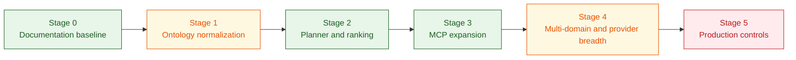

# Future Improvements Backlog

## Purpose

This document tracks execution backlog items and staged work that remain after current implementation milestones.

Use [target_architecture.md](target_architecture.md) for strategic architecture and capability intent.
Use this file for delivery planning, prioritization, and completion tracking.

## Current Status Summary

Completed or largely implemented:

- Stage 0 documentation and baseline architecture references,
- ontology configuration, ontology loader, and rule-pack integration in Flink modules,
- shared rag-api domain package (`domain/models.py`, `domain/planner.py`, `domain/evidence.py`),
- planner-driven query orchestration with deterministic ranking and planner metadata,
- expanded MCP tools (`timeline_explain`, `medication_risk_assess`, `coding_gap_detect`, `cohort_risk_summary`),
- planner quality suites (`test_planner_evaluation.py`, `test_planner_edge_cases.py`),
- provider adapter abstraction with Ollama runtime adapter.

Partially implemented:

- terminology governance breadth and mapping coverage,
- ontology conformance and retrieval quality benchmark depth,
- provider abstraction breadth (single provider implementation today),
- production privacy, policy, and rollout controls.

## Remaining High-Priority Backlog

### 1. Complete Stage 4 evaluation hardening

Target outcomes:

- add retrieval benchmark suites with stable datasets and release-over-release comparison,
- add grounded answer scorecards and failure taxonomy,
- expand ontology conformance depth beyond current checks,
- add quality trend reporting in CI artifacts.

Suggested repo touchpoints:

- `domains/healthcare/rag-api/tests/`
- `docs/ai_qa.md`
- `.github/workflows/rag-api-contracts.yml`
- `.github/workflows/ontology-conformance.yml`

### 2. Expand provider adapter implementations

Target outcomes:

- add additional provider adapters behind the existing abstraction,
- keep retrieval orchestration unchanged across provider swaps,
- add adapter-focused contract tests and fallback behavior tests.

Suggested repo touchpoints:

- `domains/healthcare/rag-api/llm_provider.py`
- `domains/healthcare/rag-api/app.py`
- `domains/healthcare/rag-api/tests/test_contracts.py`

### 3. Finish terminology and ontology governance depth

Target outcomes:

- widen standard-code mapping coverage and validation,
- strengthen governance workflow for mapping updates,
- ensure graph seed and runtime semantic consistency remains auditable.

Suggested repo touchpoints:

- `domains/healthcare/config/ontology/`
- `scripts/generate_ontology_seed_cypher.py`
- `scripts/validate_ontology.py`
- `domains/healthcare/neo4j/generated_ontology_seeds.cypher`

### 4. Production controls for non-demo readiness (Stage 5)

Target outcomes:

- stronger policy classes and PHI handling boundaries,
- retention and lineage controls tied to ontology provenance,
- deployment-level rollout and rollback playbooks,
- explicit SLO gates for latency, freshness, and audit completeness.

Suggested repo touchpoints:

- `deploy/production/`
- `docs/runbook.md`
- `docs/technical_specs.md`
- monitoring and alerting assets

## Staged Plan Status

| Stage | Focus | Status | Notes |
| --- | --- | --- | --- |
| Stage 0 | Documentation and semantic contract baseline | Completed | Architecture, ADRs, and references are in place. |
| Stage 1 | Ontology externalization and normalization | Largely completed | Loader/normalization/rules modules exist; continue mapping depth work. |
| Stage 2 | Query planner and evidence ranking | Completed (baseline) | Planner and ranking shipped with fixture and edge-case suites. |
| Stage 3 | Skill-composed MCP expansion | Completed (current scope) | Expanded tools and policy updates shipped; continue iterative refinement as needed. |
| Stage 4 | Multi-domain support and provider abstraction | In progress | Supply-chain domain added; planner tests and provider abstraction started; benchmark/scorecard/provider breadth still open. |
| Stage 5 | Production controls for real data readiness | Pending | Requires policy/privacy/SLO rollout controls for non-demo operation. |

## Near-Term Execution Order

1. Stage 4 retrieval and grounding benchmark suites.
2. Stage 4 additional provider adapters and adapter-level tests.
3. Stage 1 terminology/ontology mapping coverage deepening.
4. Stage 5 production privacy and rollout controls.

## Two-Sprint Implementation Plan

### Sprint 1: Quality and Orchestration Hardening

- [ ] 1. Retrieval benchmark gate
Scope: Add stable retrieval fixtures and scoring script for precision@k and recall@k.
Acceptance criteria: At least 20 labeled queries in fixtures; precision@5 >= 0.70; recall@5 >= 0.75; benchmark output published as CI artifact.
CI checks: New workflow job `retrieval-benchmark` in `.github/workflows/rag-api-contracts.yml`; fails when thresholds are missed.

- [ ] 2. Grounded-answer scorecard
Scope: Add answer grounding evaluator with unsupported-claim and citation-coverage metrics.
Acceptance criteria: Golden set committed; unsupported-claim rate <= 0.10; citation coverage >= 0.80; failure taxonomy emitted per run.
CI checks: New workflow job `grounding-scorecard`; uploads JSON/Markdown report artifact and enforces thresholds.

- [ ] 3. ReAct loop hardening (phase 2)
Scope: Extend loop stop criteria, fallback behavior, and loop metadata tests.
Acceptance criteria: ReAct tests cover confidence stop, max-iteration stop, no-progress stop, and fallback path; no regression in planner suites.
CI checks: `python3 domains/healthcare/rag-api/tests/test_react_controller.py`; `python3 domains/healthcare/rag-api/tests/test_planner_evaluation.py`; `python3 domains/healthcare/rag-api/tests/test_planner_edge_cases.py`; aggregated via `scripts/test_react_planner.sh`.

- [ ] 4. Evidence fusion reranking
Scope: Add deterministic cross-source reranking using relevance + recency + graph signal weight.
Acceptance criteria: Ranking function documented and unit tested; top-k ordering deterministic across repeated runs; route quality improves on fixture set.
CI checks: New unit suite in `domains/healthcare/rag-api/tests/` and benchmark delta assertion in `retrieval-benchmark` job.

### Sprint 2: Runtime Resilience and Governance Promotion

- [ ] 5. Multi-provider runtime + failover
Scope: Add second provider adapter and deterministic failover policy.
Acceptance criteria: Adapter switch by env works; timeout/5xx failover tested; retrieval orchestration unchanged.
CI checks: Extend `domains/healthcare/rag-api/tests/test_contracts.py` with provider/failover cases; add matrix job in `.github/workflows/rag-api-contracts.yml`.

- [ ] 6. Ontology governance depth
Scope: Increase vocabulary mapping coverage and drift checks.
Acceptance criteria: Mapping coverage report generated; generator output parity enforced; ontology drift fails CI.
CI checks: Strengthen `.github/workflows/ontology-conformance.yml`; run `python scripts/validate_ontology.py` and fail on parity/drift mismatch.

- [ ] 7. Policy-as-code and PHI boundaries
Scope: Encode policy classes, redaction rules, and retention constraints as testable rules.
Acceptance criteria: Policy fixtures cover allowed/denied tool calls and redaction classes; export guardrails validated for all roles.
CI checks: Add policy regression suite in `domains/healthcare/rag-api/tests/`; run as required check in `rag-api-contracts.yml`.

- [ ] 8. Progressive delivery SLO gates
Scope: Define promotion gates for latency, error rate, and grounding score.
Acceptance criteria: Documented SLO thresholds in runbook; canary promotion checklist added; rollback trigger criteria explicit.
CI checks: Add deployment pre-check job in `.github/workflows/deploy-ai-prd.yml` validating SLO config and required artifacts.

### Exit Criteria After Sprint 2

- [ ] Retrieval and grounding quality gates are required checks on pull requests.
- [ ] ReAct and planner validation runs via a single stable command and CI job.
- [ ] At least two LLM providers are supported with tested failover.
- [ ] Ontology and policy drift checks block merges when governance constraints fail.
- [ ] Production promotion includes explicit SLO gates and rollback criteria.

## Multi-Domain Extension Backlog

### Supply Chain Domain

The `domains/supply-chain/` scaffold is in place with producer, graph_writes, pipeline service, ontology seeds, and docker-compose overlay. Remaining work:

- [ ] Full Flink consumer job for supply-chain topics (reuse healthcare runner pattern)
- [ ] Supply-chain RAG API with graph_context Cypher for supplier/part/facility traversal
- [ ] Supply-chain planner evaluation fixtures and contract tests
- [ ] Risk signal rules engine integration (single-source, lead-time, quality threshold rules)
- [ ] Supply-chain query examples script (`scripts/sc_query_examples.sh`)
- [ ] BOM cascade impact analysis: given a disruption, traverse DEPENDS_ON to find all affected assemblies
- [ ] Supplier scorecard aggregation from quality inspections, shipment lead times, and disruption history
- [ ] Neural embedding deployment for supply-chain Qdrant collection (shared MiniLM model)

### New Domain Template

To add a third domain (e.g., Insurance Claims, Cybersecurity SOC):

1. Create `domains/<name>/` with: `domains/healthcare/config/ontology/`, `domains/healthcare/producer/`, `domains/healthcare/flink-app/app/`, `domains/healthcare/rag-api/domain/`, `domains/healthcare/neo4j/`, `domains/healthcare/schemas/`
2. Define Avro envelope schema with domain-specific ID fields
3. Write docker-compose overlay with isolated Neo4j + Qdrant + topic init
4. Implement graph_writes and pipeline_service for the domain's entity model
5. Add planner classifier and retrieval plan for domain request types
