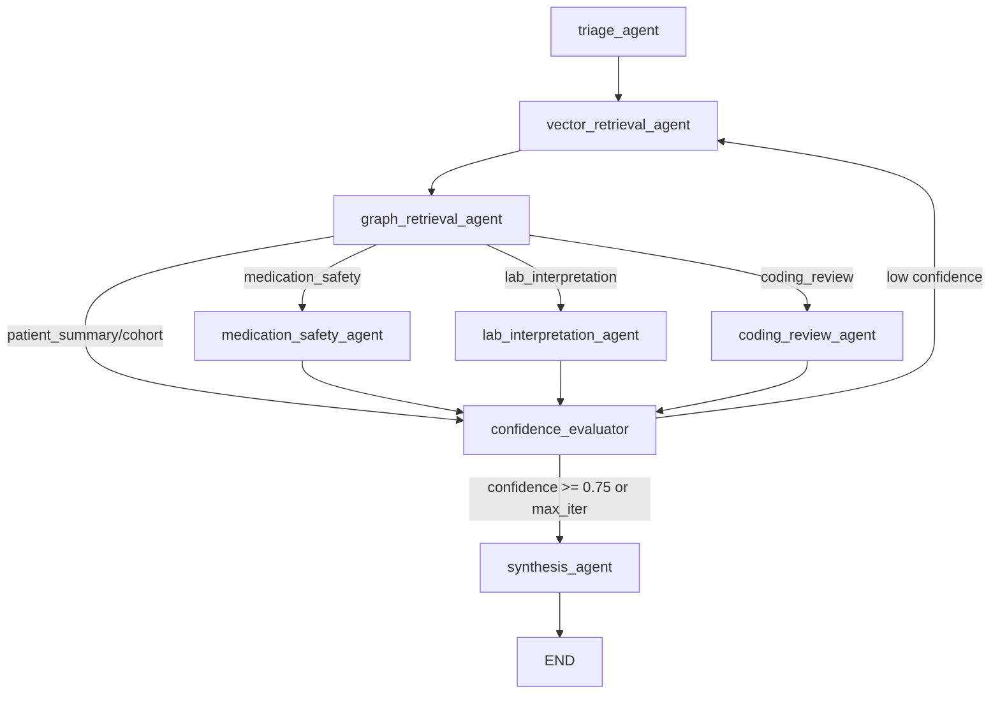

# Multi-Agent Architecture Comparison

## Overview

This document compares three query orchestration modes in the healthcare GraphRAG system:

| Aspect | Single-Pass | ReAct Controller | LangGraph Multi-Agent |
|--------|------------|-----------------|----------------------|
| File | `domain/planner.py` | `domain/react_controller.py` | `langgraph_agents/` |
| Orchestration | Sequential function calls | Bounded iteration loop | StateGraph with conditional edges |
| Agent count | 0 (procedural) | 0 (single loop) | 8 nodes (5 specialist + 3 control) |
| Routing | Keyword heuristics | Same heuristics, repeated per iteration | Triage agent → conditional edges |
| Parallelism | None | None | Sequential today; `Send()` available for future parallel dispatch |
| Observability | Prometheus metrics + audit log | Iteration metadata in response | LangSmith traces + MLflow spans + agent message trail |
| Confidence gate | None | Binary (both channels = 1.0) | Same heuristic, with re-retrieval loop |
| Tool selection | Fixed: vector + graph | Fixed: vector + graph per iteration | Per-agent tool binding |

## Architecture

### Current: Single-Pass Pipeline

```
Question → classify_request_type() → select_retrieval_plan()
         → vector_context() → rank_vector_context()
         → graph_context() → rank_graph_context()
         → ask_ollama()
         → response
```

One linear pass. No agent reasoning, no tool selection, no iteration.
The planner uses keyword matching, not LLM-based classification.

### Current: ReAct Controller

```
Question → loop:
             classify → plan → vector_search → graph_lookup
             → merge unseen results → estimate_confidence
             → if confident or no progress: break
         → ask_ollama(aggregated evidence)
         → response
```

Bounded loop (max 3 iterations, capped at 6). Every iteration repeats the
same vector+graph retrieval. There is no action selection—the action is
always `vector_and_graph_retrieve`. The spec doc describes richer behavior
(retries, policy-blocked actions, observation history) that is not
implemented.

### New: LangGraph Multi-Agent



Eight LangGraph nodes with typed shared state (5 specialist agents + 3 control/infrastructure nodes):

| Agent | Responsibility |
|-------|---------------|
| `triage_agent` | Classify question, select retrieval plan |
| `vector_retrieval_agent` | Qdrant similarity search + evidence ranking |
| `graph_retrieval_agent` | Neo4j patient graph traversal + evidence ranking |
| `medication_safety_agent` | Interaction, contraindication, adverse event analysis |
| `lab_interpretation_agent` | Lab signal and abnormal observation extraction |
| `coding_review_agent` | Claims gap detection and ICD-10 mapping analysis |
| `confidence_evaluator` | Evidence completeness scoring, loop control |
| `synthesis_agent` | Grounded answer generation via Ollama |

## Key Differences

### 1. Agent Separation of Concerns

**Single-Pass / ReAct**: All logic in `run_query()` or `run_react_query_loop()`.
One function handles classification, retrieval, ranking, and synthesis.

**LangGraph**: Each agent is a standalone node with a single responsibility.
Agents share state through `HealthcareAgentState` TypedDict with reducer
fields for automatic list merging.

### 2. Conditional Routing

**Single-Pass / ReAct**: Request type affects only the retrieval plan parameters
(query text prefix, top-k cap). No specialist behavior.

**LangGraph**: After graph retrieval, `_route_specialist()` dispatches to
domain-specific agents based on `request_type`:
- `medication_safety` → deep interaction/contraindication analysis
- `lab_interpretation` → abnormal observation and lab signal extraction
- `coding_review` → claims gap detection, ICD-10 mapping audit
- Others → skip specialist, go directly to confidence evaluation

### 3. Observability via LangSmith and MLflow

**Single-Pass**: Prometheus counters/histograms + JSON audit log.

**ReAct**: Same as single-pass, plus iteration metadata in the response
(`react.actions` array).

**LangGraph**: Two complementary tracing backends:

**LangSmith** (when `LANGSMITH_API_KEY` is set):
- Each agent node's execution time and I/O
- State transitions and conditional edge decisions
- Retry loops and confidence progression
- Agent message trail (`messages` field in state)

**MLflow** (when `MLFLOW_TRACKING_URI` is set):
- Nested span hierarchy (`CHAIN` → `AGENT` → `RETRIEVER` / `LLM`)
- Per-span latency, outcome, and healthcare-specific attributes
- Cross-mode evaluation with six healthcare scorers
- Experiment tracking and comparison artifacts
- MLflow UI at http://localhost:5000

MLflow tracing also works for single-pass and ReAct modes, wrapping the full pipeline in a `healthcare_query_{mode}` root span.

Enable by setting:
```bash
# LangSmith
export LANGSMITH_API_KEY=<your-key>
export LANGSMITH_PROJECT=healthcare-graphrag

# MLflow
export MLFLOW_TRACKING_URI=http://localhost:5000
export MLFLOW_EXPERIMENT_NAME=healthcare-graphrag

# LangGraph mode
export RAG_API_LANGGRAPH_ENABLED=true
```

### 4. Evaluation Framework

The `langgraph_agents/evaluation.py` module provides four scoring metrics:

| Metric | What it measures |
|--------|-----------------|
| `routing_accuracy` | Did triage classify to the expected request type? |
| `agent_coverage` | Were all expected specialist agents activated? |
| `evidence_completeness` | Did both vector and graph channels contribute? |
| `answer_quality` | Non-empty, non-error, reasonable-length answer? |

Run evaluation across all three modes to compare:

```python
from langgraph_agents.evaluation import run_evaluation_suite

# LangGraph mode
lg_scores = run_evaluation_suite(run_langgraph_query, mode="langgraph")

# Single-pass mode (disable ReAct)
sp_scores = run_evaluation_suite(run_query, mode="single_pass")

# ReAct mode (enable ReAct)
react_scores = run_evaluation_suite(run_query, mode="react")
```

### 5. State Management

**Single-Pass**: Local variables in `_run_query_single_pass()`.

**ReAct**: Mutable `seen_event_ids` / `seen_graph_patient_ids` sets and
`merged_vector` / `merged_graph` lists inside the loop function.

**LangGraph**: `HealthcareAgentState` TypedDict with `Annotated` reducer
fields. Lists use `operator.add` for automatic append-merge across nodes.
State is immutable within each node; updates are returned as dicts.

## Configuration

| Environment Variable | Default | Purpose |
|---------------------|---------|---------|
| `RAG_API_LANGGRAPH_ENABLED` | `false` | Enable LangGraph multi-agent mode |
| `LANGGRAPH_MAX_ITERATIONS` | `3` | Max confidence re-retrieval loops |
| `LANGSMITH_API_KEY` | (none) | Enable LangSmith tracing |
| `LANGSMITH_PROJECT` | `healthcare-graphrag` | LangSmith project name |
| `MLFLOW_TRACKING_URI` | (none) | Enable MLflow tracing (e.g. `http://mlflow:5000`) |
| `MLFLOW_EXPERIMENT_NAME` | `healthcare-graphrag` | MLflow experiment name |

## File Structure

```
domains/healthcare/rag-api/
├── langgraph_agents/
│   ├── __init__.py          # Public API
│   ├── state.py             # HealthcareAgentState TypedDict
│   ├── agents.py            # Agent node functions
│   ├── graph.py             # StateGraph builder + runner
│   ├── tools.py             # LangChain tool wrappers
│   ├── evaluation.py        # Lightweight evaluation helpers
│   ├── mlflow_tracing.py    # MLflow span decorators and trace wrappers
│   └── mlflow_eval.py       # MLflow evaluation harness (delegates to evaluation.py)
├── domain/
│   ├── retrieval.py         # Embedding, vector search, graph search (Cypher)
│   ├── synthesis.py         # Prompt construction and LLM synthesis
│   ├── response_policy.py   # Truncation, sanitization, budget enforcement, confidence
│   ├── planner.py           # Request classification and retrieval planning
│   ├── evidence.py          # Deterministic evidence ranking
│   ├── react_controller.py  # ReAct loop orchestration
│   └── models.py            # Shared types (RequestType, RetrievalPlan)
├── app.py                   # Composition root: settings, clients, HTTP routes, MCP tools
└── tests/
    ├── test_langgraph_agents.py
    └── test_mlflow_integration.py
```

## Migration Path

The three modes coexist. Set environment variables to select:

```bash
# Single-pass (default)
unset RAG_API_REACT_ENABLED
unset RAG_API_LANGGRAPH_ENABLED

# ReAct
export RAG_API_REACT_ENABLED=true

# LangGraph (takes priority)
export RAG_API_LANGGRAPH_ENABLED=true
```

The LangGraph path reuses the same retrieval functions (`vector_context`,
`graph_context`), ranking functions (`rank_vector_context`,
`rank_graph_context`), and LLM synthesis (`ask_ollama`) as the other modes.
The response schema is compatible—`langgraph` metadata replaces `react`
metadata when LangGraph is active.
