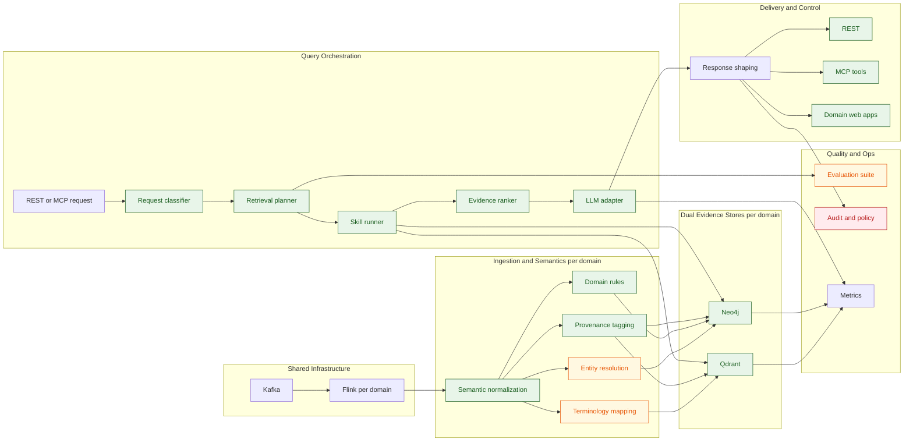

# Target Architecture and Delivery Plan

## Purpose

This document translates the current Healthcare GraphRAG demo architecture into a concrete reference architecture for a governed, ontology-aware, agentic healthcare intelligence platform.

It focuses on three improvements:

- explicit healthcare ontology and terminology control,
- skill-based retrieval and reasoning orchestration,
- staged implementation that fits the current repository structure.

Initial ontology files now live under `domains/healthcare/config/ontology/`, and current implementation status is documented in [technical_specs.md](technical_specs.md), [runbook.md](runbook.md), [skills_layer.md](skills_layer.md), and [future_improvements.md](future_improvements.md).

This document separates implemented capabilities from the staged roadmap for the repository.

## Target Outcome

The target system should behave like a semantic intelligence platform rather than a simple GraphRAG pipeline.

Desired characteristics:

- source events are normalized into canonical healthcare concepts before persistence,
- vector and graph stores are populated from the same semantic contract,
- query orchestration selects retrieval and reasoning strategies intentionally,
- AI tools are decomposed into auditable skills with policy-aware execution,
- evaluation, provenance, and guardrails are part of the architecture rather than post-processing.

## Current Implementation Snapshot

Implemented in the current repository:

- ontology-driven ingestion modules exist in `domains/healthcare/flink-app/app` (`ontology_loader.py`, `normalization.py`, `rules_engine.py`),
- dual persistence remains active across Qdrant and Neo4j,
- `rag-api` query flow now includes request classification, retrieval planning, and deterministic evidence ranking,
- LLM calls are routed through a provider adapter abstraction (`llm_provider.py`, default `ollama`),
- MCP surface now includes expanded clinical workflow tools (`timeline_explain`, `medication_risk_assess`, `coding_gap_detect`, `cohort_risk_summary`),
- planner quality checks exist (`test_planner_evaluation.py`, `test_planner_edge_cases.py`) in addition to API contract tests,
- LangGraph multi-agent orchestration with eight specialized nodes (triage, vector retrieval, graph retrieval, medication safety, lab interpretation, coding review, confidence evaluation, synthesis) is implemented behind the `RAG_API_LANGGRAPH_ENABLED` feature flag,
- MLflow tracing with nested span hierarchy and healthcare-specific evaluation harness is implemented behind the `MLFLOW_TRACKING_URI` feature flag,
- LangSmith integration for LangGraph pipeline tracing is available via `LANGSMITH_API_KEY`.

Still in progress or pending:

- full terminology governance depth and comprehensive mapping coverage,
- richer retrieval benchmark and grounded-answer scorecard automation,
- multi-provider adapter implementations beyond the Ollama adapter,
- production-grade policy, privacy, and rollout controls,
- LangGraph and MLflow production hardening for non-demo workloads.

## Current Gaps

The current repository is strong on streaming, dual persistence, and shared API logic, but several important semantics remain implicit.

Current gaps to close:

- terminology mappings are still partial and need broader vocabulary coverage and stronger governance workflows,
- planner logic is currently heuristic and requires benchmark-driven route quality evaluation,
- provider abstraction exists but only Ollama is implemented at runtime today,
- quality validation now covers planner behavior and contracts, but retrieval benchmarks and grounded-answer scorecards remain limited,
- production controls (policy classes, privacy posture, staged rollout controls) remain incomplete for non-demo workloads.

AI-trends-driven gaps (see [future_improvements.md](future_improvements.md) for detailed backlog):

- no structured output generation (JSON-mode or schema-constrained extraction),
- no dynamic model routing based on task complexity or cost targets,
- no persistent agent memory for cross-session patient monitoring,
- no input-side prompt injection detection or adversarial guardrails,
- no streaming responses to client UIs,
- no evaluation-gated CI/CD that blocks deployment below quality thresholds,
- no per-user identity propagation or fine-grained data access governance,
- no neural reranking between retrieval and synthesis,
- no multimodal clinical image or document understanding.

## Target Architecture Principles

1. Canonical semantics before retrieval.
2. Shared semantic contract across Kafka, Flink, Neo4j, Qdrant, REST, and MCP.
3. Separation of domain knowledge, orchestration logic, and generation provider.
4. Deterministic evidence assembly before probabilistic synthesis.
5. Policy and provenance attached to every evidence path.
6. Structured outputs with schema-constrained extraction for downstream system integration.
7. Confidence-aware responses — abstain or escalate when evidence is insufficient.
8. Evaluation-gated promotion — quality thresholds block releases, not just tests.
9. Identity-aware governance — per-user access control propagated through the agent pipeline.
10. Model-agnostic generation — route to local, managed, or specialized models based on task requirements.

## Target Architecture

```text
Source Systems / Producers
  -> Kafka + Schema Registry
  -> Flink ingestion and enrichment
  -> Semantic normalization layer
     -> terminology mapping
     -> entity resolution
     -> rule execution
     -> provenance tagging
  -> Dual persistence
     -> Qdrant semantic evidence view
     -> Neo4j ontology-aligned graph view
  -> Query orchestration layer
     -> request classification
     -> retrieval planning
     -> skill execution
     -> evidence ranking and policy shaping
  -> LLM synthesis adapter
  -> Delivery surfaces
     -> REST
     -> MCP tools
     -> provider web
  -> Evaluation and operations
     -> contract tests
     -> ontology conformance checks
     -> retrieval quality tests
     -> latency and safety monitoring
```



## Ontology Model

The ontology layer is implemented under `domains/healthcare/config/ontology/` and consumed at runtime by the Flink ingestion pipeline, seed generation, and validation scripts.

### Implemented ontology packages

| Package | File(s) | Status |
| --- | --- | --- |
| Clinical entity ontology | `entities.yaml` | Implemented — defines canonical concepts (Patient, Encounter, ClinicalEvent, Observation, Condition, Medication, etc.) |
| Relationship ontology | `relationships.yaml` | Implemented — defines allowed edges (HAS_CONDITION, INTERACTS_WITH, MAY_INDICATE, CONTRAINDICATED_FOR, etc.) |
| Terminology mappings | `vocabularies.yaml`, `icd10_mappings.yaml`, `cpt_mappings.yaml`, `lab_mappings.yaml`, `medication_mappings.yaml`, `patient_mappings.yaml`, `provider_mappings.yaml`, `device_mappings.yaml`, `payer_mappings.yaml` | Implemented — partial vocabulary coverage; broader mapping governance is a backlog item |
| Provenance and policy | `provenance.yaml` | Implemented — defines source trust, PHI class, and retention class |
| Graph seeds | `graph_seeds.yaml` | Implemented — drug safety relationships generated into `generated_ontology_seeds.cypher` |
| Domain rules | `rules/lab_signals.yaml`, `rules/drug_safety.yaml`, `rules/claims_outcomes.yaml` | Implemented — 14 lab rules, drug interaction/reaction/contraindication rules, 6 claims outcome rules |

### Repository shape

```text
domains/healthcare/config/ontology/
  entities.yaml
  relationships.yaml
  vocabularies.yaml
  provenance.yaml
  graph_seeds.yaml
  patient_mappings.yaml
  medication_mappings.yaml
  provider_mappings.yaml
  device_mappings.yaml
  payer_mappings.yaml
  icd10_mappings.yaml
  cpt_mappings.yaml
  lab_mappings.yaml
  rules/
    lab_signals.yaml
    drug_safety.yaml
    claims_outcomes.yaml
```

### Remaining ontology work

- Widen standard-code mapping coverage (LOINC, RxNorm, SNOMED CT depth).
- Add formal ontology conformance tests that block CI on schema drift.
- Add entity resolution policies beyond source-ID-based matching.
- Validate that runtime graph merges conform to declared relationship cardinality constraints.

## Skill Architecture

The skills layer maps business goals to agents, skills, and MCP tools. The runtime planner (`skills_layer.py`) resolves skill plans; MCP tools are implemented in `app.py`; LangGraph specialist agents provide domain-specific reasoning.

### Internal skills (mapped to implementation)

| Skill | Responsibility | Implementation |
| --- | --- | --- |
| `semantic_normalize` | Convert payloads to canonical concepts | `flink-app/app/normalization.py` |
| `terminology_map` | Map local codes to standard vocabularies | `flink-app/app/ontology_loader.py` + ontology YAML |
| `graph_reason` | Deterministic patient/cohort traversals | `domain/retrieval.py` (`graph_search`) |
| `vector_retrieve` | Semantic similarity retrieval | `domain/retrieval.py` (`vector_search`) |
| `timeline_explain` | Order events and explain progression | MCP tool `timeline_explain` |
| `safety_assess` | Interactions, contraindications, labs, adverse reactions | LangGraph `medication_safety_agent` + MCP `medication_risk_assess` |
| `evidence_rank` | Rank by priority, score, and request type | `domain/evidence.py` |
| `policy_shape` | Redact, bound, and authorize outputs | `domain/response_policy.py` |
| `audit_export` | Traceable evidence bundles | MCP tool `evidence_bundle_export` |

### User-facing MCP tools (10 implemented)

| MCP tool | Composed from | Status |
| --- | --- | --- |
| `patient_context_get` | `graph_reason` + `policy_shape` | Implemented |
| `vector_evidence_search` | `vector_retrieve` + `policy_shape` | Implemented |
| `graphrag_answer_generate` | `vector_retrieve` + `graph_reason` + `evidence_rank` + LLM synthesis | Implemented |
| `risk_summary_generate` | `vector_retrieve` + `graph_reason` + LLM synthesis | Implemented |
| `timeline_explain` | `graph_reason` + `timeline_explain` + `policy_shape` | Implemented |
| `medication_risk_assess` | `graph_reason` + `safety_assess` + `evidence_rank` | Implemented |
| `coding_gap_detect` | `graph_reason` + ICD-10 gap analysis | Implemented |
| `cohort_risk_summary` | `vector_retrieve` + `graph_reason` + `evidence_rank` | Implemented |
| `evidence_bundle_export` | `vector_retrieve` + `graph_reason` + `audit_export` + `policy_shape` | Implemented |
| `skills_plan_get` | Skills layer planner resolution | Implemented |

### Remaining skill architecture work

- Implement a reusable skill runner that MCP tools and LangGraph agents compose through, replacing direct function calls.
- Add `entity_resolve` skill for cross-source identity unification beyond source-ID matching.
- Connect LangGraph specialist agents to the skills plan so `skills_plan_get` output drives agent execution.

## Capability Map

| Capability area | Current state in repo | Target state | Primary repo touchpoints |
| --- | --- | --- | --- |
| Event contracts | shared Avro envelope with topic-specific payload JSON | canonical semantic contracts plus payload validation by domain type | `domains/healthcare/schemas/medical_event.avsc`, `docs/kafka_schema.md`, `domains/healthcare/producer/produce_events.py` |
| Stream enrichment | ontology loader, normalization, and deterministic rules are implemented in the Flink app modules | ontology-driven normalization, mapping, and provenance tagging | `domains/healthcare/flink-app/healthcare_graph_rag_job.py`, `domains/healthcare/flink-app/healthcare_graph_rag_pyflink_job.py`, `domains/healthcare/flink-app/app/` |
| Terminology mapping | partial ICD-10, MedDRA, and CPT mappings implemented across 9 YAML files | governed mapping packs with broader LOINC, RxNorm, SNOMED CT coverage | `domains/healthcare/config/ontology/vocabularies.yaml` and mapping files |
| Entity resolution | mostly source ID based | patient, provider, medication, and device identity resolution policies | Flink enrichment layer, graph merge helpers |
| Graph semantics | strong patient-centric graph, rules embedded in code and seed data | ontology-validated graph model with relationship constraints and conformance tests | `docs/neo4j_model.md`, `domains/healthcare/neo4j/init.cypher`, Flink graph writes |
| Vector retrieval | stable embedding (MiniLM-L6-v2) with deterministic top-k similarity via `domain/retrieval.py` | neural reranking, richer filters, optional cross-encoder | `domains/healthcare/rag-api/domain/retrieval.py`, `domains/healthcare/flink-app/app/text_processing.py` |
| Query orchestration | request classification, retrieval plan selection, and evidence ranking are implemented with deterministic planner logic; LangGraph multi-agent mode adds specialist routing | benchmarked and continuously tuned planning and ranking | `domains/healthcare/rag-api/app.py`, `domains/healthcare/rag-api/domain/`, `domains/healthcare/rag-api/langgraph_agents/` |
| Safety reasoning | 41 interactions, 46 adverse reactions, 23 contraindications seeded; LangGraph `medication_safety_agent` extracts structured risk chains | composable safety assessment skill with terminology-aware rules and confidence scoring | `domains/healthcare/neo4j/generated_ontology_seeds.cypher`, `domains/healthcare/rag-api/langgraph_agents/agents.py` |
| Temporal reasoning | exposed through `timeline_explain` and supported by graph and vector context retrieval | deeper encounter and time-window semantics plus benchmarked timeline quality | Flink payload normalization, `domains/healthcare/rag-api/app.py` |
| MCP surface | 10 tools implemented (`skills_plan_get`, timeline, medication risk, coding gap, cohort summary, export, patient context, vector search, graphrag answer, risk summary) with role policy enforcement | richer internal skill composition, broader role-matrix governance, structured output extraction | `docs/mcp_layer_design.md`, `domains/healthcare/rag-api/app.py`, `domains/healthcare/rag-api/config/tool_policies.json` |
| Policy and audit | role checks, evidence shaping, audit log | ontology-backed policy classes, provenance-aware redaction, richer audit events | `domains/healthcare/rag-api/app.py`, `domains/healthcare/rag-api/config/tool_policies.json` |
| Quality evaluation | contract tests, planner fixture tests, planner edge-case tests, ontology conformance checks, LangGraph agent tests, MLflow evaluation harness, and polypharmacy scenario tests (97 tests total) | evaluation-gated CI, adversarial red-teaming, retrieval benchmarks, grounded answer scorecards | `domains/healthcare/rag-api/tests/`, `scripts/validate_ontology.py`, `docs/ai_qa.md` |

## Execution Backlog

Actionable implementation backlog items, staged delivery sequencing, and recommended execution order now live in [future_improvements.md](future_improvements.md).

This keeps the target architecture focused on strategic design while the backlog remains execution-oriented and easier to update as implementation progresses.

## Definition Of Done For The Target Architecture

The architecture target should be considered reached only when all of the following are true:

- every persisted concept and relationship is defined in ontology config,
- every major healthcare query route is plan-driven rather than hard-coded,
- every user-facing tool is composed from internal skills,
- every response carries provenance and policy metadata,
- every release can be evaluated for ontology conformance, retrieval quality, and grounding quality.
