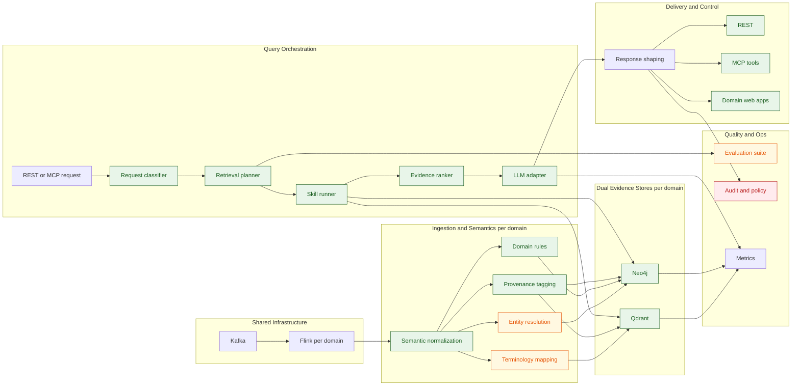

# Target Architecture and Delivery Plan

## Purpose

This document translates the current Healthcare GraphRAG demo architecture into a concrete reference architecture for a governed, ontology-aware, agentic healthcare intelligence platform.

It focuses on three improvements:

- explicit healthcare ontology and terminology control,
- skill-based retrieval and reasoning orchestration,
- staged implementation that fits the current repository structure.

Initial ontology files now live under `domains/healthcare/config/ontology/`, and current implementation status is documented in [technical_specs.md](technical_specs.md), [runbook.md](runbook.md), [skills_layer.md](skills_layer.md), and [future_improvements.md](future_improvements.md).

This document separates implemented capabilities from the staged roadmap for the repository.

## Target Outcome

The target system should behave like a semantic intelligence platform rather than a simple GraphRAG pipeline.

Desired characteristics:

- source events are normalized into canonical healthcare concepts before persistence,
- vector and graph stores are populated from the same semantic contract,
- query orchestration selects retrieval and reasoning strategies intentionally,
- AI tools are decomposed into auditable skills with policy-aware execution,
- evaluation, provenance, and guardrails are part of the architecture rather than post-processing.

## Current Implementation Snapshot

Implemented in the current repository:

- ontology-driven ingestion modules exist in `domains/healthcare/flink-app/app` (`ontology_loader.py`, `normalization.py`, `rules_engine.py`),
- dual persistence remains active across Qdrant and Neo4j,
- `rag-api` query flow now includes request classification, retrieval planning, and deterministic evidence ranking,
- LLM calls are routed through a provider adapter abstraction (`llm_provider.py`, default `ollama`),
- MCP surface now includes expanded clinical workflow tools (`timeline_explain`, `medication_risk_assess`, `coding_gap_detect`, `cohort_risk_summary`),
- planner quality checks exist (`test_planner_evaluation.py`, `test_planner_edge_cases.py`) in addition to API contract tests,
- LangGraph multi-agent orchestration with eight specialized nodes (triage, vector retrieval, graph retrieval, medication safety, lab interpretation, coding review, confidence evaluation, synthesis) is implemented behind the `RAG_API_LANGGRAPH_ENABLED` feature flag,
- MLflow tracing with nested span hierarchy and healthcare-specific evaluation harness is implemented behind the `MLFLOW_TRACKING_URI` feature flag,
- LangSmith integration for LangGraph pipeline tracing is available via `LANGSMITH_API_KEY`.

Still in progress or pending:

- full terminology governance depth and comprehensive mapping coverage,
- richer retrieval benchmark and grounded-answer scorecard automation,
- multi-provider adapter implementations beyond the Ollama adapter,
- production-grade policy, privacy, and rollout controls,
- LangGraph and MLflow production hardening for non-demo workloads.

## Current Gaps

The current repository is strong on streaming, dual persistence, and shared API logic, but several important semantics remain implicit.

Current gaps to close:

- terminology mappings are still partial and need broader vocabulary coverage and stronger governance workflows,
- planner logic is currently heuristic and requires benchmark-driven route quality evaluation,
- provider abstraction exists but only Ollama is implemented at runtime today,
- quality validation now covers planner behavior and contracts, but retrieval benchmarks and grounded-answer scorecards remain limited,
- production controls (policy classes, privacy posture, staged rollout controls) remain incomplete for non-demo workloads.

## Target Architecture Principles

1. Canonical semantics before retrieval.
2. Shared semantic contract across Kafka, Flink, Neo4j, Qdrant, REST, and MCP.
3. Separation of domain knowledge, orchestration logic, and generation provider.
4. Deterministic evidence assembly before probabilistic synthesis.
5. Policy and provenance attached to every evidence path.

## Target Architecture

```text
Source Systems / Producers
  -> Kafka + Schema Registry
  -> Flink ingestion and enrichment
  -> Semantic normalization layer
     -> terminology mapping
     -> entity resolution
     -> rule execution
     -> provenance tagging
  -> Dual persistence
     -> Qdrant semantic evidence view
     -> Neo4j ontology-aligned graph view
  -> Query orchestration layer
     -> request classification
     -> retrieval planning
     -> skill execution
     -> evidence ranking and policy shaping
  -> LLM synthesis adapter
  -> Delivery surfaces
     -> REST
     -> MCP tools
     -> provider web
  -> Evaluation and operations
     -> contract tests
     -> ontology conformance checks
     -> retrieval quality tests
     -> latency and safety monitoring
```



## Ontology Model Needed

The target architecture needs a machine-readable ontology layer that is small enough for this repo and structured enough to grow.

### Core ontology packages

1. Clinical entity ontology
   Defines canonical concepts such as Patient, Encounter, ClinicalEvent, Observation, Condition, Medication, MedicationOrder, DeviceReading, Claim, Procedure, Provider, Payer, AdverseEvent, and AdverseOutcome.

2. Relationship ontology
   Defines allowed edges such as HAS_CONDITION, HAS_OBSERVATION, ORDERS_MEDICATION, INTERACTS_WITH, MAY_INDICATE, CONTRAINDICATED_FOR, RESULTED_IN, and CODED_AS.

3. Terminology ontology
   Defines mappings to external clinical vocabularies such as ICD-10, LOINC, RxNorm, SNOMED CT, and MedDRA.

4. Provenance and policy ontology
   Defines source trust, sensitivity level, evidence class, retention rule, and consumer access constraints.

### Recommended repository shape

```text
config/
  ontology/
    entities.yaml
    relationships.yaml
    vocabularies.yaml
    provenance.yaml
    rules/
      lab_signals.yaml
      drug_safety.yaml
      claims_outcomes.yaml
```

### Minimum ontology fields

| Package | Required fields | Why it matters |
| --- | --- | --- |
| entities | `id`, `canonical_name`, `aliases`, `source_types`, `required_properties` | keeps ingestion and graph merges consistent |
| relationships | `type`, `from`, `to`, `cardinality`, `required_properties` | prevents ad hoc graph drift |
| vocabularies | `local_code`, `standard_system`, `standard_code`, `display` | supports interoperability and retrieval precision |
| provenance | `source_system`, `trust_level`, `phi_class`, `retention_class` | supports policy-aware evidence handling |
| rules | `trigger`, `condition`, `output_edge`, `severity`, `explanation` | moves domain rules out of code |

## Skill Architecture Needed

The target system should expose internal skills as reusable orchestration units, then compose user-facing MCP tools from them.

### Core internal skills

| Skill | Responsibility | Primary runtime |
| --- | --- | --- |
| `semantic_normalize` | convert payloads to canonical concepts and fields | Flink |
| `terminology_map` | map local codes and strings to standard vocabularies | Flink / rag-api |
| `entity_resolve` | unify identities across source systems | Flink |
| `graph_reason` | perform deterministic patient or cohort traversals | rag-api |
| `vector_retrieve` | retrieve semantically similar evidence | rag-api |
| `timeline_explain` | order events and explain temporal progression | rag-api |
| `safety_assess` | combine interactions, contraindications, labs, and adverse reactions | rag-api |
| `evidence_rank` | rank evidence by recency, relevance, severity, and source trust | rag-api |
| `policy_shape` | redact, bound, and authorize outputs | rag-api |
| `audit_export` | emit traceable evidence bundles and execution metadata | rag-api |

### User-facing MCP tools built from skills

| MCP tool | Composed skills | Purpose |
| --- | --- | --- |
| `patient_context_get` | `graph_reason`, `policy_shape` | current context retrieval |
| `vector_evidence_search` | `vector_retrieve`, `policy_shape` | current vector evidence retrieval |
| `graphrag_answer_generate` | `vector_retrieve`, `graph_reason`, `evidence_rank`, `policy_shape` | grounded answer generation |
| `timeline_explain` | `graph_reason`, `timeline_explain`, `policy_shape` | patient progression summaries |
| `medication_risk_assess` | `graph_reason`, `safety_assess`, `evidence_rank` | medication and contraindication review |
| `coding_gap_detect` | `graph_reason`, `terminology_map`, `evidence_rank` | ICD and claims consistency checks |
| `cohort_risk_summary` | `vector_retrieve`, `graph_reason`, `evidence_rank` | population-level triage |
| `evidence_bundle_export` | `vector_retrieve`, `graph_reason`, `audit_export`, `policy_shape` | traceable export |

### Why skills are needed

- They make orchestration testable without invoking the LLM every time.
- They separate deterministic reasoning from text generation.
- They allow new healthcare workflows to be assembled without rewriting the core query path.
- They support role-aware tool exposure through stable MCP contracts.

## Capability Map

| Capability area | Current state in repo | Target state | Primary repo touchpoints |
| --- | --- | --- | --- |
| Event contracts | shared Avro envelope with topic-specific payload JSON | canonical semantic contracts plus payload validation by domain type | `domains/healthcare/schemas/medical_event.avsc`, `docs/kafka_schema.md`, `domains/healthcare/producer/produce_events.py` |
| Stream enrichment | ontology loader, normalization, and deterministic rules are implemented in the Flink app modules | ontology-driven normalization, mapping, and provenance tagging | `domains/healthcare/flink-app/healthcare_graph_rag_job.py`, `domains/healthcare/flink-app/healthcare_graph_rag_pyflink_job.py`, `domains/healthcare/flink-app/app/` |
| Terminology mapping | partial ICD and MedDRA-style fields | governed mapping packs for ICD-10, LOINC, RxNorm, SNOMED CT, MedDRA | `domains/healthcare/neo4j/init.cypher`, new `domains/healthcare/config/ontology/vocabularies.yaml` |
| Entity resolution | mostly source ID based | patient, provider, medication, and device identity resolution policies | Flink enrichment layer, graph merge helpers |
| Graph semantics | strong patient-centric graph, rules embedded in code and seed data | ontology-validated graph model with relationship constraints and conformance tests | `docs/neo4j_model.md`, `domains/healthcare/neo4j/init.cypher`, Flink graph writes |
| Vector retrieval | deterministic stable embedding and top-k similarity | canonicalized evidence text, richer filters, reranking, optional neural embeddings | `domains/healthcare/flink-app/healthcare_graph_rag_job.py`, `domains/healthcare/rag-api/app.py` |
| Query orchestration | request classification, retrieval plan selection, and evidence ranking are implemented with deterministic planner logic; LangGraph multi-agent mode adds specialist routing | benchmarked and continuously tuned planning and ranking | `domains/healthcare/rag-api/app.py`, `domains/healthcare/rag-api/domain/`, `domains/healthcare/rag-api/langgraph_agents/` |
| Safety reasoning | seeded interactions, adverse events, contraindications | composable safety assessment skill with terminology-aware rules | `domains/healthcare/neo4j/init.cypher`, `docs/business_specs.md`, `domains/healthcare/rag-api/app.py` |
| Temporal reasoning | exposed through `timeline_explain` and supported by graph and vector context retrieval | deeper encounter and time-window semantics plus benchmarked timeline quality | Flink payload normalization, `domains/healthcare/rag-api/app.py` |
| MCP surface | expanded tool set implemented (`skills_plan_get`, timeline, medication risk, coding gap, cohort summary, export) with role policy enforcement | richer internal skill composition and broader role-matrix governance | `docs/mcp_layer_design.md`, `domains/healthcare/rag-api/app.py`, `domains/healthcare/rag-api/config/tool_policies.json` |
| Policy and audit | role checks, evidence shaping, audit log | ontology-backed policy classes, provenance-aware redaction, richer audit events | `domains/healthcare/rag-api/app.py`, `domains/healthcare/rag-api/config/tool_policies.json` |
| Quality evaluation | contract tests, planner fixture tests, planner edge-case tests, ontology conformance checks, LangGraph agent tests, and MLflow evaluation harness are in place | retrieval benchmarks and grounded answer scorecards automated per release | `domains/healthcare/rag-api/tests/`, `scripts/validate_ontology.py`, `docs/ai_qa.md` |

## Execution Backlog

Actionable implementation backlog items, staged delivery sequencing, and recommended execution order now live in [future_improvements.md](future_improvements.md).

This keeps the target architecture focused on strategic design while the backlog remains execution-oriented and easier to update as implementation progresses.

## Definition Of Done For The Target Architecture

The architecture target should be considered reached only when all of the following are true:

- every persisted concept and relationship is defined in ontology config,
- every major healthcare query route is plan-driven rather than hard-coded,
- every user-facing tool is composed from internal skills,
- every response carries provenance and policy metadata,
- every release can be evaluated for ontology conformance, retrieval quality, and grounding quality.
